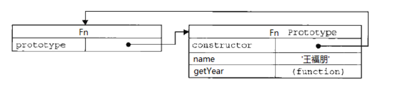
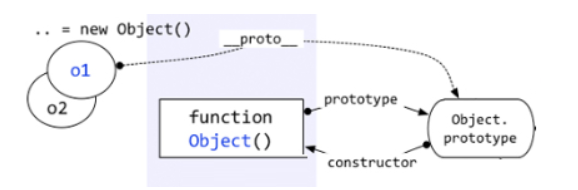
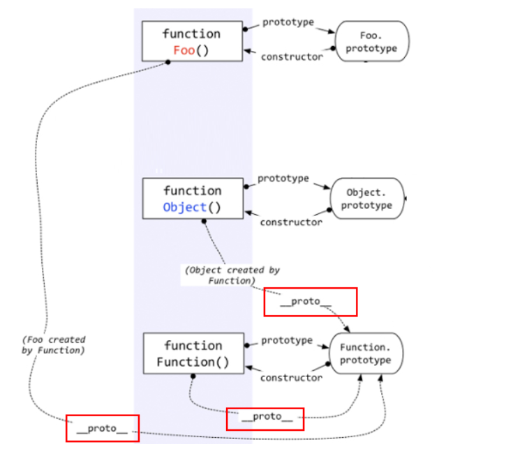

### Symbol

属性私有化,数据保护

```js
let _gender = Symbol('gender')

function Person(name, gender) {
    this.name = name;
    this[_gender] = gender
}

Person.prototype.say = function () {
    console.log(this[_gender]);
}
p1.say()
```

###let

> 不支持变量声明预解析(先声明后使用)
>
> 支持块作用域
>
> 不允许重复声明(暂存死区)
>
> 定义的变量不会给window增加属性
>
> `let c;  "c" in window  //false`

###const

> 不支持变量声明预解析(先声明后使用)
>
> 支持块作用域
>
> 不允许重复声明(暂存死区)
>
> 常量(值一旦确定,不允许修改,所有必须初始化)

###事件委托

```html
<button class="active">选项一</button>
<button>选项二</button>
<button>选项三</button>
<p class="active">内容一</p>
<p>内容二</p>
<p>内容三</p>
<script>
    var buttons = document.querySelectorAll('button')
    var ps = document.querySelectorAll('p')
    for (let i = 0; i < buttons.length; i++) {
        buttons[i].onclick = function () {
            for (let i = 0; i < buttons.length; i++) {
                buttons[i].className = '';
                ps[i].className = '';
            }
            this.className = 'active';
            ps[i].className = 'active';
        }
    }
<script>    
```

解构赋值

```
let [a,b,c]=[1,2,3]
let {left:L,top:T}={left:100,top:200}
let [a]='miaov'
```

扩展运算符

```typescript
...
    let a = [1, 2, 3, 4];
    console.log(...a);
    console.log(Math.max(...a));
    let b = ['a', 'c', 'v'];
    console.log([...a, 'skd', ...b]);
    let obj1 = {left: 100, right: 200};
    let obj2 = {top: 200, height: 200}
    let obj3 = {
        ...obj1,
        ...obj2
    };
    console.log(obj3);
```

字符串扩展

> \u{1F602}     unicode 表示法
>
> ``
>
> ${表达式} 

进制

> 二进制 	0b
>
> 八进制	0o(ES6之前:0开头表示八进制)
>
> 十进制	非0开头
>
> 十六进制		0x

迭代

> for... in: 以原始插入的顺序迭代对象的可枚举属性(遍历的是对象的键名),是遍历整个整个原型链
>
> for... of 根据迭代对象的迭代器具体实现迭代对象数据(遍历的是键值)
>
> ```
> let arr = ['a', 'b', 'c'];
> for (let string of arr) {
>     console.log(string);
> }
> ```

箭头函数

```
   //当参数只有一个的时候小括号可以省略
    let fn = (x) => {
        console.log('fn1')
    };
    let fn = x => {
        console.log('fn1')
    }; 
   //如果多于1条语句,或者返回的是一个对象
    let fn = x => {
        return {
            x: 1,
            y: 2
        }
    };
    箭头函数的this在函数创建件就绑定好了,箭头函数的this指向创建该作用域的对象
    箭头函数的注意事项
    内部this对象指向创建上下文对象
    不能作用构造函数
    没有arguments
    不能作为生成器函数
    let obj8={
    name:'zfpx',
    getName:()=>{
        console.log(this.name);
        },
    };
    console.log(obj8.getName());// undefined
    //箭头函数的this是定死的,指向外层的this
```

类

```
class Person {
        //类
        constructor(name) {//构造函数: 对象初始化的时候执行的函数
            this.name = name
        }

        getName() {
            console.log(this);
        }
    }

    // 继承
    class Student extends Person {
        constructor(name, type) {
            //super
            super(name);
            //如果子类需要有自己的初始化过程,
            // 有自己的constructor函数,需要在子类调用父类的构造函数
            this.type = type;
        }
    }
```

promise

```javascript
避免回调地狱(就是回调嵌套回调无限嵌套)
 接受一个参数：callback，我们把要执行的异步任务放置在这个callback中

                Promise对象内部会维护一个状态
                    默认是：pending
                    成功：resolved
                    失败：rejected

 Promise对象下有一个方法：then，该方法在Promise对象的状态发生改变的时候触发then的回调
 catch
     let p1 = new Promise((resolove, reject) => {
        setTimeout(function () {
            resolove(2)
        }, Math.random() * 1000)
    })
    let p2 = new Promise((resolove, reject) => {
        setTimeout(function () {
            resolove(3)
        }, Math.random() * 1000)
    })
    Promise.all([p1, p2]).then(data => {
        console.log(data);
    }, err => {
        console.log(err);
    })
```

迭代器

```
 yield* 后面跟的是可遍历的结构,它会调用该结构的遍历器接口
 function* fn() {
        console.log(0);
        yield console.log(1);
		yield* [1,3,4];
        yield console.log(2);
    }

    //返回一个迭代器函数
    let f = fn();
    f.next()
    f.next()
```

代码规范(这一大推写着写着就变成这样了)

```javascript
在let和const之间优先使用const
尽管const声明的变量不能直接修改值,但是对于对象和数组,却是不受保护可以修改的

静态代码一律使用单引号或者反引号

解构
const [a,b]=1,2
cosnt {first,last}=obj

对象
单行定义的对象最后不以逗号结尾
多行定义的对象最后以逗号结尾
const a = { k1: v1, k2: v2 };
const b = {
  k1: v1,
  k2: v2,
};

对象尽量静态化
cosnt a={x:null}
a.x=3

对象的属性和方法简写
// bad
const atom = {
  ref: ref,

  value: 1,

  addValue: function (value) {
    return atom.value + value;
  },
};

// good
const atom = {
  ref,

  value: 1,

  addValue(value) {
    return atom.value + value;
  },
};

数组
const itemsCopy=[...items]

Array.from方法 将类似数组的对象转为数组
const foo = document.querySelectorAll('.foo');
const nodes = Array.from(foo);

箭头函数
[1,2,3].map((x)=>{
    return x*x
})
可以指定原型
cosnt anObject={y:'y'}
const x={
    __proto__:anObject
}

super()

const anObject = {y: 'y', test: () => 'zoo'};

const x = {
    __proto__: anObject,
    test() {
        return super.test() + 'x'
    }
};
console.log(x.test());

动态属性
const x = {
  ['a' + '_' + 'b']: 'z'
}
x.a_b //z

reduce 有点难理解
第三个参数可以是索引,默认给值,可以给{} ,[]

JSON.stringfiy('第一个参数是序列化的参数',
			'第二个参数是一个函数key,value操作',
			'让代码清晰些4相当于4个空格')
JSON.parse() 一样也具有这个特点

//indexOf 如果找不到返回-1    如果重复返回第一个的索引

箭头函数
let getTempItem = id => ({ id: id, name: "Temp" });//如果不加括号会报错
如果不需要返回值 void
let fn = () => void console.log(2);
箭头函数注意点
    函数体内的this对象,就是定义时所在的对象,而不是使用所在的对象
    不可以当作构造函数,就是说不能new
    箭头函数没有自己的作用域
    不可以使用arguments
    不可以使用yield
    也就是说,this对象的指向是可变的,但是在箭头函数中,this的指向是固定的
    因为箭头函数没有this ,如果真的需要this需要重写定义this
    function foo() {
      var _this = this;

      setTimeout(function () {
        console.log('id:', _this.id);
      }, 100);
    }
    箭头函数里面根本没有自己的this,而是应用外层的this
    箭头函数是的this从动态变成静态,所有需要引用动态this的时候不要使用箭头函数
Array.from
可以将各种值转为真正的数组,并且还提供map功能
Array.from({ length: 2 }, () => 'jack') //[ 'jack', 'jack' ]
Array.of
用于将一组值,转换为数组
Array.of(3, 11, 8) // [3,11,8]
比如  Array(3)//[,,,]  一个值得时候表示的是数组的长度
Array.of   相当于 [].slice.call(arguments)
n**m   指数运算符
双冒号运算符    取代call   apply  bind
f::b
等同于 b.bind(f);   b.apply(f,arguments);
find
找到第一个复合条件的数组,参数是一个回调函数,返回第一个返回值为true的成员
[1,2,3,4,5,6].find(a=>a>3) //4
entries()  Object.keys() Object.values()
entries() 对键值对遍历  keys() 对键名遍历  values() 对键值遍历
includes  用于表示数组是否包含特定的值  第二个参数是起始位置默认为0
[1,3,4].includes(3,2)  //false
对象的扩展	
    const rest = (a, b) => ({a, b});
    console.log(rest('张三', '李四'));
   // { a: '张三', b: '李四' }
   let a = {
    fun () {
        return 'leo';
        }
    }
    // 等同于
    let a = {
        fun : function(){
            return 'leo';
        }
    }	
Object.assign()
深拷贝需要使用其他方法,因为Object.assign() 拷贝的是属性值,
假如原对象的属性值是一个指向对象的引用,它也只拷贝那个引用值
  let obj1 = { a: 0 , b: { c: 0}};
  let obj2 = Object.assign({}, obj1);
  console.log(JSON.stringify(obj2)); // { a: 0, b: { c: 0}}
  合并对象,合并属性的时候后续参数中具有相同属性的覆盖
  	var o1 = { a: 1 };
    var o2 = { b: 2 };
    var o3 = { c: 3 };

    var obj = Object.assign(o1, o2, o3);
    console.log(obj); // { a: 1, b: 2, c: 3 }	
Set
数据结构  所有成员唯一性  add  添加新成员  size  成员总数    delete   has  clear
Map
提供了"值-值"的对应关系,是一种更完善的hash结构实现   set  get  size   has  delete clear

for... of
当遇到next返回值得done属性为true就会终止,return 返回的不包括在for...of 循环中
function * f(){
    yield 1;
    yield 2;
    yield 3;
    yield 4;
    return 5;
}
for (let k of f()){
    console.log(k);
}
// 1 2 3 4  没有 5 

当变量值为null时,布尔值环境为false ,值类型为0
当变量值为undefined,布尔值环境为false,值类型为NaN

ES6开始全部变量和顶层对象(window)的属性是分开的
let b = 'leo';
window.b; // undefined

字面量
简单理解就是变量赋值是右边的都是字面量
let a='hi len'
`hi len` 为字符串字面量  a为变量名
var n=1;//字面量创建方式
var num=new Number(1); //构造函数创建方式
闭包
闭包的函数继承了父级容器的参数和变量,内部函数包含外部函数的作用域
内容函数只能在外部函数中访问
内部函数形成闭包:可以访问外部函数的参数和变量,
但外部函数却不能使用这个内部函数的参数和变量
外部函数的返回值为内部函数名

function f(a) {
    function g(b){
        return a + b;
    }
    return g;
}

//默认参数  剩余参数  
function f(a,b=1,...c) {
    
}


Proxy???
```

### 正则

```
正则  gi   g全局i区分大小写
exec
注意分组的参数
若检索成功,返回匹配的数组,否则返回null
let result = /len/g.exec('hello len!!');

//[ 'len', index: 6, input: 'hello len!!' ]
test
若匹配成功返回true否则返回false
let str = "hello leo!";
let res = /leo/.test(str);   // true

search
若检索成功,返回第一个与正则对象匹配的字符串的起始位置,否则返回-1
let str = "hello leo!";
let res = str.search(/leo/g);  // 6

match
若检索成功,返回与reg匹配的所有结果的一个数组,否则返回null
str.match(regSS)
```

Object.defineProperty

```
定义新属性或者修改原有的属性
let obj={
    test: 'hello'
};
//对象已有的属性添加特性
Object.defineProperty(obj,'test',{
    value:"张三",
    writable:true,//属性的值是否可以被重写,设置为true可以被重写
    enumerable:false,//属性是否可以被枚举(for...in或者object.keys())
    configurable:true,
    //目标属性是否可以使用delete删除,目标属性是否可以再次设置特性
});
//定义的新属性,特性中configurable,enumerable,writable都为默认的false
//当使用get或者set方法,不允许使用writable和value这两个属性
var obj = {};
Object.defineProperty(obj,"newKey",{
    get:function (){} | undefined,
    set:function (value){} | undefined,
    configurable: true | false,
    enumerable: true | false,
});
//getter 获得属性值的方法,setter设置属性值的方法
//get或者set不是必须成对出现的,任写一个就可以
```

[ES6](https://juejin.im/post/5c02b106f265da61764aa0c1)

this的调用

```
var f = function () {
  console.log(this.x);
}

var x = 1;
var obj = {
  f: f,
  x: 2,
};

// 单独执行
f() // 1

// obj 环境执行
obj.f() // 2
```

[this指向问题](https://note.youdao.com/share/?id=b2fab3b044aa90033395df0c8c9ca3a4&type=note#/)

###javaScript的秘密花园

```
    hasOwnProperty函数
        为了判断一个对象是否包含自定义属性而不是原型链上的属性
        唯一一个处理属性但是一查找原型链上的函数
        使用外部的hasOwnProperty函数获取正确的结果
        Object.hasOwnProperty.call(foo,'bar')//指向的对象,属性->返回true,false
    this是基于原型赖以生存的土壤
```

###  解构赋值

```
let obj1={name:'张三', age: 4};
let {name:myname,age:myage}=obj1;
// let myname=obj1.name
// let myage=obj1.age
console.log(myname);
//默认解构
let obj2={name:'zfpx', age: 9};
let {name,age=8}=obj2;
console.log(name, age);
```

### 模板字符串的实现原理

```
function replaces(dec) {
    return dec.replace(/\$\{([^}]+)\}/g,function (arguments,key) {
        console.log(arguments);
        console.log(eval(key));
    })
}
eval()
可以执行一段javascript 语句
var str = "if (x == 5) {alert('z is 42'); z = 42;} else z = 0; ";
var str1="1+4";
返回值是最后的结果
```

### 赋值

* 基础数据类型:赋值,赋值之后两个变量互不影响
* 引用数据类型: 赋址,两个变量具有相同的引用,指向同一个对象,相互影响

```
对于基本类型进行赋值操作,两个变量互不影响
let a='alex';
let b=a;
a='alex02';
console.log(a);//alex02
console.log(b);//alex
//对于引用类型
let a = {
    name: "muyiy",
    book: {
        title: "You Don't Know JS",
        price: "45"
    }
}
let b = a;
b.name="张三";

浅拷贝

* object.assign()  //如果说它是深拷贝是不准确的
用于将所有可枚举属性的值从一个或者多个源对象赋值到目标对象
let a = {
    name: "muyiy",
    book: {
        title: "You Don't Know JS",
        price: "45"
    }
}
let b = Object.assign({}, a);
console.log(b);
* 展开语法   ...
* Array.prototype.slice() 

let a = [0, "1", [2, 3]];
let b = a.slice(1);
console.log(b);
// ["1", [2, 3]]

a[1] = "99";
a[2][0] = 4;
console.log(a);
// [0, "99", [4, 3]]

console.log(b);
//  ["1", [4, 3]]
浅拷贝:第一层为基础数据类型不会是原数据一同改变,
但是原数据子对象会发现改变

深拷贝

JSON.stringify()
JSON.parse()
都不会发生改变
在遇到函数、 undefined 或者 symbol 的时候，该对象也不能正常的序列化

let a = {
    age: undefined,
    sex: Symbol('male'),
    jobs: function() {},
    name: 'yck'
}
let b = JSON.parse(JSON.stringify(a))
console.log(b) // {name: "yck"}
你会发现在上述情况中，该方法会忽略掉函数和 undefined和symbol
可以使用lodash中的cloneDeep或者使用30s中的deepClone
```

### new

```
* 访问构造函数里的属性
* 访问到原型里的属性
注意 不能使用new Symbol();因为Symbol是基本数据类型,每个Symbol()返回的symbol值都是唯一的
第一种情况
实例中只能返回返回对象中的属性
    function Car(color, name) {
        this.color = color;
        return {
            name: name
        }
    }

    var car = new Car("black", "BMW");
    car.color;
    // undefined
第二种情况
没有return 返回undefined
且 实例只能访问构造函数中的属性
function Car(color, name) {
    this.color = color;
}

var car = new Car("black", "BMW");
car.color;
// black

car.name;
// undefined
总结
* 创建了一个全新的对象
* 这个对象会被执行__proto__链接
* 生成的新对象会绑定到函数调用的this
* 通过new 创建的每个对象将最终被__proto__ 链接到这个函数的prototype对象上

```

### 求和函数sum，使输入sum(2)(3)或输入sum(2,3)

```
函数柯里化
多个参数的函数换成接受一个单一参数
用闭包把参数保存起来,当参数的数量足够执行函数了,就开始执行函数
let curry=(fn,...args)=>{
    fn.length <= args.length ? fn(...args) : curry.bind(null, fn, ...args);
};

function sum() {
    if (arguments.length === 1) {
        let sum01=arguments[0];
        let add=function (arg) {
            sum01+=arg;
            return add
        };
        add.valueOf=function () {
            return sum01
        };
        return add;
    }else{
        let sum3=0;
        for (let i = 0; i < arguments.length; i++) {
            sum3+=arguments[i];
        }
        return sum3;
    }
}

console.log(sum(1)(2));
//toString   valueOf都可以
```

###你不知道的Chrome调试工具技巧 

```
控制台上
$0 是当前选中的html  $1 是我们上一次选择的节点的应用...一直到$4
---
Array.from(document.querySelectorAll('dic'))===$$('div')
--
$_  上一次执行的结果的引用
--
控制台右键点击save  以文件的形式查看错误信息
+ '123'            // 123
+ 'ds'               // NaN
+ ''                    // 0
+ null              // 0
+ undefined    // NaN
Boolean过滤数组中的所有假值
双位操作符替换Math.floor()  但是负数来说就不相同了
~~4.9
取整 |0
返回多行语句 需要用()包裹起来
clas=dir=>(
	Math.PI* diameer;
 )
```
### bind()

```javascript
bind方法与call/apply最大的不同是前端返回一个绑定上下文的函数,后两个直接执行函数
        var value = 2;

        var foo = {
            value: 1
        };

        function bar(name, age) {
            return {
                value: this.value,
                name: name,
                age: age
            }
        };

        bar.call(foo, "Jack", 20); // 直接执行了函数
        // {value: 1, name: "Jack", age: 20}

        var bindFoo1 = bar.bind(foo, "Jack", 20); // 返回一个函数
        bindFoo1();
        // {value: 1, name: "Jack", age: 20}
可以指定this 
返回一个函数
可以传入参数
柯里化

this存在的问题
        var nickname = "Kitty";
        function Person(name){
            this.nickname = name;
            this.distractedGreeting = function() {

                setTimeout(function(){
                    console.log("Hello, my name is " + this.nickname);
                }, 500);
            }
        }

        var person = new Person('jawil');
        person.distractedGreeting();
        //Hello, my name is Kitty
解决方案1: 缓存this

    var nickname = "Kitty";
    function Person(name){
        this.nickname = name;
        this.distractedGreeting = function() {

            var self = this; // added
            setTimeout(function(){
                console.log("Hello, my name is " + self.nickname); // changed
            }, 500);
        }
    }

    var person = new Person('jawil');
    person.distractedGreeting();
    // Hello, my name is jawil
第二种bind
    var nickname = "Kitty";
    function Person(name){
        this.nickname = name;
        this.distractedGreeting = function() {

            setTimeout(function(){
                console.log("Hello, my name is " + this.nickname);
            }.bind(this), 500);
        }
    }

    var person = new Person('jawil');
    person.distractedGreeting();
    // Hello, my name is jawil
验证是否是数组
        var toStr = Function.prototype.call.bind(Object.prototype.toString);
        function isArray(obj){ 
            return toStr(obj) === '[object Array]';
        }
        isArray([1, 2, 3]);
        // true

        // 使用改造后的 toStr
        toStr([1, 2, 3]); 	// "[object Array]"
        toStr("123"); 		// "[object String]"
        toStr(123); 		// "[object Number]"
        toStr(Object(123)); // "[object Number]"
柯里化

	只传递给函数一部分参数来调用,让它返回一个函数去处理剩下的参数
	var add=function(x){
        return function(y){
            return x+y
        }
	}
	var increment=add(1);
	increment(2)
	这里定义一个add函数,它接受一个参数并返回一个新的函数,调用add之后,返回的函数
	就通过闭包的方法记住add的第一个参数,所有bind本身也是闭包的一种使用场景
this问题
一个绑定函数也能使用new操作符创建对象,这种就想把原函数当成构造函数
提供的this被忽略,同时调用时的参数被提供给模拟函数
        var value = 2;
        var foo = {
            value: 1
        };
        function bar(name, age) {
            this.habit = 'shopping';
            console.log(this.value);
            console.log(name);
            console.log(age);
        }
        bar.prototype.friend = 'kevin';

        var bindFoo = bar.bind(foo, 'Jack');
        var obj = new bindFoo(20);
        // undefined
        // Jack
        // 20

        console.log(obj.habit);
        // shopping

        console.log(obj.friend);
        // kevin
```

###Array.prototype.slice.call()

```javascript
将函数的实际参数转换成数组
Array.prototype.slice.call(arguments)
[].slice.call(arguments,0)  //默认从0开始往后截取
Array.from()  //ES6
```

### 防止抖动

```js
会遇到一些频繁的事件触发比如:
window: resize,scroll, mousedown mousermove keyup keydown...
当持续触发事件是,一定时间内没有再触发事件,处理函数才会执行一次
//第一个参数是函数,第二个参数是定时器的时间
function debounce(func, wait) {
    var timeOut;

    return function () {
        if(timeOut) {
            clearTimeout(timeOut);
        }
        // 保存this上下文，参数
        var that = this, args = arguments; //event的问题
        timeOut = setTimeout(function () {
            func.apply(that, args);
        }, wait)
    }
}
```

### toString和valueOf

```
toString(): 返回对象的字符串表示
valueOf(): 返回对象的字符串,数值或者布尔值表示 
//先看看toString()方法的结果
var a = 3;
var b = '3';
var c = true;
var d = {test:'123',example:123}
var e = function(){console.log('example');}
var f = ['test','example'];

a.toString();// "3"
b.toString();// "3"
c.toString();// "true"
d.toString();// "[object Object]"
e.toString();// "function (){console.log('example');}"
f.toString();// "test,example"

//再看看valueOf()方法的结果
var a = 3;
var b = '3';
var c = true;
var d = {test:'123',example:123}
var e = function(){console.log('example');}
var f = ['test','example'];

a.valueOf();// 3
b.valueOf();// "3"
c.valueOf();// true
d.valueOf();// {test:'123',example:123}
e.valueOf();// function(){console.log('example');}
f.valueOf();// ['test','example']
特殊的地方 表示对象的时候,toString->  [object Object]
而valueOf 返回自身

//例子一
var example = {test:'123'};
console.log(+example);// NaN

//例子二 同时改写 toString 和 valueOf 方法
var example = {
    toString:function(){
        return '23';
    },
    valueOf:function(){
        return '32';
    }
};
console.log(+example);// 32
通过例子一和例子二中,在有一元加操作符,会先调用valueOf,再调用Number()
```

### 节流

```js
不管操作多频繁,我始终固定时间触发一次
function throttle(func,wait) {
    let timeout;
    return function () {
        let context=this,
            args=arguments;
        if(!timeout){
            timeout=setTimeout(function () {
                timeout=null;
                func.apply(context,args);
            },wait)
        }
    }
}
```

### 数组去重

```
function uniq(array){
    var temp = []; //一个新的临时数组
    for(var i = 0; i < array.length; i++){
        if(temp.indexOf(array[i]) == -1){
            temp.push(array[i]);
        }
    }
    return temp;
}

//filter 第一个参数迭代的对象 第二个是下标,第三个数组本身
array.filter((item, index, array) => array.indexOf(item)===index);

Array.from(new Set(array))

//排序去重
array.concat().sort((a,b)=>a-b)).filter((item,index,array)=>{
//a||b,a为true返回a
//a&&b,a为true返回b
    return !index||item!==array[index-1]
})

[...new Set(array")]
```

### 类型判断

```
typeof  检测六种基础类型+object+function
Undefined null Boolean String number Symbol  function Object
Object.prototype.toString.call(obj)=> [object 类型]
```

### 最大值最小值

```
Maxs=arr=>{
    let res=arr[0];
    for(let i=0;i<arr.length;i++){
        res=Math.max(res,arr[i]);
    }
    return res;
}

Math.max.apply(null,arr)

Math.max(...arr)

arr.reduce((r, v) => Math.max(r, v)))

arr.sort((a,b)=>b-a)[0]

arr.reduce((r,v)=r>v?r:v)
```

### 数组乱序

```js
arr.sort(()=>Math.random()-0.5)
```


### 数组扁平化

```js
flatten=arr=>arr.reduce((r,s)=>{
    return r.concat(Array.isArray(s)?flatten(s):s)
},[])

flatten=arr=>arr.toString().split(',').map(item=>Number(item));

flatten=arr=>arr.join('.').split(',').map(item=>parseInt(item));
flatten=arr=>arr.join('.').split(',').map(item=>+item);
flatten=arr=>{
    let res=[];
    return arr.map(item=>{
        return arr.isArray(item)?res=res.concat(flatten(item)):res.push(item);
    })
}

//some至少有一个
function flatten(arr) {
    while(arr.some(item=>Array.isArray(item))) {
        arr = [].concat(...arr);
    }
    return arr;
}

//Array.from  toString   split
```

### 在数组中查找指定索引

```
indexOf
//ES6
findIndex   返回符合条件的第一个元素的索引
findLastIndex  倒序
```

### [深入理解javascript](http://www.cnblogs.com/wangfupeng1988/p/3977924.html)

> 数组是对象,函数是对象,对象还是对象,对象里面的一切都是属性,只有属性,没有方法,方法也是属性
>
> 一切(引用类型)都是对象,对象是属性的集合
>
> null是js中一个基本数据类型,之所以显示"Object",是因为对象在底层被表示为二进制,在js中中二进制前三位为0会被判断为object类型,null的二进制都是0,自然前三位也是0,所以返回对象
>
> 对象都是通过函数创建的
>
> ```js
>         function Fn() {
>             this.name = '王福朋';
>             this.year = 1988;
>         }
>         var fn1 = new Fn();
>         //var obj = { a: 10, b: 20 };  语法糖
>         //var arr = [5, 'x', true];	   语法糖
> 
>         var obj = new Object();
>         obj.a = 10;
>         obj.b = 20;
> 
>         var arr = new Array();
>         arr[0] = 5;
>         arr[1] = 'x';
>         arr[2] = true;
> ```
>
> 其中Object 和Array都是函数
>
> ```js
> console.log(typeof (Object));  // function
> console.log(typeof (Array));  // function
> ```
>
> prototype原型
>
> 
>
> `Fn.Prototype.constructor=Fn`
>
> 隐式原型`__proto__`
>
> 每个函数function都有一个prototype,每个对象都有一个`__proto__`
>
> 
>
> `obj.__proto__===Object.prototype` 
>
> 实例出来的对象都有一个`__proto__`属性,指向创建这个对象的函数的prototype
>
> 但是Object.prototype是一个特例,它的`__proto__`指向的是null
>
> 函数也是一种对象,函数也有`__proto__`吗?
>
> ```js
> function fn(x,y){
>     return x+y;
> }
> var fn1=new Function('x','y','return x+y;')
> 第一种是传统的函数创建方式,第二种是new Function创建的,
> 第二种不推荐
> ----
> 
> fn.__proto__===Fuction.prototype
> ```
>
> 
>
> 对象的`__proto__`指向创建它的函数的prototype
>
> ```js
> Object.__proto__=== Function.prototype
> var a = Function.prototype; //将Function.prototype看作一个基本对象a，此时：
> a.constructor === Function;
> a.__proto__.constructor === Object; //a.__proto__指向Object.pototype
> 
> instanceof 是做类型检测的
> "abc" instanceof String  //false  左边不是Object类型直接返回false
> "abc".__proto__ instanceof  String.prototype
> ```
>
> instanceof判断规则是
>
> 沿着A 的`__proto__` 这条线来找,如果B的prototype在这条线上,那么返回true,否则返回false
>
> ```js
>    function Foo(){}
>     var f1 = new Foo();
>     console.log(f1 instanceof Foo); // true
>     console.log(f1 instanceof Object); // true
>      
>     分析方法：
>         f1的__proto__路线A：
>             (1) f1.__proto__ === Foo.prototype
>             (2) Foo.prototype.__proto__ === Object.prototype
>             (3) Object.prototype.__proto__ === null //到终点
> ```
>
> Object函数也是Fucntion创建出来的,而且Fucntion是被自身创建的
>
> 访问一个对象的属性时,先在基本属性中查找,如果没有,再沿`__proto__`这条链往上找
>
> .png)
>
> 执行上下文环境或者叫执行上下文,
>
> * 变量,函数表达式---变量声明默认为undefined
> * this
> * 函数声明 

### 你不知道的javascript

> 把类数组转换成真正的数组
>
> * Array.prototype.slice.call(arguments)
> * Array.from(arguments)
>
> 判断对象是什么引用类型
>
> * Object.prototype.toString.call(obj)
>
> toNumber()
>
> * 基本类型值true=1,false=0,undefined=NaN,null=0,处理失败返回NaN
> * 如果有valueOf方法先进行强制转换,若没有则用toString进行强制转换
>
> toBoolean()
>
> * 假值:undefined ,null,false,+0,-0,NaN," ",假值以外都是真值
>
> 取整
>
> * `~~` 取整,负数向上取整,正数向下取整
> * x|0 也可以取整,规则同上
>
> 强制转换成Boolean
>
> * !!
>
> ==
>
> * NaN不等于NaN,+0不等于-0
> * null==undefined,因为null,undefined是假值转化为boolean值都是0
> * 下面一般情况下为true
>
> ```
> "0" == false //隐式转化
> false == 0	
> false == "" 
> false == [] //[]的length为0=>array(0)  []为0
> "" == 0
> "" == []
> 0 ==[]
> ```
>
> * 如果两边的值中有[],"",0 尽量不要用==,两边有true和false也不要用==
>
> {}+[]
>
> * {} 被当作一个独立的空代码块,+[]强制类型转换为0
>
> []+{}
>
> * []会转换为"" ,+{}后,会强制转换为"[object object]"
>
> 优先级
>
> * &&>||>?> :
>
> 函数会首先被提升,然后才是变量
>
> ```
> console.log(a);//由于上面已声明a,相同的变量名声明会被直接忽略掉
> // [Function a]
> var a = "孙悟空";
> function a(){ console.log("小钻风"); }
> 
> var a=1;
> var a;
> console.log(a);//1
> ```
>
> 自执行函数不会进行变量提升的
>
> 等号右边没有变量提升的
>
> ```
> console.log(ff);//ff is not defiend
> var f= funciton ff(){}
> ```
>
> 不管条件是否成立都要变量提升,但是var和function声明不定义,当条件成立第一步先给函数赋值
>
> ```
> console.log(a); //undefined
> console.log(F); //undefined
> if(true){
>     var a=1;
>     function F() {
>         
>     }
> }
> //----------------
> f=function(){return true}
> g=function(){return false}
> (function(){
>     if(g()&&[]==![]){ //g=undefined  ,g()会报错,已经条件判断,只声明不定义
>         f=function f(){return false}
>         function g(){return true}
>     }
> })
> ```

###发布订阅者模式

```
没理解
```

### 引用数据类型

```js
let obj={a: 1};// b:xxxFFFF111
let obj1=obj;
obj1.b=obj={x: 1};
console.log(obj.b);// undefined
console.log(obj1.b);//{x:1}

function fn() {
    this.name = '张三';
}

console.log(fn.name); //fn

console.log((new Function('res', 'return res')).name);//anonymous

function fn3(y,x='你好',z) {

}
//函数的length是形参的长度,但是默认值不算在里面,而且书写规范,默认值应该写在最后,
//如果默认值等于return, 后续不会执行,会影响默认值
console.log(fn3.length);//1

//函数声明
num()//报错
var num = function (){
    console.log(1);
}
```

### 私有作用域

```js
var a=1;
var b=2;
function AA(a){
    a++; //NaN
    b++; //3
    console.log(a); //NaN
    console.log(b); //3
}
AA()
console.log(a); //1
console.log(b); //3

-----
var a=3;
function B(a,b) {
    a++;
    console.log(a + b); //7
}
B(a,a++); a++由于是后++ ,所有传入给b依然是3
console.log(a); a=4

//----------------------------
var code=null;
function fn1(n) {
    n=n||code++; //n=0
    return ++code; //code =2
}
var n=fn1();//2
console.log(n);//2
//---------------
n=f2(m);
var m=0;
function f2(n){
    n=isNaN(n);//isNaN(undefined)==>true
    return n;
}
console.log(window.n)

//------
var ary = [1, 2, 3];

function FF(ary) {
    ary.push(100);
    ary.shift();
    ary = ary[ary.length - 1];
    return ary;
}

console.log(FF(ary));//100
console.log(ary);//[ 2, 3, 100 ]
```

 