### 对象转基本类型

```js
let a = {
  valueOf() {
    return 0;
  },
  toString() {
    return '1';
  },
  [Symbol.toPrimitive]() {
    return 2;
  }
}
1 + a // => 3
'1' + a // => '12'
```

优先级: `Symbol.toPrimitive>valueOf>toString`

```
'a'++'b'
因为+'b' 会被强制转换成NaN
```

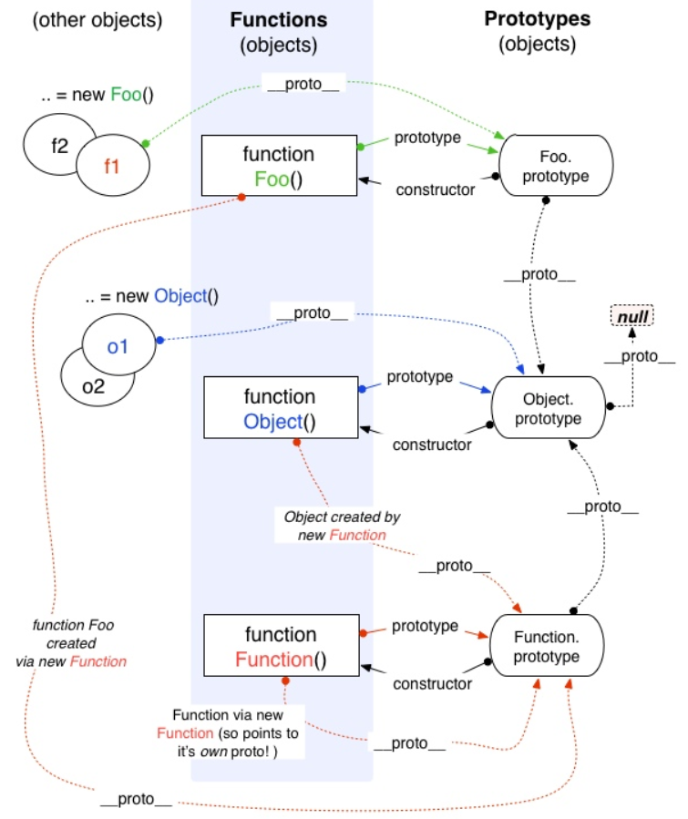

```
function Foo() {
    return this;
}
Foo.getName = function () {
    console.log('1');
};
Foo.prototype.getName = function () {
    console.log('2');
};

new Foo.getName();   // -> 1
new Foo().getName(); // -> 2
优先级的顺序
new (Foo.getName());
(new Foo()).getName();
//new Foo() 是返回return的内容而不是去看构造函数的属性	
```
### 如何成为全核工程师

> 先精后广,一专多长

### []==false, !![]==true

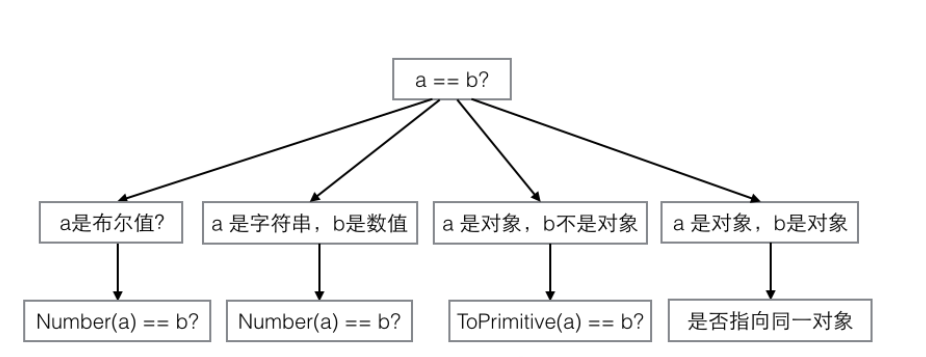

```javascript
js中隐式强制类型转换
转化为数字类型  false等于0, true等于1
如果是对象,先调用valueOf,如果没有用调用toString,这个过程叫ToPrimitive()
NaN==NaN  false
首先分析[]==![]
Boolean() 判断 0、-0、null、false、NaN、undefined、或者空字符串（""），则生成的 Boolean 对象的值为 false,
![] 变成!Boolean([]) 也就是!true,也就是false
```

### [] + {} 和 {} + []一样吗

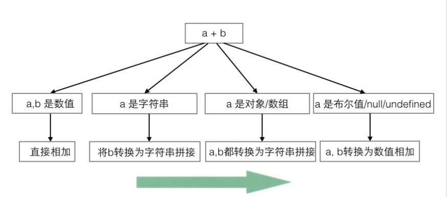

> 当有一个操作数是字符串时
>
> * 如果两个操作数都是字符串,将两个字符串拼接起来
> * 如果只有一个操作符石字符串,则另一个操作数转换为字符串(toString)
>
> 当有一个操作数是复杂数据类型(对象,数组)时,将两个操作数都转换为字符串(toString)相加
>
> 当 **有一个操作数是简单数据类型（true/false， null，undefined）** 时，同时不存在复杂数据类型和字符串，则将两个操作数都转换成数值（ToNumber）相加。

[]+{}

```javascript
满足a有对象/数组,所有都转换为字符串拼接
""+"[object object]"="[object Object]"
```

1+{}

```
满足第三条 a是对象/数组
"1[object Object]"
```

{}+[]

```
"[object Object]"+toNumber([])
"[object Object]"+0
```

{}+{}

```
"[object Object][object Object]"
```

###函数的name属性

```
通过构造函数方式创建的函数name都是 'anonymous'

使用bind方法得到一个新的函数

function ff(){};
var f=ff.bind();
f.name 是bound ff
```

### 闭包

**作用域是定义时的作用域,而不是执行时的作用域**

闭包的使用场景

> 函数作为返回值
>
> ```js
> function F1(){
> 	var a = 100
> 	//返回一个函数(函数作为返回值)
> 	return function(){
> 		console.log(a)
> 	}
> }
> ```
>
> 函数作为参数传递
>
> ```js
> function F1(){
> 	var a = 100
> 	return function(){
> 		console.log(a)   //自由变量，父作用域寻找
> 	}
> }
> ```
>
> 

一个函数执行如果形成一个不销毁作用域,保护里面的私有变量或者存储私有变量,但是闭包容易引起内存泄露

造成内存泄露的情况:

* 全局变量
* 不销毁作用域

```
function fn(){
    var a=1;
    return function(){
        a++
    }
}
```

作用域

```
全局:关闭浏览器的时候销毁
私有: 看是否返回地址并且被占用了,决定是否销毁
var 是没有块级作用域的
```

作用域链

```
是一个查找过程: 在一个私有作用域下遇到变量了,先看是不是自己私有的,如果不是往上一级找,没有继续找一只找到window下为之,没有就报错
```

上一级作用域

```
看当前整个作用域对应我的地址是在哪一个作用域下定义的,那个作用域就是当前这个作用域的上一级
```

块级作用域

```
{}   if(){}    for(){}   while(){}
```

let 和const 定义的变量属于一个私有作用域,变量是私有变量

实例即可以通过构造函数中this.属性的方式得到私有属性还可以通过`__proto__`拿到所属类的原型的公有属性

词法作用域

```
常见的变量
```


### javaScript 引擎

javaScript引擎是谷歌的v8引擎,这个引擎由两个部分组成

* 内存堆:这是内存分配发生的地方
* 调用栈:这是你的代码执行的地方

创建执行上下文有两个阶段

* 创建阶段
* 执行阶段

在创建阶段会发生三件事

* this值的决定,就是this绑定
* 创建词法环境组件
* 创建变量组件

this的绑定

> 在全局执行上下文中,this的值指向全局对象,(在浏览器中,this引用window对象)
>
> 在函数执行上下文,this的值取决于该函数式如何被调用的,如果它被一个引用对象调用,那么this会被设置成那个对象,否则this的值被设置全局对象或者undefined(在严格模式下)

词法环境内部有两个组件

* 环境记录器
* 一个外部环境的引用

> 环境记录器是存储变量和函数声明的实际位置
>
> 外部环境的引用意味着他可以访问其父级词法环境(作用域)

词法环境有两种类型

> 全局环境(在全局执行上下文中)是没有外部环境引用的词法环境,
>
> 函数环境中,函数内部用户定义的变量存储在环境记录器中,并且引用的外部环境可能是全局环境，或者任何包含此内部函数的外部函数。 

简而言之

* 在全局环境中,环境记录器是对象环境记录器
* 在函数环境中,环境记录器是声明式环境记录器

### 值类型

```js
// 值类型：Number、string、bollean、undefined
var a = 100
var b = a
a = 200
console.log(b) // 100 保存与复制的是值本身
typeof abc      //"undefined"
typeof null    //"object"
为什么要说呢?因为我错了好多次
typeof区分不了引用类型(除了函数)
用instanceof 来区分引用类型
alert(person instanceof Object); // 变量 person 是 Object 吗？

alert(colors instanceof Array); // 变量 colors 是 Array 吗？

alert(pattern instanceof RegExp); // 变量 pattern 是 RegExp 吗？
```

### 引用传值

[值传递和引用传递](https://www.nowcoder.com/questionTerminal/b296e9e1c40542ec8677c1e452b6b576)

```javascript
function addNum(num)
{ 
　num+=10; 
　return num; 
} 
var num=10; 
var result=addNum(num); 
console.log(num);//10
console.log(result);//20
当为函数传递参数的时候,是将此值复制一份传递给函数,所以在函数执行之后,num本身的值并没有改变,函数中的被改变的值仅仅是副本而已

function mutate(obj) {
  obj.a = true;
}

const obj = {a: false};
mutate(obj)
console.log(obj.a); // 输出 true

在值传递的场景中,函数的形参只是实参的一个副本(相当于a拷贝了一份),当函数调用完成后,并不改变实参
在引用传递的场景中,函数的形参和实参指向同一个对象,当参数内部改变形参的时候,函数外面的实参也被改变

function setName(obj){
	obj.name = '嘉明';
	obj = new Object();
	obj.name = '庞嘉明';
}
var person = new Object();
setName(person);
console.log(person.name); // '嘉明'，为啥不是'庞嘉明'呢？
新建的对象 obj = new Object()
它自己空间保存的地址将会被新的对象的存储地址所覆盖，因为是传值不是引用，所以它不会影响到student空间所保存的地址，故最后虽然对obj的name属性重新赋值，但也丝毫不影响之前赋值结果，按值传递
你传进的一个对象 对象在内存地址中，即使你再外部赋值，但是内部 改变了，你外部就等于没有赋值
```

### 当取值为百分比时，需要特别注意：**百分比不是相对于父元素的高度的，而是相对于父元素的宽度的**。`height`、`top`的百分比取值，总是相对于父元素的**高度**。  

> `padding-top`、`margin-top`、`padding-bottom`、`margin-bottom`取值为百分比时，是相对于**父元素的宽度**。

### fixed问题

```
一提到position:fixed，自然而然就会想到：相对于浏览器窗口进行定位。

但其实这是不准确的。如果说父元素设置了transform，那么设置了position:fixed的元素将相对于父元素定位，否则，相对于浏览器窗口进行定位。
```

### JavaScript 的怪癖

#### 隐式转换

隐式转换为Boolean

> if语句

字符串的隐式转换

> 加运算符(+) ,但是只要其中一个操作数是字符串,那么它执行连接字符串的操作

### `为什么 ++[[]][+[]]+[+[]] = 10？`

```
拆分
++[[]][+[]]
+
[+[]]
继续拆分

++[[]][0]
+
[0]

继续拆分

+([] + 1)
+
[0]

+([] + 1) === +("” + 1)，并且 
+("” + 1) === +("1")，并且 
+("1") === 1 

最后简化为
1+[0]
[]==''  [0]=='0', [1]=='1'
所以 1+'0' ==='10'
```

### 2==true为什么是false

> 因为==是比较值类型是否相等,true转换为数字是1 ,所以2==1为false
>
> '2'==true    '2' 隐式转化为2  2==true 为false

### null >=0 ? true：false

```
null == 0  // false  null在设计上，在此处不尝试转型. 所以 结果为false. 
null > 0  // false   null 尝试转型为number , 则为0 . 所以结果为 false, 
null >= 0  // true 
null<=0		//true
那么你看
-null == 0  // true
+null == 0 // true
Number(null) == 0  // true
```

### 你不知道的JavaScript续集

数组

> 使用delete运算符可以将单元从数组中删除，但是请注意，单元删除后，数组的length属性并不会发生变化。
> 数组通过数字进行索引，但有趣的是它们也是对象，所以也可以包含字符串键值和属性（但这些并不计算在数组长度内）

```js
var a = [ ];
a[0] = 1;
a["foobar"] = 2;
a.length; // 1
a["foobar"]; // 2
a.foobar; // 2
如果字符串键值能够被强制类型转换为十进制数字的话，它就会被当做数字索引来处理
var a = [ ];
a["13"] = 42;
a.length; // 14

类数组
var a = { '0': 1, '1': 2, '2': 3, length: 3 };
function foo() {
    var arr = Array.prototype.slice.call(arguments);
    arr.push("bam");
    console.log(arr);
}
foo("bar", "baz"); // ["bar","baz","bam"]
同时用Array.from() 也能实现同样的功能
对伪数组或可迭代对象(包括arguments Array,Map,Set,String…)转换成数组对象
```

字符串

> JavaScript中字符串是不可变的，而数组是可变的。 

 特殊的数字

```
var a=2/'foo';
a==NaN //false 
因为NaN===NaN  //false
可以使用全局isNaN() 来判断一个值是否是NaN
但是 isNaN('abc')  //true
ES6开始我们使用Number.isNaN()
var a = 2 / "foo";
var b = "foo";
Number.isNaN( a ); // true
Number.isNaN( b ); // false——好！

无穷数
var a = 1 / 0; // Infinity
var b = -1 / 0; // -Infinity

零值    常规的0(也叫+0)和-0
var a = 0 / -3; // -0
var b = 0 * -3; // -0
从字符串转换为数字
+"-0"; // -0
Number( "-0" ); // -0
JSON.parse( "-0" ); // -0
我们为什么需要负零呢
数字的符号位用来代表其他信息（比如移动的方向）
此时如果一个值为0的变量失去了它的符号位，它的方向信息就会丢失。
```

值和引用

```javascript
var a = [1,2,3];
var b = a;
a; // [1,2,3]
b; // [1,2,3]
// 然后
b = [4,5,6];
a; // [1,2,3]
b; // [4,5,6]
由于引用指向的是值本身而非变量，所以一个引用无法更改另一个引用的指向

function foo(x) {
    x.push(4);
    x; // [1,2,3,4]
    // 然后
    x = [4, 5, 6];
    x.push(7);
    x; // [4,5,6,7]
}
var a = [1, 2, 3];
foo(a);
a; // 是[1,2,3,4]，不是[4,5,6,7]
我们无法自行决定使用值复制还是引用复制，一切由值得类型来决定。
如果通过值复制的方式来传递复合值（如数组），就需要为其创建一个复本，这样传递的就不再是原始值
foo(a.slice())

如果要将标量基本类型值传递到函数内并进行更改，就需要将该值封装到一个复合值（对象、数组等）中，然后通过引用复制的方式传递。
function foo(wrapper) {
    wrapper.a = 42;
}
var obj = {
    a: 2
};
// var obj=new Object();  obj.a=2;
foo(obj);
obj.a; // 42
与预期不同的是，虽然传递的是指向数字对象的引用复本，但我们并不能通过它来更改其中的基本类型值

function foo(x) {
    x = x + 1;
    x; // 3
}
var a = 2;
var b = new Number(a); // Object(a)也一样
foo(b);
console.log(b); // 是2，不是3
只是多数情况下我们应该优先考虑使用标量基本类型
```

封装对象包装

```
var a=Boolean(false);
var b=new Boolean(false);
if (!b) {
console.log( "Oops" ); // 执行不到这里
}
我们为false创建了一个封装对象，然而该对象是真值，所以这里使用封装对象得到的结果和使用false截然相反
如果想要自行封装基本类型值,可以使用Object(...)函数(不带new关键字)
var a = "abc";
var b = new String( a );
var c = Object( a );
typeof a; // "string"
typeof b; // "object"
typeof c; // "object"
b instanceof String; // true
c instanceof String; // true
```

拆封

```
可以使用ValueOf()函数
var a = new String( "abc" );
var b = new Number( 42 );
var c = new Boolean( true );
a.valueOf(); // "abc"
b.valueOf(); // 42
c.valueOf(); // true

使用隐式拆封
var a = new String( "abc" );
var b = a + ""; // b的值为"abc"
typeof a; // "object"
typeof b; // "string"
```

原生函数作为构造函数

```
关于数组（array）、对象（object）、函数（function）和正则表达式，我们通常喜欢以常量的形式来创建它们。实际上，使用常量和使用构造函数的效果是一样的（创建的值都是通过封装对象来包装）

var a = new Array( 1, 2, 3 );
a; // [1, 2, 3]
var b = [1, 2, 3];
b; // [1, 2, 3]
构造函数Array(..)不要求必须带new关键字。不带时，它会被自动不上。因此Array(1,2,3)和new Array(1,2,3)的效果是一样的。
Array构造函数只带一个数字参数的时候，该参数会被作为数组的预设长度（length），而非只充当数组中的一个元素

```

表达式的副作用

```
var a = 42;
var b = a++;
a; // 43
b; // 42 这是a++的副作用

========================
function foo() {
    a = a + 1;
}
var a = 1;
foo(); // 结果值：undefined。副作用：a的值被改变
```

### [你懂 JavaScript 嗎？](https://ithelp.ithome.com.tw/articles/10208086)

toJSON

```js
var obj = {
    key: 'foo',
    toJSON: function () {
        return 'bar';
    }
};
var ret = JSON.stringify(obj);
console.log(ret);
区别非常明显，toJSON 的返回值直接代替了当前对象
```

Number

```js
undefined   ---> NaN
null		---> 0
boolean 的true为1  false即是0
string  -->数字或NaN
object		若定义valueOf优先用,其次toString

Number(undefined) // NaN
Number(null) // 0
Number(true) // 1
Number(false) // 0
Number('12345') // 12345
Number('Hello World') // NaN
Number({ name: 'Jack' }}) // NaN

const a = {
  name: 'Apple',
  valueOf: function() {
    return '999'
  }
}

Number(a) // 999

const a = new String('');
const b = new Number(0);
const c = new Boolean(false);

!!a // true
!!b // true
!!c // true
```

parseInt

```js
参数:第一个参数是string 第二个参数是介于2和36之间的整数,通常默认为10,也就是我们通常使用的十进制转换,如果是5就是5进制,超出这个范围，则返回NaN。如果第二个参数是0、undefined和null，则直接忽略
* 将字符串转为整数
* 如果字符串头部有空格,空格会被自动去除
* 如果参数不是字符串,先转为字符串再转换
parseInt('12px')  如果遇到不能转为数字的字符,就不再进行下去,返回转好的部分
如果字符串的第一个字符不能转化为数字（后面跟着数字的正负号除外），返回NaN。
如果开头是0x按照16进制转换,如果是0按照10进制转换
```

又犯错了一次

```js
const a = true;
const b = 123;

a === b // false
a == b // false
true强制转换为1

const a = '1,2,3';
const b = [1,2,3];
a === b // false
a == b // true
在a == b当中，阵列a由于没有valueOf()，只好使用toString()取得其基型值而得到字串'1,2,3'，此时就可比较'1,2,3' == '1,2,3'，因此是相等的（true）。

Object(null) 和Object(undefined) 等同于Object()也就是{}
var a = null;
var b = Object(a); // 等同於 Object()
a == b; // false

var c = undefined;
var d = Object(c); // 等同於 Object()
c == d; // false

var e = NaN;
var f = Object(e); // 等同於 new Number(e)
e == f;//false

避免修改原型的valueOf
Number.prototype.valueOf = function() {
  return 3;
};

new Number(2) == 3; // true
```

抽象的关系运算符

- `a <= b`其实是`!(b > a)`，因此`!false`得到true。
- `a >= b`其实是`b <= a`也就是`!(a > b)`等同于`!false`得到true

 ```js
const a = { b: 12 };
const b = { b: 13 };

a < b // false，'[object Object]' < '[object Object]'
a > b // false，其實是比較 b < a，即 '[object Object]' < '[object Object]'
a == b // false，其實是比較兩物件的 reference

a >= b // true
a <= b // true
 ```

```js
`[]==[]`  false 因为两个的地址不是一样的

`'ab' < 'cd' // true `  以字典的字母顺序形式进行比较

'Hello World' > 1 // false，字串 'Hello World' 无法转化为数字,变成了NaN
NaN 不大于、不小于、不等于任何值，当然也不等于自己
```

### 图解构造器Function和Object的关系

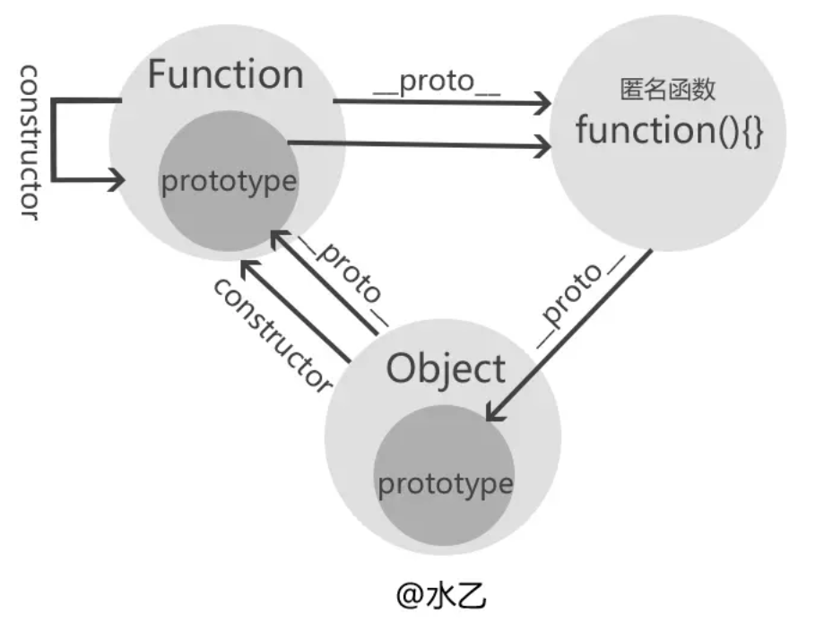

```typescript
//①构造器Function的构造器是它自身
Function.constructor=== Function;//true

//②构造器Object的构造器是Function（由此可知所有构造器的constructor都指向Function）
Object.constructor === Function;//true

//③构造器Function的__proto__是一个特殊的匿名函数function() {}
console.log(Function.__proto__);//function() {}

//④这个特殊的匿名函数的__proto__指向Object的prototype原型。
Function.__proto__.__proto__ === Object.prototype//true

//⑤Object的__proto__指向Function的prototype，也就是上面③中所述的特殊匿名函数
Object.__proto__ === Function.prototype;//true
Function.prototype === Function.__proto__;//true
```

> `Function instanceof Object` 和 `Object instanceof Function` 运算的结果当然都是true啦 
>
> 所有的构造器的constructor 都指向Function
>
> Function 和prototype指向一个特殊匿名函数,而这个特殊匿名函数的 `__proto__` 指向 `Object.prototype` 

 ### Array.of

```js
Array.of方法用于将一组值，转换为数组。
Array.from()
Array.from方法用于将两类对象转为真正的数组：类似数组的对象和可遍历（iterator）的对象（包括Map和Set）
```

###创建包含N个空对象的数组

```typescript
Array(3).fill().map(()=>({}))
Array.apply(null,{length:3}).map(()=>({}))
```

### 函数表达式

```js
函数表达式，则必须等到解析器执行到它所在的代码行，才会真正被解析。
console.log(sum(10 , 10)); //TypeError: sum is not a function
var sum = function(num1 , num2){
	return num1 + num2;
}
```

### [Javascript中Y组合子](https://juejin.im/post/5a562bd7518825732c53717c)

```javascript
递归就是函数不断调用自身
阶乘
let factorial=n=>n?factorial(n-1)*n:1;

const factorial = n => n === 1 ? 1 : n * factorial(n - 1)
优化
尾递归: 调用自身函数,计算仅用常量栈空间
const factorial = (n, total) => n === 1 ? total : factorial(n - 1, n * total)
优化
柯里化,将尾递归变为只接受单个参数的变量
const fact = (n, total = 1) => n === 1 ? total : fact(n - 1, n * total)

Lambda函数(匿名函数)
// ES5
var f = function (x) {
  return x;
};

// ES6
const f = x => x
lambda表达式写出递归(匿名函数递归)
将lambda表达式作为参数之一传入其身
const factorial= (f,n) => n===1 ? 1 : n*f(f,n-1);
factorial(factorial,6)
//这个也太难看了,解决方案柯里化
// 这块不怎么好懂我就忽略了

Lambda演算
Lambda演算中所有函数式匿名的,它们没有名称,只接受一个输出变量,即独参函数
构建一个高阶函数，它接受一个函数作为参数，并让这个函数将自身作为参数调用其自身:
const invokeWithSelf = f => f(f)
写个递归
const fact = (n, total = 1) => n === 1 ? total : fact(n - 1, n * total)
拿到前面的进行优化
const fact = f => (total = 1) => n => n === 1 ? total : f(f)(n * total)(n - 1)
const factorial = fact(fact)()

factorial(6) // => 720
构建Y
const fact = f => (total = 1) => n => n === 1 ? total : f(n * total)(n - 1)

const Y = f => (x => f(v => x(x)(v)))
               (x => f(v => x(x)(v))) // 瞧，这不就是黑魔法Y组合子嘛

const factorial = Y(fact)()

factorial(6) // => 720
```

### 尾调用优化

```js
尾调用时指在函数return的时候调用一个新的函数,由于尾调用的实现需要存储到内存中,在一个循环体中，如果存在函数的尾调用，你的内存可能爆满或溢出。
尾调用实际用途——递归函数优化
在ES5时代，我们不推荐使用递归，因为递归会影响性能。

但是有了尾调用优化之后，递归函数的性能有了提升。
const factorial = (n, total) => n === 1 ? total : factorial(n - 1, n * total)
```

### let

```js
let和const都能够声明块级作用域,let的特点是不会变量提升，而是被锁在当前块中。
 function test() {
        if(true) {
          console.log(a)//TDZ，俗称临时死区，用来描述变量不提升的现象
          let a = 1
        }
    }
    test()  // a is not defined

    function test() {
        if(true) {
          let a = 1
        }
        console.log(a)
    }    
    test() // a is not defined
    
 临时死区的意思是在当前作用域的块内，在声明变量前的区域叫做临时死区。   
```

### **Object.is()** 

```js
用来解决JavaScript中特殊类型 == 或者 === 异常的情况。
Object.is()来处理2个值的比较。
    console.log(Object.is(NaN, NaN)) // true
    console.log(Object.is(+0, -0)) // false
    console.log(Object.is(5, "5")) //false
```

### 解构赋值

```js
function test(value) {
    console.log(value);
}
test({a=1,b=2}={a:2,b:3});
```

### yield使用限制

```js
yield只可以在生成器函数内部使用，如果在非生成器函数内部使用，则会报错。
   function *createIterator(items) {
        //你应该在这里使用yield
      items.map((value, key) => {
        yield value //语法错误，在map的回调函数里面使用了yield
      })
    }
    const a = createIterator([1, 2, 3]);
    console.log(a.next()); //无输出
    
在对象中添加生成器函数
    const obj = {
      a: 1,
      *createIterator() {
        yield this.a
      }
    }
    const a = obj.createIterator();
    console.log(a.next());  //{value: 1, done: false}
```

### 函数的caller

```js
caller : 当前这个函数在哪个函数调用的
function fn(){
    console.log(fn.caller);
}
function ff() {
    fn();
}
ff();//[Function: ff]
arguments.callee  就是当前函数本身
function fn(){
    console.log(argument.callee) 
}
fn.prototype.constructor===fn;//true  ,也代表的是函数本身
```

### 捕获和冒泡

```js
xxx.onclick=function(){} //DOM0事件绑定,给元素的事件行为绑定方法,这些方法在事件传播的冒泡阶段(或者目标阶段)执行的
xxx.addEventListener('xxx',function(){},false)
//第三个参数false也是控制绑定的方法在事件传播的冒泡阶段执行,但是在捕获阶段执行没有实际意义,默认是false,可以不写
```

### DOM0和DOM2的运行机制

> DOM0事件绑定的原理:就是给元素的某一个事件私有属性赋值(浏览器会建立监听机制,当我们出发元素的某个行为,浏览器会自己把属性中赋的值去执行)
>
> DOM0事件绑定:只允许给当前元素的某个事件行为绑定一个方法,多次绑定后面的内容会替换前面绑定的,以最后一次绑定的方法为主

DOM0事件绑定和DOM2事件绑定的区别

> 机制不一样
>
> * DOM0采用的是私有属性赋值,所有只能绑定一个方法
> * DOM2采用的是事件池机制,所以能绑定多次方法
>
> 移出的操作

```js
    let list = document.querySelector('#list');
    list.addEventListener('click',function (ev) {
        console.log(ev.target.innerHTML);
    })
    list.addEventListener('click',function () {
        console.log(2);
    })

    box.onclick=function(){}
    box.onclick=null// DOM0的移出(不需要考虑绑定的是谁)

//DOM2移出的时候
    function f3() {
        console.log(2);
    }
    list.addEventListener('click',f3);
    list.removeEventListener('click',f3);
        //DOM2移出的时候,必要清除移出的是哪个方法技巧(不要绑定匿名函数,都绑定实名函数)
```

DOM0和DOM2是可以同时使用,因为是浏览器的两个运行机制,执行顺序和编写顺序有关

### mouseenter和mouseover的区别

```js
1. over属于滑过事件,从父元素进入子元素,属性离开父亲,会触发父元素的out,触发子元素的over
enter属于进入,从父元素进入子元素,并不算离开父元素,不会触发父元素的leave,触发子元素的enter
2. enter和leave阻止了事件的冒泡传播,而over和out还存在冒泡传播的

所有对于父元素嵌套子元素的这种情况,我们用enter的使用会比over多一些
```

### 事件委托(事件代理)

> 给容器的click绑定一个方法,通过事件的冒泡传播机制,把容器的click行为触发,根据事件对象中的事件源(ev.target)来做不同业务处理

```html
<ul id="list">
    <li>item 1</li>
    <li>item 2</li>
    <li>item 3</li>
    <li>item n</li>
</ul>
<script>
    let list = document.querySelector('#list');
    list.onclick=function (ev) {
        let target=ev.target||window.event.target;
        console.log(target.innerHTML);
    }
</script>
```

### JQ的事件绑定

> on/off : 基于DOM2事件绑定实现事件的绑定和移除
>
> one:只绑定一次,第一次执行完成后,会把绑定的方法移出(基于on/off完成)
>
> click/ mouseenter/... jq提供的快捷绑定方法,但是这些方法都是基于on/off完成的
>
> delegate 事件委托方法(在1.7以前用的是live方法)

```js
$(document).on('click',fn)
$(document).off('click',fn)
$(document).one('click',fn)
$(document).click(fn)
```

### 自执行匿名函数

**任何消除函数声明和函数表达式间歧义的方法，都可以被解析器正确识别** 

自执行函数的作用域指向window

针对这些一元运算符，到底用哪个好呢，测试发现（）的性能最优越 

```js
(function(){ /* code */ }());
!function(){alert('iifksp')}()        // true
+function(){alert('iifksp')}()        // NaN
-function(){alert('iifksp')}()        // NaN
~function(){alert('iifksp')}()        // -1
```

### 发布订阅设计模式(观察者模式)

> 思想:准备一个容器,把到达指定时候要处理的事情,事先一一增加到容器中(发布计划,并且向计划表中订阅方法),当到达指定时间点,通知容器中的方法依次执行

[文章](http://www.10tiao.com/html/780/201806/2650587454/1.html)

### forEach和map的区别

相同点

> - forEach和map方法里每次执行匿名函数都支持3个参数，参数分别是item（当前每一项）、index（索引值）、arr（原数组）

map

> 返回一个新数组,不会对空数组进行检测,不会该变原有数组

forEach

> 让数组每一项做一件事
>
> 空数组就不会执行回调函数

### Promise A+规范

```js
class Promise {
    constructor(excutorCallBack) {
        this.status = 'pending';
        this.value = undefined;
        this.fulfilledAry = [];
        this.rejectedAry = [];
        let resolveFn = result => {
            let timer=setTimeout(()=>{
                clearTimeout(timer);
                if (this.status !== 'pending') return;
                this.status = 'fulfilled';
                this.value = result;
                this.fulfilledAry.forEach(item=>item(this.value))
            })
        };
        let rejectFn = reason => {
            let timer=setTimeout(()=>{
                if (this.status !== 'pending') return;
                this.status = 'rejected';
                this.value = reason;
                this.rejectedAry.forEach(item => item(this.value));
            })
        };
        try{
            excutorCallBack(resolveFn, rejectFn());
        }catch(err){
            // 有异常信息按照rejected状态处理
            rejectFn(err);
        }
        excutorCallBack(resolveFn, rejectFn);
    }

    then(fulfilledCallBack, rejectedCallBack) {
        //处理不传递的状况
        typeof fulfilledCallBack!=='function'?fulfilledCallBack=result=>result:null;
        typeof rejectedCallBack!=='function'?rejectedCallBack=reason=>{
            throw new Error(reson.message);
        }:null;
        //返回一个新的promise实例
        return new Promise((resolve,reject)=>{
            this.fulfilledAry.push(()=>{
                try{
                    let x=fulfilledCallBack(this.value);
                    x instanceof Promise?x.then(resolve,reject):resolve(x);
                    // if(x instanceof Promise){
                    //     x.then(resolve, reject);
                    //     return;
                    // }
                    // resolve(x);
                }catch(err){
                    reject(err)
                }
            });
            this.rejectedAry.push(()=>{
                try{
                    let x=rejectedCallBack(this.value);
                    x instanceof Promise?x.then(resolve,reject):resolve(x);
                    // resolve(x);
                }catch(err){
                    reject(err)
                }
            });
        });
        // this.fulfilledAry.push(fulfilledCallBack);
        // this.rejectedAry.push(rejectedCallBack);
    }

    catch(rejectedCallBack) {
        return this.then(null,rejectedCallBack)
    }

    static all(promiseAry=[]){
        return new Promise((resolve, reject)=>{
            //index:记录成功的数量 result记录成功的结果
            let index=0,
                result=[];
            for (let i = 0; i <promiseAry.length; i++) {
                //promiseAry[i] 每一个需要处理的promise实例
                promiseAry[i].then(val=>{
                    index++;
                    result[i]=val;
                    //索引需要和promiseAry对应,保证结果的顺序和数组的顺序一致
                    if (index === promiseAry.length) {
                        resolve(result);
                    }
                }, reject);
            }
        });
    }
}
module.exports = Promise;
```

### call,apply,bind串联起来理解

```js
cat.call(dog, a, b) = cat.apply(dog, [a, b]) = (cat.bind(dog, a, b))() = dog.cat(a, b)
```

### 本地存储和服务器存储

> 用到本地存储的地方:
>
> * 页面之间的信息通信
> * 性能优化

session和cookie

> session是服务器存储
>
> * 不兼容IE8及以下
> * 也有存储的大小限制,一个源下最多只能存储5MB内容
> * 本地永久存储,只要你不手动删除,永久存储在本地(但是我们可以基于API  removeItem/clear手动清除)
> * 杀毒软件或者浏览器的垃圾清除暂时不会清除localStorage(新版本谷歌会清除localStorage)
> * 在隐私或者无痕浏览下,是记录localStorage
> * localStorage和服务器没有半毛钱关系
>
> cookie是客户端存储
>
> * 兼容所有的浏览器
> * 有存储的大小限制,一般一个源只能存储4kb内容
> * cookie有过期时间(当前我们自己可以手动设置这个时间)
> * 杀毒软件或者浏览器的垃圾清理都可能会把cookie信息强制掉
> * 在隐私或者无痕浏览器模式下,是不记录cookie的
> * cookie不是严格的本地存储,因为要和服务器之间来回传输

```js
localStorage.gsetItem([key],[value])//[value]必须是字符串格式(即使写的不是字符串,也会默认转换为字符串)
localStorage.getItem([key]) //通过属性名获取存储的信息
localStorage.removeItem([key])//删除指定的存储信息
localStorage.clear()//清除当前域下存储的所有信息
localStorage.key(0)//基于索引获取指定的key名
```

[设置cookie](https://github.com/js-cookie/js-cookie)

### 数组的方法

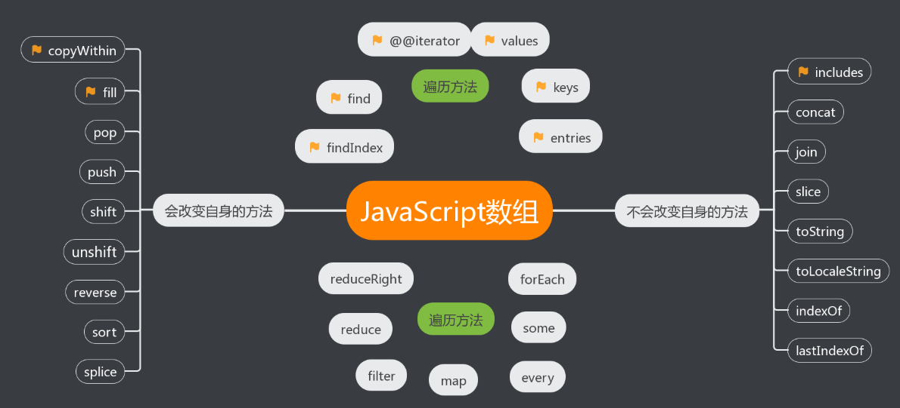

###flex

[文档](https://zhuanlan.zhihu.com/p/25303493)

小程序使用flex布局

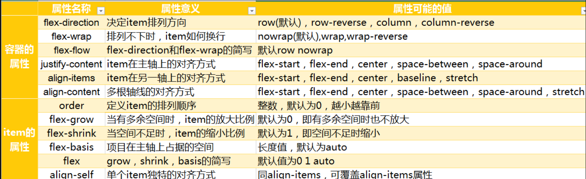

```css
需要一个容器 display:flex
flex-direction (元素排列方向)
    row, row-reverse, column, column-reverse
flex-wrap (换行)
    nowrap, wrap, wrap-reverse
flex-flow (以上两者的简写)
    flex-direction || flex-wrap
justify-content (水平对齐方式)
    flex-start, flex-end, center, space-between, space-around
align-items (垂直对齐方式)
    stretch, flex-start, flex-end, center, baseline
align-content (多行垂直对齐方式)
    stretch, flex-start, flex-end, center, space-between, space-around
```

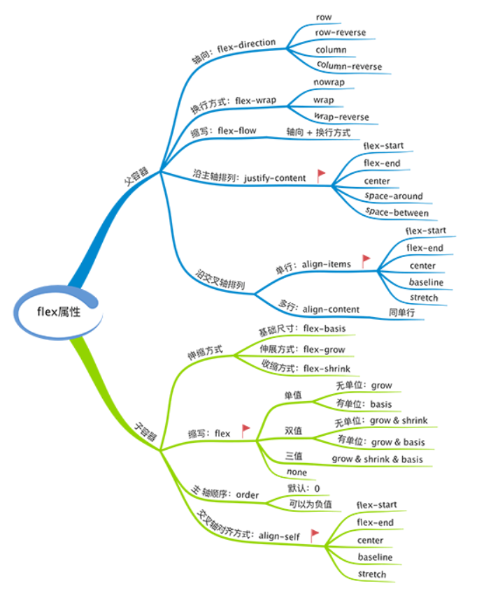 

### 递归的本质是栈的读取

> 在算法中我们会遇到很多递归实现的案例,所有的递归都可以转换成非递归实现,
>
> 其转换的本质是:递归是解析器(引擎)来帮我们做了栈的存取,非递归是手动创建栈来模拟栈的存取过程
>
> 递归组件可以转换成扁平数组来实现:
>
> **更改DOM结构成平级结构,点击节点以及节点的视觉样式通过操作总的list数据区实现**
>
> **然后使用虚拟长列表来控制vue组组建实例创建的数量**

### 性能优化

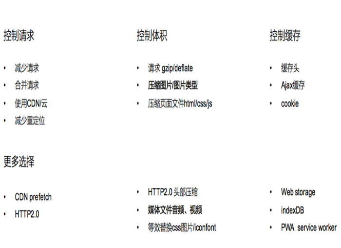

> 减少DNS查找,避免重定向
>
> ```js
> DNS:负责将域名URL转化为服务器主机IP
> DNS查找流程：首先查看浏览器缓存是否存在，不存在则访问本机DNS缓存，再不存在则访问本地DNS服务器。所以DNS也是开销，通常浏览器查找一个给定URL的IP地址要花费20-120ms，在DNS查找完成前，浏览器不能从host那里下载任何东西。 
> 当客户端的DNS缓存为空时,DNS查找的数量与WEB页面中唯一主机名的数量相等,所以减少唯一主机名的数量就可以减少DNS查找的数量
> ```

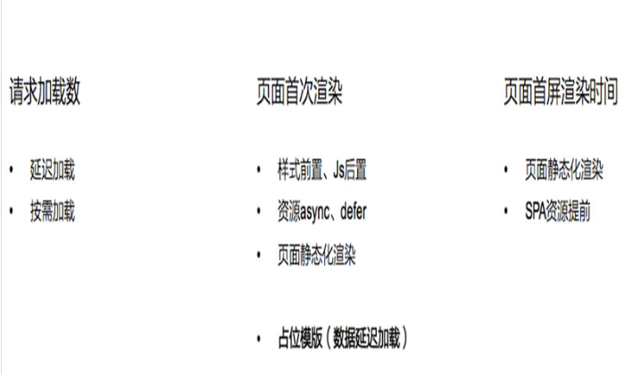

> 资源async  defer
>
> **defer**
>
> 如果script设置了该属性,则浏览器会异步的下载该文件,并且不会影响后续DOM的渲染
>
> 如果有多个设置了`defer`的`script`标签存在，则会按照顺序执行所有的`script`； `defer`脚本会在文档渲染完毕后，`DOMContentLoaded`事件调用前执行。 
>
> ```js
> <script defer src='1.js'></script>
> <script>
>     window.addEventListener('DOMContentLoader',function(){
>     console.log('DOMContentLoader')
> })
>  </script>
> ```
>
> **async**
>
> `async`的设置，会使得`script`脚本异步的加载并在允许的情况下执行 `async`的执行，
>
> 并不会按着`script`在页面中的顺序来执行，而是谁先加载完谁执行。 
>
> 推荐使用场景
>
> > defer 如果你的脚本代码依赖于页面中的DOM元素(文档是否加载解析完毕),或者被其他脚本文件依赖
> >
> > * 评论框    代码语法高亮

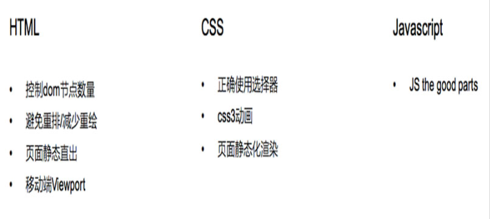

> 页面静态直出
>
> * 就是浏览器直接输出渲染好数据的html页面(简称直出)
> * 直出就是需要node.js的支持,服务器上的浏览器渲染好的东西,直接输出给客户端的浏览器
> * 简单来说,就是直接把配件选好,让店家帮忙组装器,一次性发过来,就是直出这个道理

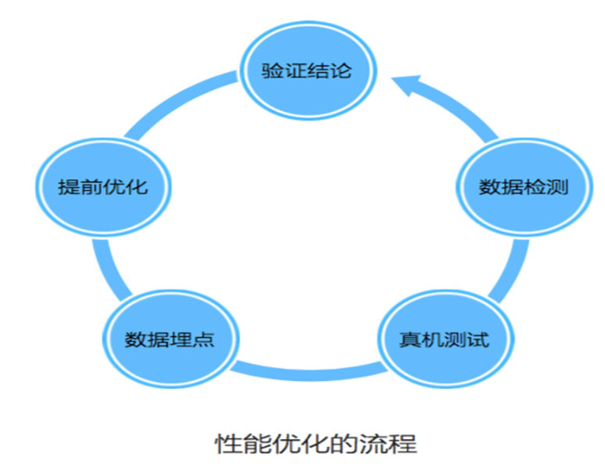

### [重读《JavaScript高级程序设计》](http://reng99.cc/2018/03/01/javascript-high-level/)


###arguments对象是类数组

> apply()方法接受两个参数:一个是运行函数的作用域,另一个是参数数组,这个参数数组可以是Array实例,也可以是arguments对象(类数组对象)

```js
function sum(num1 , num2){
	return num1 + num2;
}
function callSum1(num1,num2){
	return sum.apply(this,arguments); // 传入arguments类数组对象
}
function callSum2(num1,num2){
	return sum.apply(this,[num1 , num2]); // 传入数组
}
console.log(callSum1(10 , 10)); // 20
console.log(callSum2(10 , 10)); // 20
```

### Object.create()和new object()和{}的区别

> Object.create()
>
> * Object.create(null) 创建的对象是一个空对象，在该对象上没有继承 Object.prototype 原型链上的属性或者方法
>
> * Object.create()方法接受两个参数:Object.create(obj,propertiesObject) ;
>
>   obj:一个对象，应该是新创建的对象的原型。
>
>   propertiesObject：可选。该参数对象是一组属性与值，该对象的属性名称将是新创建的对象的属性名称，值是属性描述符（这些属性描述符的结构与[`Object.defineProperties()`](https://developer.mozilla.org/zh-CN/docs/Web/JavaScript/Reference/Global_Objects/Object/defineProperties)的第二个参数一样）。注意：该参数对象不能是 [`undefined`](https://developer.mozilla.org/zh-CN/docs/Web/JavaScript/Reference/Global_Objects/undefined)，另外只有该对象中自身拥有的可枚举的属性才有效，也就是说该对象的原型链上属性是无效的。
>
>   ```js
>   var o = Object.create(Object.prototype, {
>     // foo会成为所创建对象的数据属性
>     foo: { 
>       writable:true,
>       configurable:true,
>       value: "hello" 
>     },
>   ```
>
>   

###[面试](https://juejin.im/post/5c64d15d6fb9a049d37f9c20)

### 跨标签页通讯??

### 浏览器下事件循环

> 事件循环是指:执行一个宏任务,然后执行清空微任务列表,循环再执行宏任务,再清微任务列表

### 从输入 url 到展示的过程

* DNS解析

* TCP三次握手

* 发送请求,分析url,设置请求报文(头,主体)

* 服务器返回请求的文件(html)

* 浏览器渲染

  * html parse==>DOM Tree

    > 标记化算法,进行元素状态的标记
    >
    > dom树构建

  * css parser==>Styel tree

    > 解析css代码,生成样式树

  * attachment==>Render Tree

    > 结合dom树与style树,生成渲染树

  * layout:布局

  * GPU painting:像素绘制页面

### 内存泄露

* 意外地**全局变量**,无法被回收
* 定时器:未被正确关闭,导致所引用的外部变量无法被释放
* 事件监听:没有正确销毁
* 闭包:会导致父级中的变量无法被释放
* dom引用: dom元素被删除时,内存中的引用未被正确清空

### 剑指offer??

###描述创建一个对象的过程

* 新生成了一个对象
* 链接到原型
* 绑定this
* 返回新对象

### JQ的attr和prop的区别

从源码来看:

* `attr`是通过`setAttribute`和`getAttribute`来设置的,使用的是DOM属性节点
* `prop`是通过`document.getElementById(el)[name]=vlaue`来设置的,是转化为js对象的属性
* 通过设置`checked，selected，readonly，disabled`等的时候使用prop效果更好，减少了访问dom属性节点的频率。 
* 一般如果是标签自身自带的属性，我们用prop方法来获取；如果是自定义的属性，我们用attr方法来获取。 

### DOM节点的attr和property有何区别

* property只是一个JS对象的属性的修改 
* Attribute是对html标签属性的修改 

### 获取当前时间

```js
new Date().toISOString().slice(0,10)
```

### toLocaleString()

> 方法返回一个字符串表示数组中的元素,数组中的元素使用各自toLocaleString方法转成字符串,这些字符串将使用一个特定语言环境的字符串 
>
> ```js
> var number = 1337;
> var date = new Date();
> var myArr = [number, date, "foo"];
> var str = myArr.toLocaleString(); 
> console.log(str); 
> // 输出 "1,337,2019/2/15 下午8:32:24,foo"
> 
> let a=3500
> a.toLocaleString() //3,500
> ```
>
> 

###写React/Vue项目时为什么要在组件中写key,其作用是什么

> key的作用是为了在diff算法执行时更快的找到对应的节点,提高diff速度

### undefined.toString()

和null.toString()一样也是报错的,原始数据类型存储的是值,是没有函数可以调用的

### 构造函数的返回值

> * 没有返回值则按照其他语言一样返回实例化对象
>
>   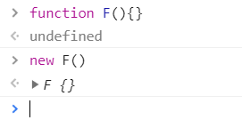
>
> * 若有返回值则检查其返回值是否为**引用类型**。如果是非引用类型，如基本类型（string,number,boolean,null,undefined）则与无返回值相同，实际返回其实例化对象。 
>
> * 若返回值是引用类型，则实际返回值为这个引用类型。 

### AMD和Commonjs的理解

> Commonjs是服务器模块的规范,nodejs采用这个规范conmonJS规范加载模块是同步的
>
> 也就是说只有加载完成,才能执行后面的操作,AMD规范则是非同步加载模块,允许指定回调函数
>
> AMD推荐的风格通过返回一个对象作为模块对象,
>
> commonJS的风格通过对module.exports或者exports的属性赋值来达到暴露模块对象的目的
>
> AMD **加载模块完毕可以使用**
>
> CMD require  **加载时执行**

### commonJS中require/exports和ES6中的import/export区别

> commonJS 模块的重要特性是**加载时执行**    (同步导入,值拷贝)
>
> ES6动态引用,import/export 最终都是编译为require/exports (异步导入,导入的值指向同一个内存地址)

### var的存在为什么会被let,const代替

>   var 在全局作用域下声明变量会导致变量挂载在 window 上，其他两者不会 

### 原型继承和class继承

class只是语法糖,本质也是一个函数

比较常用的 构造函数继承,call 继承父级的属性,然后改变new来继承父类的

### 模块化

解决命名冲突

提供复用性

提高代码可维护性

### 立即执行函数

在早期,使用立即执行函数实现模块化是常见手段,通过函数作用域解决了命名冲突,污染全局作用域的问题

### 并发和并行的区别

> 并发是宏观概念,我分别有两个任务,执行两个任务的切换
>
> 并行是微观概念,同时完成多个任务的情况就可以称之为并行

 ### 有一万数据,想让其绑定到页面上

* 文档碎片:遍历数据,把对应的数据和结构都添加到文档碎片中,把文档碎片扎入页面中
* 虚拟DOM:类似REACT框架,基于虚拟DOM以及DIFF算法,也可以优化数据
* 其实本质来讲本来就不能出现一万条数据
* 异步数据加载(分页加载)

> 需要服务器做支持
>
> 客户端向服务器发送一个GET请求,传递给服务器,每页展示的条数,当前要展示的页数等信息
>
> `?lint=20&page=1`  每页展示20条当前第一页
>
> 服务器接收请求后,在所以的数据那第一页的20条数据返回给客户端

### axios

>  parseFloat(code) 进行判断   //code 是整体返回的状态
>
>  [文档](https://juejin.im/post/5b55c118f265da0f6f1aa354#heading-10)
>
>  [跨域](https://www.cnblogs.com/wancheng7/p/8987694.html)
>
>  qs 是url参数转化的js库
>
>  axios封装

### 单线程为什么这么快

1. 纯内存
2. 非阻塞IO
3. 避免线程切换和竞争消耗

### 为什么虚拟dom会提高性能

虚拟dom想当于在js和真实dom中间加了一个缓存,利用dom diff算法避免了不必要的dom操作,从而提高了性能

### es6不理解的

```js
app.model({
  reducers: {
    add() {}  // 等同于 add: function() {}
  },
  effects: {
    *addRemote() {}  // 等同于 addRemote: function*() {}
  },
});
```

### vw  vh

| 单位 | 含义                              |
| ---- | --------------------------------- |
| vw   | 相对于视窗的宽度，视窗宽度是100vw |
| vh   | 相对于视窗的高度，视窗高度是100vh |
| vmin | vw和vh中的较小值                  |
| vmax | vw和vh中的较大值                  |

视图窗口的宽度,vw和%的区别

| 单位  | 含义                                                         |
| ----- | ------------------------------------------------------------ |
| %     | 大部分相对于祖先元素，也有相对于自身的情况比如（border-radius、translate等) |
| vw/vh | 相对于视窗的尺寸                                             |

### vue 生命周期的应用场景

>  create  :进行ajax请求异步数据的获取,初始化数据
>
> mounted: 挂载元素内dom节点的获取
>
> nextTick: 单一事件更新数据后立即操作dom
>
> updated: 任何数据的更新,如果要做统一的业务逻辑处理
>
> watch :监听具体数据变化,并做相应的处理

### flex 两边定宽中间自适应

> 大盒子 flex   left right 给宽  middle 给 flex:1

### Math.max

Math.max(x) 的参数是Number类型,也就是Number(x)

Number(null)=0,Number(undefined)=NaN

也就是类似于强转 +null=0, +undefined=NaN

### if判断的条件

在js中if条件为null/undefined/0/NaN/'' 统统被解释为false,其他都被判断为true