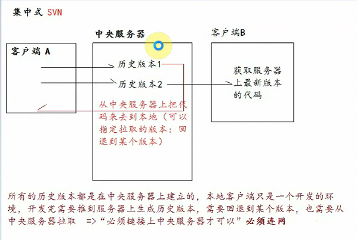
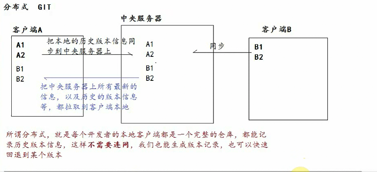
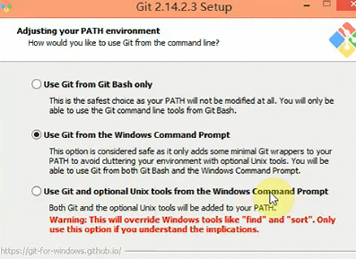
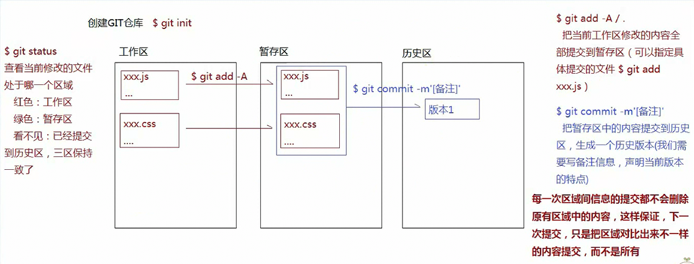
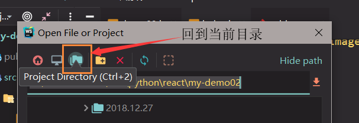
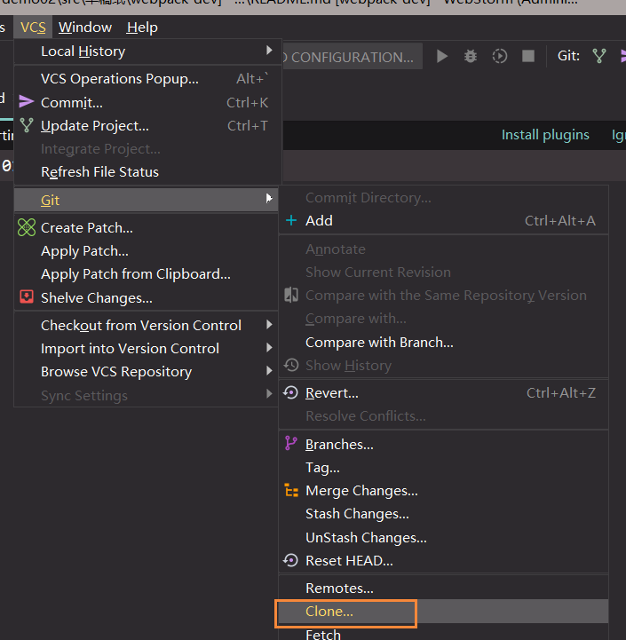
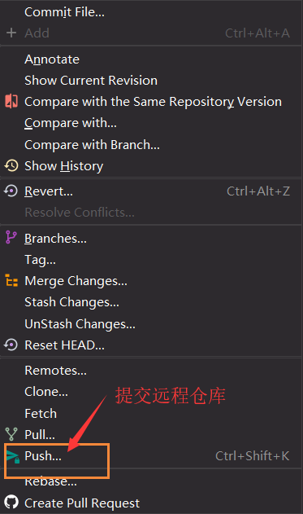

### GIT

分布式版本控制系统

SVN(集中式)/GIT(分布式)





> git 是按照源数据(文件流)来实现文件传输的
>
> svn 是按照文件传输的
>
> 所以git比svn更快

linux 团队开发的git,所以git中的命令大部分是linux命令

```
 ls  -l/-a  查看当前目录结构(-a是可以看见所有的,包含隐藏的)
 clear 清屏
 cd  文件路径(可以拖进来)
 mkdir: 创建文件夹
 touch: 创建空的文件
 vi  :向文件中插入或者管理一些内容
 	i  进入到插入模式
 	ESC+ :WQ,退出内容的插入模式,把刚才编辑的内容进行保存
 echo 向指定的文件中输入内容
 cat 查看文件中的内容
 cp  拷贝
 rm  删除文件 -r (递归删除)  -f 强制删除,一旦删除无
 rm node_modules -rf
 exit 结束
 echo 哈哈哈 > 2.txt
```



选择这个就可以用cmd也能用linux命令

###[终端 Terminal 为 Cmder](https://juejin.im/post/5be84823e51d455d981bebd8)

### git常规流程

```
每个GIT仓库都有三个区:
工作区:写代码
暂存区: 临时存放每一次修改的代码,但是并没有生成历史版本
历史区: 存放所有历史版本的地方(提交到历史区就会生成历史版本)

把暂存区的某一个文件删除
git rm --cached xxx.xx
git rm --cached . -r 撤回暂存区所有内容
只加-f  强制删除
```




### 团队协作开发

基础开发流程

>  首先创建中央仓库(添加协作者)(最好别创建空仓库,因为空仓库没有任何分支)
>
> 创建客户端本地仓库
>
> ```
> git init  创建本地仓库
> git remote add origin '远程仓库git 地址'  让本地仓库和远程保持连接
> git remote -v  查看连接信息
> git remote rm origin 移出本地仓库和远程仓库的连接
> git remote update origin  更新链接通道
> 最简单的方式: 只要把远程仓库克隆岛本地,就想当于创建本地仓库,而且自动连接
> git clone '远程仓库地址' '本地仓库文件夹名字(不写默认是仓库名)'
> ```
>
> 各自和中央服务器同步信息
>
> 推送: `git push origin master `  (每一次push之前最好都pull一下)
>
> 拉取: `git pull origin master` 
>
> 先拉后推就是先与主分支同步,然后回退把历史里面需要拉到本地
>
> 分支
>
> `git stash / git stash pop`  在切换分支的时候,有一部分信息并没有提交成为历史版本,为了防止信息的丢失,我们需要先使用stash保存,然后再基于`stash pop` 还原


### webstorm



克隆仓库注意本地是个空仓库,`.idea`文件也是不可以的



不要将`.idea`文件夹添加到版本库中




代表远程仓库的master分支的最新状态(也就是远程的分支已经和本地同步了)

