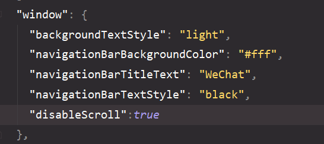

### 入门

webstorm 跳转到哪一行ctrl+G

###  iview UI框架

> `vue init mpvue/mpvue-quickstart 项目名 `
>
> yarn start
>
> 单位rpx   记得不要带空格  12rpx
>
> 不建议使用小程序的生命周期
>
> **activated**  该钩子在服务器渲染期间不被调用   keep-alive组件激活时调用
>
> deactivated  该钩子在服务器端渲染不被调用, keep-alive 组件停用时调用 
>
> 不支持`纯HTML` 小程序里BOM/DOM都是不能用的 v-html是不能用的
>
> 不支持部分复杂的 JavaScript 渲染表达式
>
> 不支持过滤器
>
> 不支持在 template 内使用 methods 中的函数 
>
> **嵌套列表渲染，必须指定不同的索引** 
>
> flex布局
>
> 单位是 1rpx=1物理像素=0.5px;
>
> ### 事件(冒泡事件||非冒泡事件)
>
> * 冒泡事件: bind+事件名
> * 非冒泡事件 catch+事件名
>
> @事件    @tap
>
> 
>
> App.vue没有template标签
>
> 长按`@longpress`
>
> main.js里面
>
> ```js
> export default{
>     config:{
>         "pages": [
>             "pages/index/main",
>             "pages/login/main",
>         ],
>         "window": {
>             "backgroundTextStyle": "light",
>             "navigationBarBackgroundColor": "#fff",
>             "navigationBarTitleText": "WeChat",
>             "navigationBarTextStyle": "black"
>         }
>     }
> }
> ```

> import Notify from '@/static/...'   //@ 是mpvue指向src目录
>
> 记住 新创建的页面要记得 重新yarn start
>
> "^pages/add/add"   页面前带有^符号会自动编辑成首页
>
> 组件中的main.js
>
> ```js
> import Vue from 'vue'
> import App from './index'
> 
> const app = new Vue(App)
> app.$mount();
> export default {
>   config:{
> 
>   }
> }
> 
> ```
>
> 

### 配置sass

```js
npm i sass-loader -D / npm i node-sass -D
在css里面写上 lang='scss'   注意单位还是用rpx
```

> ##  
>
> 注意导入后就别用sass了
>
> 可以放在static文件里面,然后再导入,注意导入的路径`/src/dist`
>
> 为了防止冒泡使用@tap.stop
>
> vue中获取数据放到created 中,mpvue则放到mounted中
>
> ### 不支持vue属性
>
> ```js
> 1. keep-alive
> 2. solt
> 3. class 和 style 的 classObject 和 styleObject 语法。
> 4. filters
> ```

> 页面跳转可以用a标签
>
> 
>
> 记得组件用单标签
>
> 多用计算属性解决问题
>
> 如果使用了vuex辅助函数 
>
> ```js
> 在main.js添加
> 
> import store from './store'
> Vue.prototype.$store = store
> ```
>
> 注意：vue的create,mounted等生命周期钩子函数只执行一次，当组件创建并被挂载到DOM上以后，就不会执行了； 
>
> 当你需要使用wx.createSelectorQuery() 查询某个元素的位置时 ,使用mounted的生命周期,保证位置,如果你希望当页面被关闭时，状态不被保存的话，需要在onUnload方法下处理相关逻辑，或者在onShow时重置data里的状态 
>
> ```js
> export default {
>   config: {
>     usingComponents: {
>       'i-card': '../../../static/iview/card/index'
>     }
>   }
> }
> ```
>
> ## Fly.js 请求
>
> ```js
> 将 component 字段设为 true 可这一组文件设为自定义组件
> ```
>
> 小程序不用a标签的跳转(注意在导航栏使用了就不能用a链接跳转了)解决方法使用 switchTab
>
> ```
> <a href="/pages/index/main" open-type="switchTab">回到首页</a>
> ```
>
> ```js
> <div class="my" @click="toMy"></div>
> //页面的深度不超过5层  如果用wx.redirectTO就可以解决
> methods:{
>     toMy(){
>         wx.redirectTo({
>             url:'/pages/my/main'
>         })
>     }
> }
> ```
>
> 禁止页面下拉(会出现白条)在最下面添加禁止
>
> 
>
> input 标签的name 属性  通过    e.detail.value.xxx 获取