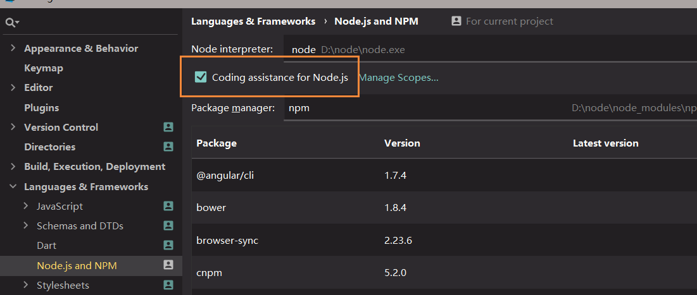
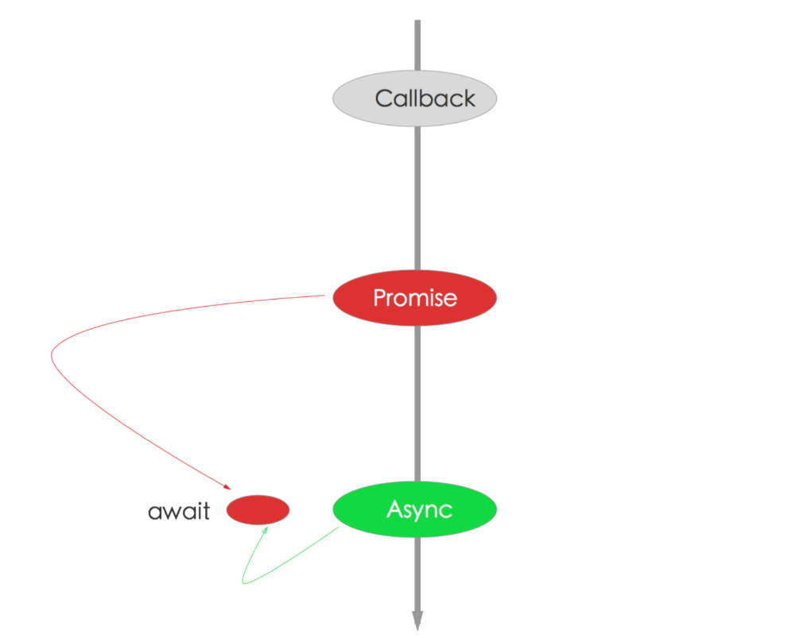
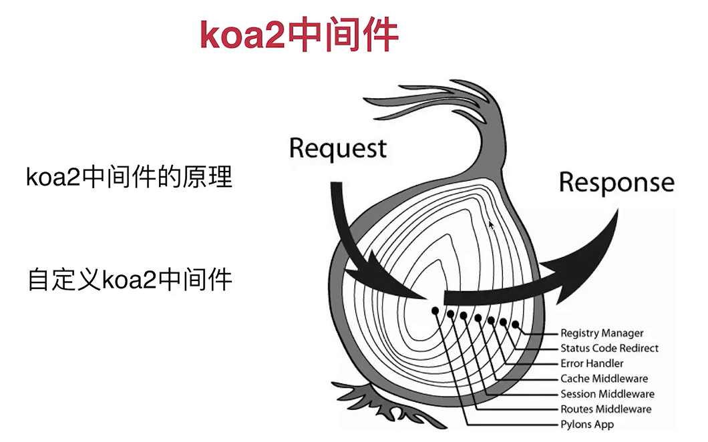
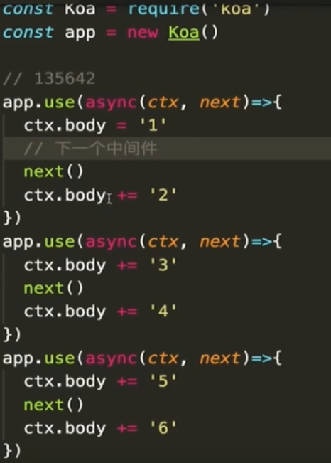

###node

node做后台的优势和特点

> 单线程
>
> 基于V8引擎渲染:快
>
> 异步无阻塞的I/O操作
>
> event-driven 事件驱动:类似于发布订阅或者回调函数

JS运行在客户端浏览器中=>"前端"

* 浏览器给js提供了很多全局的属性和方法

js运行在服务器端的node中

* node也给js提供很多的内置属性和方法

前端(浏览器运行js)是限制I/O操作的

node 本身是基于CommonJS模块规范设计的,所以模块是node的组成

* 内置模块
* 第三方模块
* 自定义模块

CommonJS 模块化设计的思想(AMD/CMD/ES6 module 都是模块设计思想)

* module:代表当前这个模块对象
* module.exports:模块的这个`属性`是用来导入当前模块的属性和方法
* exports: 是内置的一个`变量`,也是用来导出当前模块属性方法,虽然module.exports跟exports不是同一个东西,但是对应的值是同一个的值都是对象
* 但是exports={}  是无法导出内容的,默认和module.exports是同一个堆内存,但是export指向的是新的堆内存,而module.exports不受影响

require导入规则

* `require('./xxx')` 或者`../ ` ` /xxx`   是为了导入自定义的模块,换句话说,要想导入自定义的模块,必须加入路径
* `require('xxx')`  首先到当前项目的node_modules 中查找是否存在这个模块,不存在就在node提供的内置模块(导入第三方或者内置)

### 安装在本地和全局的区别

安装在全局的特点

> 所有的项目都可以使用这个模块'
>
> * 容易导致版本冲突
> * 容易在全局的模块下,不能基于commonJS模块规范调取使用(也就是不能再js中通过require调取使用)

安装在本地的特点

> 只能当前项目使用这个模块
>
>  不能直接的使用命令操作(安装在全局可以使用命令)

node中内置的模块

> fs内置模块
>
> ```js
> let fs=require('fs');
> * fs.mkdir /fs.mkdirSync: 创建文件夹,有Sync的是同步创建,反之没有是异步创建,想实现无阻塞的I/O操作就是异步
> * fs.readdir /fs.readdirSync :读取文件目录中的内容
>     fs.readdir('./',(err,result)=>{
>         if(err){
>             console.log(err);
>             return;
>         }
>         console.log(result)//返回的结果是一个数组
>     })
> * fs.rmdir : 删除文件夹
> * fs.readFile : 读取文件中的内容
> * fs.writeFile : 向文件中写入内容 (覆盖写入: 写入新的内容会替换原有的内容)
> * fs.appendFile : 追加写入新内容,原有的内容还在
> * fs.copyFile : 拷贝文件到新的位置
> * fs.unlink : 删除文件
> 
> let path =require('path');
> path.resolve() //返回当前模块的绝对地址(不包含模块名称)<==> __dirname
> path.resolve(__dirname,'less/tt') //可以把相对路径跟绝对路径进行拼接,(第一个参数是绝对路径,第二个参数是相对的,如果都是绝对路径,以最后一个绝对路径为主)
> ```
>
> url内置模块
>
> * url.parse(url[,flag]):把一个url地址进行解析,把地址中的每一部分按照对象键值对的方式存储起来
>
> http内置模块
>
> ```js
> let server=http.createServer();//创建服务
> server.listen(); // 监听端口
> 
> let url = require('url'),
>     http=require('http'),
>     path=require('path'),
>     fs=require('fs');
> http.createServer((req,res)=>{
>     //req 请求对象
>     //req.url 请求资源的路径地址及路径传参
>     //req.method 客户端请求的方式
>     //req.headers 客户端的请求头信息,它是一个对象
>     let {pathname,query}=url.parse(req.url,true);
>     //res 响应对象 response
>     //把请求的url地址中,路径名称 & 问号传参 分别解析出来
>     // res.write 基于这个方法,服务器端可以向客户端返回内容
>     // res.end 结束响应
>     //res.writeHead 重写响应头信息
>     // res.write('hello world');
>     res.writeHead(200,{
>         //mime  text/plain
>         'content-type':'text/plain;charset=utf-8;'
>     });
>     res.end('hello world');//返回的内容一般是string或者buffer格式的数据
> 
> }).listen(3000,()=>{
>     console.log('成功了');
> });
> ```
>
> 

### console

| 占位符 |  类型  |
| :----: | :----: |
|   %s   | String |
|   %d   | Number |
|   %j   |  JSON  |

###  开启Node提示



### express

[中文文档](https://www.zybuluo.com/bajian/note/444152)

express跟穿串一样，一遍过 

```js
//express   body-parser
//server.js
let express = require('express'),
    app=express();
//导入中间件
let bodyParser = require('body-parser'),
    session = require('express-session');
let port=8686;
//创建服务监听端口
app.listen(port,()=>{
    console.log('成功的回调函数');
});
//静态资源文件处理
app.use(express.static('./static'));
//body-parser 如果是post/put请求,会把基于请求主体传递的信息预先捕获
//如果传递json格式的字符串,基于bodyParser.json()会把它转换为json格式的对象
//如果传递的是url-encoded格式的字符串,会基于bodyParser.urlencoded()把他转换为对象键值对的方式
//把转换后的结果挂载到req.body属性上
app.use(bodyParser.json());
app.use(bodyParser.urlencoded({extended: false}));

//API处理
//express 里面的中间件:在API接口请求处理之前,把一些公共的部分进行提取,
//中间件中就是先处理这些公共的内容,处理完成后,在继续执行接口请求执行
//app.use() 就是中间件(middleware)
app.use('/xxx',(req,res,next)=>{
    //请求path地址中是以'/use'开头的,
    next();//不执行next是无法走到下一个中间件或者请求中的(next就是执行下一个的意思,可能是下一个中间件,也有可能是下一个请求)
});
app.use((req,res,next)=>{
    //所有请求都会走这个中间件,而且中间件执行的顺序是按照书写的先后顺序执行
    next();
});
app.get('/getUser',(req,res)=>{
    /*
    * 当客户端向服务器发送请求,如果请求方式是GET,请求路径是'/getUser'
    * 触发执行,里面有三个参数 req,res,next
    * req.params 存储的是路径参数信息
    * req.path 请求的路径名称
    * req.query 请求的问号参数信息(get请求都是这样传递的信息)
    * req.body 当请求的方式是post,我们基于body-parser中间件处理,会把客户端请求主体中传递的内容存放到body属性上
    * req.session 当我们基于express-session中间件处理后,会把session放到这个属性上,基于可以操作session信息
    * req.cookies 当我们基于cookie-parser中间件处理后,会把客户端传递的cookie存放这个属性上
    * req.get()获取指定的请求头信息
    * req.param() 基于这个可以把url-encoded格式字符串
    * res:response 可以共服务器上客户端返回内容
    * res.cookie() 通过此方法可以设置一些cookie信息,通过响应头set-cookie返回客户端,客户端把返回的cookie信息中道本地
    * res.JSON() 向客户端返回json格式的字符串,但是允许我们传递json对象,方法会帮我们转换为字符串然后再返回(自动执行了res.end
    * res.redirect() 响应式重定向的(状态码302)
    * res.render() 只有页面时需要服务器渲染的时候才需要
    * res.send-status() 设置返回的状态码(它是结束响应,把状态对应的信息当成响应主体返回)
    * res.type() 设置响应内容的mime类型
    * res.status()设置响应状态码
    * res.send-file(path)首先把path指定的文件中内容得到,然后把内容返回给客户端浏览器
    * (完成了文件读取和响应两步操作),也会自动结束响应
    * res.send() 你想返回啥随便,也会自动结束响应
    * res.set()设置响应头的
    * */
    res.send({
        message:'ok'
    });
});
app.post('/register',(req,res)=>{
   //get 结束问号传递的信息,可以使用req.query/req.param()
   //post 请求主体传递的信息,此时我们需要一个中间件(body-parser)
    console.log(req.body);//获取的是请求主体内容
});
```

### koa


### [轮询](http://www.zhufengpeixun.cn/plan/html/36.websocket-1.html)

```js
//server.js
const express = require('express');
const path = require('path');
const app=express();
app.get('/',function (req,res) {
    res.sendFile(path.resolve(__dirname,'index.html'));
});
app.get('/clock',function (req,res) {
    res.end(new Date().toLocaleString());
});
app.listen(8080);
//index.html
<div id="clock"></div>
<script>
    setInterval(()=>{
        let xhr = new XMLHttpRequest();
        xhr.open('get', '/clock', true);
        xhr.onreadystatechange=function () {
            document.querySelector('#clock').innerHTML=xhr.responseText;
        };
        xhr.send();

    },1000)
</script>
```

> ajax轮询需要服务器有很快的处理速度和资源

global

* 全局变量
* 一个js文件就是一个模块,就想当于在外面包裹了一个自执行函数
* 在一个模块中var不会给全局对象global
* 一个模块中的this不是global 而是当前模块

__dirname

* 当前文件目录(当前模块所在的绝对路径)
* __filename
  - 当前文件路径(相对dirname来说增加了文件名或者说模块名称)

process(进程)

process.env  配置环境变量

Buffer(缓冲区)

setImmediate  立即执行下一个进程

process.nextLick 在当前进程中最后执行的(属于主队列)

require  导入

exports  导出

cache  缓存机制

module 模块

module.exports 导出当前模块

```js
//宏任务
new Promise(res=>{
   console.log( 'promise')
}).then( ()=>{
    //微任务
    console.log('then')
})
//宏任务
setTimeout(()=>{
    console.log(1)
})
宏任务
	主体script setTimeout setInterval
微任务
	Promise.then	process.nextTick
```

Module

```
每个模块有一个内置对象Module
每个模块有一个exports对象
在模块对象module下有一个属性exports
当我们导入的模块是一个文件夹的时候,就会在文件夹下面找到index文件进行导入
```


Node.js学习重点: Async函数与Promise

1. 中流砥柱：Promise
2. 终极解决方案：Async/Await

CLI

```
`npm init  --yes`   //初始化
npm i comander  	//下载依赖包
npm uninstall <package>命令    //移出某些包
chalk   //颜色
inquire  //交互式命令行工具
```

GUI

```
electron  桌面端
```

Koa  框架(web框架)

Express  框架

```js
npm  i koa
//热重载  supervisor
npm install nodemon -D
npm i supervisor
supervisor  文件名    // 就可以热重载了
客户端从发送请求到看到内容
服务器:接受到请求(request)=>处理请求,生成数据=> 发送数据(response)
Koa: request => middleware=> response

koa 处理了request和response,我们需要做的是注册(编写) middleware

Application
	Content
		Request
		Response
		state :用户数据存储空间
		cookie
koa-static-cache :静态文件代理服务	
const koaStaticCache = require('koa-static-cache');
app.use(koaStaticCache(__dirname+'/static',{
    prefix:'/public',  //如果当前请求的url是以/public
}));
koa-router 路由
const Router =require("koa-router")
coust router=new Router()
com install koa-json
koa-swig:模板引擎
npm i koa-swig
const Swig=require('koa-swig')
cosnt render=Swig(options);
-----



-----

```
### koa-generator

安装` yarn global add koa-generator`

创建项目

>  koa2 项目名



中间件经过两次,一进一出



### nuxt(ssr)

https://www.cnblogs.com/cckui/p/9964171.html


