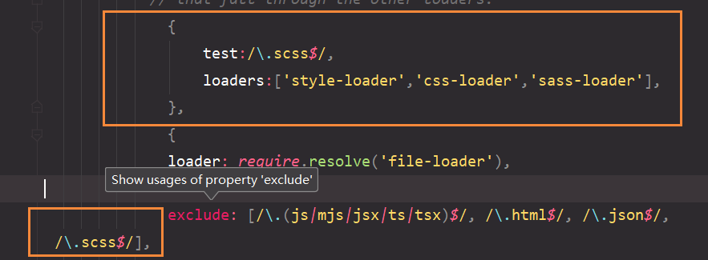
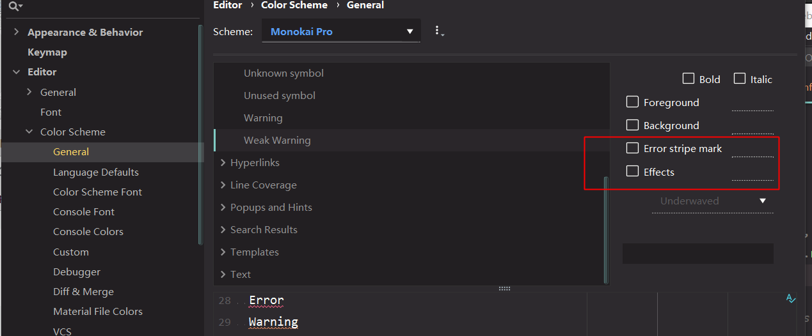
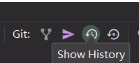
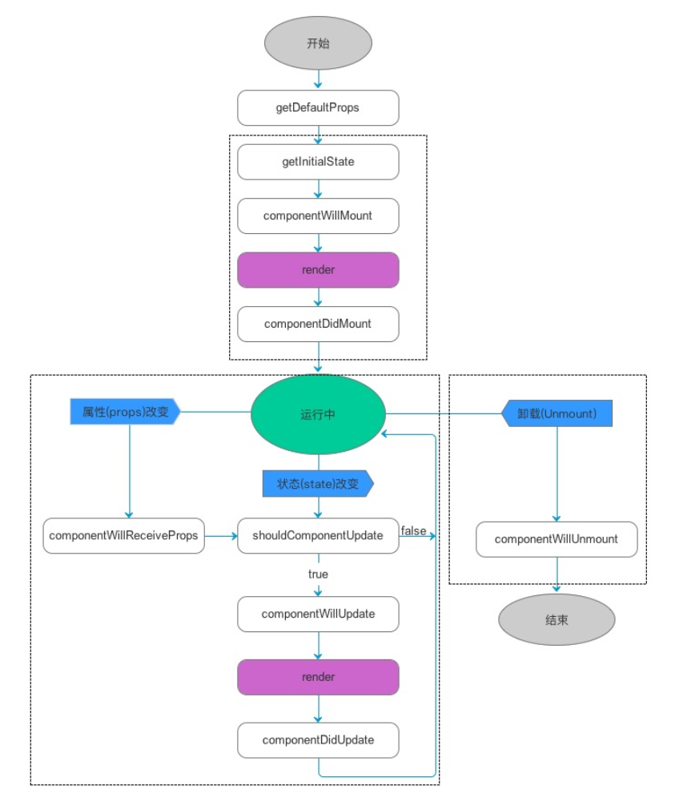
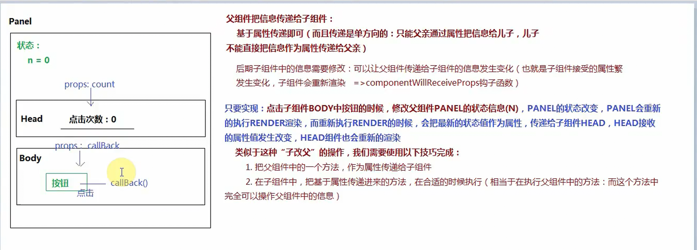
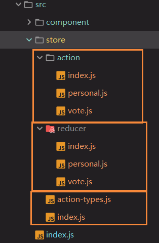
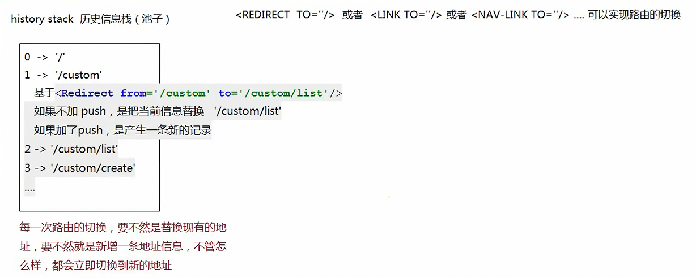
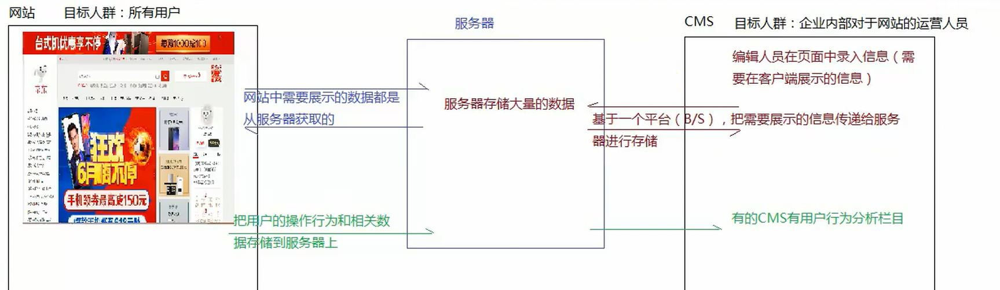
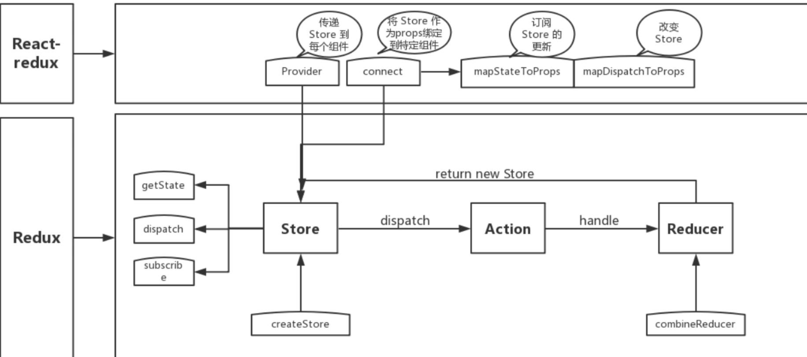

###

###[webstrom自动格式化代码](https://segmentfault.com/q/1010000014002641?sort=created)

命令

```json
js框架 MVC
安装
npm install create-react-app -g
生成项目(项目名npm发包包命名规范 /^[a-z0-9_-]$/)
create-react-app 项目名字
查看全局安装目录
npm root -g
```

文件

```js
public 存放的是当前项目的HTML页面(单页面应用放index.html即可)
html 导入的地址应该写成绝对路径  %PUBLIC_URL%   public的文件夹
	不能用相对路径

src  项目结构最主要的目录,后期的js,路由组件都放这里
	 index.js 是当前目录的入口文件
react-scripts 是webpack的所有配置
  "scripts": {
    "start": "react-scripts start",
    "build": "react-scripts build",
    "test": "react-scripts test",
    "eject": "react-scripts eject"
  }
  执行命令 npm run start /yarn start
```

React脚手架的深入剖析

```js
暴露webpack配置项
为了结构的美化,把所有的webpack配置等都隐藏到了node_modules中(react-script)
yarn eject 
首先会提示确认是否执行eject操作,操作是不可逆转的,一旦暴露出来配置项,就无法再隐藏回去了
报错信息
Remove untracked files, stash or commit any changes, and try again.

如果当前的项目基于git管理,在执行eject的时候,如果还没有提交到历史区内容,需要先提交历史区,然后再eject才可以,否则报错
* 需要在vcs 里面commit 进行git操作
再进行 yarn eject

之后多个两个文件夹
config  存放的是webpack的配置文件
	webpack.config.dev.js 开发环境下的配置项(yarn start)
	webpack.config.prod.js 生产环境下的配置项(yarn build)
scripts   存放的是可执行脚本的js文件
	start.js  yarn start执行的就是这个js
	build.js  yarn  build 执行的就是这个就是
	
配置less
yarn add less less-loader
less 开发和生产都需要改
参考
https://www.cnblogs.com/esofar/p/9631657.html
https://www.cnblogs.com/jayxiangnan/p/9116663.html

set HTTPS=true&&npm start  开启HTTPS协议模式
set PORT=63341  修改端口号

```

### 配置sass

```js
 yarn add node-sass sass-loader -D
如果yarn不能安装就用cnpm
less类似一样的
    {
                  test:/\.scss$/,
                  loaders:['style-loader','css-loader','sass-loader'],
              },
```




```js
 npm install less less-loader --save-dev
```


去掉webstorm 报灰色线

>  Editor -> Colors & Fonts -> General , 在Errors and Warnings里把Wadk Warning里的 两项勾选去掉。 



撤销工作区的修改

`已修改，未暂存（撤销工作区的修改）`

```
git reset --hard
```

react  & react-dom

```js
渐进式框架
我们应该把框架的功能进行拆分,用户想用什么,让其自己自由组合即可
全家桶
渐进式框架N多部分的组合
VUE全局桶(vue-cli/vue/vue-router/vuex/axios(fetch)/vue element(vant))
REACT全家桶: create-react-app/react/react-dom/react-router/redux/react-redux/axios/ant/sage/mobx
react:REACT框架的核心部分,提供了Component类可以共我们进行组件开发,提供了钩子函数(生命周期函数)
所有的生命周期函数都是基于回调函数完成的
react-dom :把JSX语法(REACT特有的语法)渲染为真实DOM(能够展示的结构都叫真实的DOM)

* 不推荐jsx的容器是body
* 只能出现一个根元素
* 给元素设置样式类用的是className而不是class
* style={{}}
* jsx元素设置属性 ,属性值对应大括号中 对象,函数都可以放(也可以放js表达式)
将数据嵌入jsx中,可以嵌入变量或者直接的数据值
let name='xxx';
ReactDOM.render(<div>
                <h1>{name}</h1>
                <h2>{'haha'}</h2>
                </div>)
不能嵌入对象(代指: {} /^$/ 日期对象 函数  数据中的某一项是前面也不行)    
可以嵌入基本类型值(null/undefined/布尔值都是空元素,也就是不显示任何内容)

把JSX(虚拟DOM) 变为真实的DOM(不太理解)--(8,9)

循环创建jsx元素需要设置标识key,并且在当前循环的时候,这个key需要唯一
let name='珠峰培训',
    data=[{id:1,title:'xxx'},{id:2, title: 'xxx'}];
ReactDOM.render(<ul style={{color:'red'}} className={'box clearfix'} OnClick={(ev)=>{
    console.log(ev);
}}>
    {data.map((item,index)=>{
        return <li key={index}>
            {item.id}
            {item.title}
        </li>
    })}
</ul>,root);
使用三元运算符解决判断操作(if和swich是不可以的)
```

React是如何把jsx元素转换为真实的DOM元素并且添加到页面中

> 基于babel/babel-loader: 把jsx语法编译为react.create-Element这种模式
>
> create-Element 至少有两个参数,没有上限
>
> 第一个: 标签名(字符串)
>
> 第二个:属性(没有给元素设置null)
>
> 其他:当前元素的所有子元素内容
>
> 执行create-Element 把传递的参数最后处理成为一个对象
>
> 

React 组件

组件/模块管理 ,就是把一个程序划分为一个个组件来单独处理

优势

* 有助于多人协助开发
* 提高复用性

React创建组件有两种方式

* 函数声明式组件
* 基于继承component类来创建组件

src->component 这个文件夹存放开发的组件

create-element 在处理的时候,遇到一个组件,返回的对象中type就不再是字符串,而是一个函数(类),但是属性还是props中

```js
({
    type:Dialog,
    props:{
        lx:1,
        con:'xxx',
        children:一个值或者一个数组
    }
}
首先判断type是什么类型,如果是字符串就创建一个元素标签,如果函数或者类,就把函数执行,把props中的每一项(包含children传递给函数)
React.Children.map

基于继承component类创建组件

基于create-element 把jax 转换为一个对象,当react渲染这个对象的时候,遇到type是一个函数或者类,不是直接创建元素,而是先把方法执行:
	* 如果是函数式声明的组件,就把它当作普通方法执行(方法中的this是undefiend),把函数返回的jsx元素进行渲染
	* 如果是类声明式的组件,会把房钱类new它执行,创建类的一个实例(当前本次调用组件就是它的实例)执行constructor之后,会执行this.render(),把render中返回的jsx拿过来渲染,所以 类声明式组件,必须有一个render的方法,方法中需要一个jsx元素
	但是不管是哪一种方式,最后都会拿解析出来的props属性对象作为实参给对应的函数或者类
```

创建组件有两种方式"函数式","创建类式"

> 函数式
>
> * 简单
> * 能实现的功能也很简单,只是简单的调取和返回jsx而已
>
> ```js
> ReactDOM.render(<div>
>                     /*单闭合*/
>                 <Vote  title={xxx}/>
>                     /*双闭合*/
>                 <Vote>
>                 <p>11111111</p>
>                 </Vote>
>                 </div>)
> 
> import React from 'react';
> exprot default function Vote(props){
>   return <div className={'penel panel-default'}>
>    {props.Children}
>     {props.Children.map(props,children,item=>{return item;})}
>   </div>
> }
> ```
>
> 
>
> 创建类式
>
> * 操作相对复杂一些,但是也可以实现更为复杂的业务功能
>
> * 能够使用生命周期函数操作业务
>
> * 函数式可以理解为静态组件(组件中的内容调取的时候就已经固定了,很难在修改,而这种类的组件可以基于组件内部的状态来动态更新渲染的内容
>
> * ```js
>   import React from 'react';
>   
>   //ref是react操作DOM的方案
>   //* 给需要操作的元素设置ref(保持唯一性,否则会冲突覆盖)
>   //* 在实例上挂载了refs属性,他是一个对象,存储了所有设置ref的元素(ref值:元素对象)
>   export default class Vote extends React.Component{
>       constructor(props){
>           super(props); //React.Component.call(this)可以把component中的私有实例继承过来,this.props/this.state(this.setState)/this.content/this.refs/this.updater
>           //初始化状态
>           this.state={
>               n:0,
>               m:0,
>           }
>       }
>       //状态处理方式
>       render(){
>           let {title,children}=this.props,
>               {n,m}=this.state;
>           return <div>
>               支持:<span>{m}</span>
>           	反对: <span>{n}</span>
>               </div>
>       }
>       //DOM处理方式
>           render(){
>           let {title,children}=this.props,
>               {n,m}=this.state;
>           return <div>
>               支持:<span ref={'AA'}>0</span>
>           	反对: <span ref={'BB'}>0</span>
>               平局值: <span ref={'CC'}>0</span>
>               </div>
>       }
>       suport=ev=>{
>           this.refs.AA.innerHTML++;
>           this.computed();
>       }
>          suport=ev=>{
>           this.refs.BB.innerHTML++;
>           this.computed();
>       }
>          computed=()=>{
>              let {AA,BB}=this.refs;
>              //然后再进行操作
>          }
>       supprot=ev=>{
>           this.refs.AA.innerHTML++;
>           //使用箭头函数式为了保证方法中this永远是实例本身(无论在哪执行这个方法)
>           //ev.target获取当前操作的事件源(dom元素)
>           this.setState({
>               //修改状态信息并且通知render重新渲染(异步操作:如果有其他代码执行,先执行其他代码,然后再通知状态修改)
>               n:this.state.n+1
>           },()=>{
>               //回调函数一般不用,当通知状态修改完成,并且页面重新渲染完成后,执行回调
>           })
>       }
>   }
>   ```

```
yarn add prop-types
基于这个插件我们可以给组件传递的属性设置规则
设置的规则不会影响页面的,但是会控制台报错
```



> 3. ### **显示当前文件的最新版本信**
>
> 4. ### 返回上一个版本

###生命周期函数(钩子函数)

* 描述一个组件或者程序从创建到销毁的过程,我们可以再过程中基于钩子函数完成一些自己的操作

* [生命周期](https://www.cnblogs.com/gdsblog/p/7348375.html)

* 

  ```js
  基本流程
  constructor 创建一个组件
  componentWillMout  第一次渲染之前
  render 第一次渲染
  componentDidMout 第一次渲染之后
  
  修改流程:当组件的状态数据发生改变(setState)或者传递给组件的属性发生改变
  shouldComponentUpdate 是否允许组件重新渲染(允许则执行后面函数,不允许直接结束即可)
  componentWillUpdate 重新熏染之前
  render 第二次以后重新渲染
  componentDidUpdate 重新渲染之后
  
  属性改变:
  componentWillReceiveProps(nextProps/nextState):父组件把传递给组组建的属性发生改变后出发的钩子函数
  接受最新属性之前,基于this.props.xxx 获取的是原有的属性信息,nextProps存储的是最新传递的属性信息
  shouldComponentUpdate
  	是否允许组件更新, 返回true是允许,返回false 是不在继续走
  	componentWillUpdate:
  	更新之前: 和should一样,方法中通过this.state.xxx 获取的还是更新前的状态信息,方法有两个参数:nextProps/nextState存储的是最新的属性和状态
  	render 更新
  	componentDidUpdate  更新之后
  
  卸载
  componentWillUnmount :卸载组件之前(一般不用)
  ```

  

> React是face-Book 公司开发的一款MVC版js 框架
>
> MVC  Model (数据层)  View(视图层)  controller(控制层)
>
> 核心思想: 通过数据的改变来影响视图的渲染(数据)
>
> 属性的属性是只读的:只能调用组件时候传递进来,不能自己在组建内部修改(但是可以设置默认值和规则)

### 复合组件

1. 复合组件:父组件嵌套子组件

> 传递信息的方式
>
> * 父组件需要把信息传递给子组件
>
>   > **属性传递**:调取子组件的时候,把信息基于属性的方式传递给子组件(子组件props中存储传递的信息),这种方式只能父组件把信息传递给子组件,子组件无法直接的把信息传递给父组件,也就是属性传递信息是单向传递的;
>   >
>   > ```js
>   > export default class Vote extends React.Component {
>   >     static defaultProps = {
>   >         title: '标题不知道,随便投',
>   >     };
>   > 
>   >     constructor(props) {
>   >         super(props);
>   >     }
>   >     render() {
>   >         let {title} = this.props;
>   >         return   <VoteHead title={title}/>
>   > ```
>   >
>   > **双下文传递**:父组件先把需要给后代元素(包括孙子元素)使用的信息都设置好(设置在上下文中),后代组件需要用到父组件中的信息,主动去父组件中调用使用即可
>   >
>   > ```js
>   >  /*  在父组件中
>   >          设置子组件上下文属性类型
>   >          static childContextTypes={}
>   >          获取子组件的上下文(设置子组件的上下文属性信息)
>   >          getChildContext(){}
>   >          */
>   >     static childContextTypes = {
>   >         //设置上下文信息值的类型
>   >         n: PropTypes.number,
>   >         m: PropTypes.number,
>   >     };
>   > 
>   >     getChildContext() {
>   >         //return 是啥就是想当于给子组件设置下上文
>   >         let {count: {n = 0, m = 0}} = this.props;
>   >         return {
>   >             n,
>   >             m,
>   >         }
>   >     }
>   >   /*
>   >     * 子组件设置使用传递进来的上下文类型
>   >     * 设置那个的类型,子组件上下文中才有那个属性,不设置是不允许使用的
>   >     * this.context.xxx
>   >     * 指定的上下文属性类型需要和父组件指定的类型保持一致,否则报错
>   >     * */
>   >     static contextTypes={
>   >         n:PropTypes.number,
>   >         m:PropTypes.number
>   >     };
>   >     constructor(props,context){
>   >         super(props,context);
>   >         this.context.n=1000
>   >     }
>   > ```
>
>   属性VS 上下文
>
>   1. 属性操作起来简单,子组件是被动接受传递的值(组件内的属性是只读的),只能父传子(子传父不行,父传孙也需要处理:子传子,子再传孙)
>
>   2. 上下文操作起来相对复杂一些,子组件是主动获取信息使用的(子组件是可以修改获取的上下文信息,但是不会影响到父组件中的信息,其他组件不受影响),一旦父组件设置了上下文信息,他后代组件都可以直接拿到,不需要不层层的传递
>
>   其实子组件也能修改父组件中的信息
>
>   1. 利用回调函数机制: 父组件把一个函数通过属性或者上下文的方式传递给子组件,子组件要把这个方法执行即可
>
>      (也就是子组件中执行了父组件方法,还可以传递一些值过去),这样组件在这个方法中,想把自己的信息改成啥就改成啥
>
>   ```js
>     /*  在父组件中
>            设置子组件上下文属性类型
>            static childContextTypes={}
>            获取子组件的上下文(设置子组件的上下文属性信息)
>            getChildContext(){}
>            */
>       static childContextTypes = {
>           n: PropTypes.number,
>           m: PropTypes.number,
>           callBack: PropTypes.func
>       };
>   	getChildContext() {
>           //return 是啥就是想当于给子组件设置下上文
>           //只要render重新渲染,就会执行这个方法,重新更新父组件中的上下文信息,如果父组件上下文
>           //信息更改了,子组件在重新调取的时候,会使用最新的上下文信息(render=>context=>子组件调取渲染)
>           let {n, m} = this.state;
>           return {
>               n,
>               m,
>               callBack: this.updateContext
>           }
>       }
>      updateContext = type => {
>           //type :'support'/'against'
>           if (type === 'support') {
>               this.setState({n: this.state.n + 1});
>               return;
>           }
>           return this.setState({m:this.state.m-1})
>       };
>   
>   //子组件
>    <button className={'btn btn-danger'} onClick={
>                   ()=>{
>                       callBack('against');
>                   }
>               }>反对</button>
>   ```
>
>   

2. 平行组件:兄弟组件或者毫无关系的两个组件

> * 让两个平行组件拥有一个共同的父组件
> * 基于redux来进行状态管理,实现组件之间的信息传递
>
> 1. redux可以应用在任何项目中(vue/jq/react的都可以),react-redux才是专门给react项目提供的方案
>
> > ```js
> > yarn add redux react-redux
> > ```
> >
> > ```js
> > //index.js
> > 
> > //创建一个容器: 需要把reducer 传递进来(登记了所有状态更改的信息)
> > import {createStore} from 'redux';
> > /*reducer 作用:
> >     1.  记录了所有状态修改的信息(根据行为标识走不同的修改任务)
> >     2.  修改容器中的状态信息
> >     [参数]
> >         state:容器中原有的状态信息(如果第一次使用,没有原有状态,给一个厨师默认值
> >         action: dispatch 任务派发的时候传递的行为对象(这个对象中必有一个type属性,是操作的行为标识,
> >         reducer 就是根据这个行为标识来识别修改状态信息
> > * */
> > let reducer = (state = {n: 0, m: 0}, action) => {
> >     switch (action.type) {
> >         case 'VOTE_SUPPORT':
> >             //vote_support
> >             state = {...state, n: state.n + 1};
> >             break;
> >         case 'VOTE_AGAINST':
> >             //vote_against
> >             state = {...state, m: state.m + 1};
> >             break;
> >     }
> >     return state;// 只有把最新的state返回,原有的状态才会修改
> > };
> > let store = createStore(reducer);
> > /*
> > * 创建store 提供三个方法:
> > *   dispatch: 派发行为(传递一个对象,对象中有一个type属性,通知reducer修改状态信息
> > *   subscribe: 事件池追加方法
> > *   getState: 获取最新管理的状态信息
> > * */
> > <Vote title={'英格兰对战巴拿马,合力必胜'}
> >           count={{
> >               n: 100,
> >               m: 78
> >           }}
> >           store={store}/>
> > ```
>
> ```js
> //Vote.js
> import React from 'react';
> import PropTypes from 'prop-types';
> import VoteHead from './VoteHead';
> import VoteBody from './VoteBody';
> import VoteFooter from "./VoteFooter";
> 
> 
> export default class Vote extends React.Component {
>     static defaultProps = {
>         title: '',
>         count: {
>             n: 0,
>             m: 0,
>         }
>     };
> 
>     constructor(props) {
>         super(props);
>     };
> 
>     render() {
>         let {store} = this.props;
>         return <section className={'panel-heading'} style={{width: '50%', height: '20px auto'}}>
>             <VoteHead title={this.props.title}/>
>             <VoteBody store={store}/>
>             <VoteFooter store={store}/>
>         </section>
>     }
> }
> ```
>
> ```js
> //VoteBody.js
> 
> import React from 'react';
> import PropTypes from 'prop-types';
> 
> 
> export default class VoteBody extends React.Component {
>     constructor(props) {
>         super(props);
>         //init state
>         let {store: {getState}} = this.props,
>             {n, m} = getState();
>         this.state = {n, m};
>     }
> 
>     componentDidMount() {
>         let {store: {getState, subscribe}} = this.props;
>         let unsubscribe = subscribe(() => {
>             let {n, m} = getState();
>             this.setState({
>                 n,
>                 m
>             })
>         });
>         //unsubscribe(): 当前追加的方法移出,接触绑定的方式
>     }
> 
>     render() {
>         let {n, m} = this.state,
>             rate = (n / (n + m)) * 100;
>         if (isNaN(rate)) {
>             rate = 0;
>         }
> 
> 
>         return <div className={'panel-body'}>
>             支持人数: <span>{n}</span>
>             <br/>
>             反对人数: <span>{m}</span>
>             <br/>
>             支持比率: <span>{rate.toFixed(2) + '%'}</span>
>         </div>;
>     }
> }
> ```
>
> ```js
> //VoteFooter.js
> import React from 'react';
> import PropTypes from 'prop-types';
> 
> export default class VoteFooter extends React.Component {
> 
>     constructor(props, context) {
>         super(props, context);
>     }
> 
>     render() {
>         let {store: {dispatch}} = this.props;
>         return <div className={'panel-footer'}>
>             <button className={'btn btn-success'}
>                     onClick={() => {
>                         dispatch({
>                             type: 'VOTE_SUPPORT'
>                         })
>                     }}
>             >支持
>             </button>
>             &nbsp;&nbsp;
>             <button className={'btn btn-danger'} onClick={
>                 () => {
>                     dispatch({
>                         type: 'VOTE_AGAINST'
>                     })
>                 }
>             }>反对
>             </button>
>         </div>
>     }
> }
> ```

### Redux

redux:进行状态统一管理的类库(适用于任何技术体系的项目)

* 只要两个或者多个组件之间想要实现信息的共享,都可以基于redux解决,把共享的信息到redux容器中进行管理
* 还可以使用redux做临时存储:页面加载的时候,把从服务器获取的数据信息存储到redux中,组件渲染需要的数据,redux中,这样只要页面不刷新,路由切换的时候,再次渲染组件不需要重新从服务器拉取数据,直接从redux中获取即可:页面刷新,从头开始(这套方案代替了localStorage本地存储来实现数据缓存)

Redex管理文件夹

```js
store REDUX管理文件夹
 *   action 派发行为集合
 *          vote.js
 *          ...
 *          index.js 所有分模块行为的汇总
 *        
 *   reducer 管理员集合
 *          vote.js
 *          ...
 *          index.js 所有管理员的集合汇总
 *
 *   action-types.js 所有行为标识
 *   index.js 创建REDUX容器
```




Redex工程化案例

> store/index.js
>
> ```js
> /*
> * store
> *   reducer: 存放每一个模块 reducer
> *       vote.js
> *       personal.js
> *       ...
> *       index.js 把每一个模块reducer最后合并成reducer
> *   action  存放每一个模块需要进行的派发任务(ActionCreator)
> *
> * */
> import {createStore} from 'redux';
> import reducer from './reducer';
> 
> let store = createStore(reducer);
> 
> export default store;
> ```
>
> store/action-types.js
>
> ```js
> /*
> * 管控当前项目中所有redux任务派发中需要的行为标识action-type
> * */
> //vote_support
> export const vote_support = 'vote_support';
> export const vote_against = 'vote_against';
> //personal
> export const personal_init = 'personal_init';
> ```
>
> store/action/
>
> ```js
> index.js
> ======
> /*
> * 合并所有的action-creator,类似于reducer合并,为了防止冲突,合并后的对象是以版块名称单独划分管理
> * */
> import vote from './vote';
> import personal from './personal';
> 
> let action ={
>     vote,
>     personal
> };
> export default action;
> 
> personal.js
> ======
> import * as TYPE from '../action-types';
> 
> let personal = {};
> export default personal;
> 
> vote.js
> ======
> /*
> * 每个版块单独的action-creator :就是把dispatch派发时候需要传递的action对象进一步统一封装处理
> * react-redux中会体验到他的好处
> * */
> import * as TYPE from '../action-types';
> let vote={
>     support(){
>         //dispatch 派发的时候需要传递啥就返回啥即可
>         return {
>             type: TYPE.vote_support
>         };
>     },
>     against(){
>         return {
>             type: TYPE.vote_against
>         }
>     }
> };
> export default vote;
>     
> ```
>
> store/reducer
>
> ```js
> index.js
> =====
> /*
> * 把每一个模块但是设置的reducer函数最后合并成为总的reducer
> * 为了保证合并reducer过程中,每个模块管理的状态信息不会相互冲突
> * redux在合并的时候容器中的状态进行分开管理(一合并reducer时候设置的属性名作为状态
> * 划分的属性名,把各个版块管理的状态放到自己的属性下
> * state={
> *   vote:{
>         n:0,
>         m:0
> *       },
> *   personal:{
> *       baseInfo:{}
> *       }
> *   }
> *   store.get-state().vote.n以后获取状态信息的时候,也需要把vote加上
> * */
> import {combineReducers} from 'redux';
> import vote from './vote';
> import personal from './personal';
> 
> let reducer=combineReducers({
>     vote,
>     personal
> });
> export default reducer;    
> 
> personal.js
> ======
> import * as TYPE from '../action-types';
> export default function vote(state = {
>     baseInfo:{}
> }, action) {
>    //...
>     return state;
> }   
> 
> vote.js
> =====
> //vote版块的reducer
> //      state: 原始redux管理的状态管理(设置初始值)
> //      action: dispatch派发的时候传递的行为对象(type,)
> 
> import * as TYPE from '../action-types';
> //把模块中所有导出的内容全部导出,并重新命名为type
> export default function vote(state = {
>     n: 0,
>     m: 0,
> }, action) {
>     switch (action.type) {
>         case TYPE.vote_support:
>             state = {...state, n: state.n + 1};
>             break;
>         case TYPE.vote_against:
>             state = {...state, m: state.m + 1};
>             break;
>     }
>     return state;
> }    
> ```
>
> src/index.js
>
> ```js
> import React from 'react';
> import ReactDOM from 'react-dom';
> import 'bootstrap/dist/css/bootstrap.css'
> 
> import Vote from './component/Vote/Vote';
> 
> import store from './store';
> 
> 
> ReactDOM.render(<main>
>     <Vote title={'英格兰对战巴拿马,合力必胜'}
>           count={{
>               n: 100,
>               m: 78
>           }}
>           store={store}/>
> </main>, document.querySelector('#root'));
> ```
>
> component/Vote
>
> ```js
> Vote.js
> =====
>     render() {
>         let {store} = this.props;
>         return <section className={'panel-heading'} style={{width: '50%', height: '20px auto'}}>
>             <VoteHead title={this.props.title}/>
>             <VoteBody store={store}/>
>             <VoteFooter store={store}/>
>         </section>
>     }
>     
> VoteBody.js
> =====
> import React from 'react';
> import PropTypes from 'prop-types';
> 
> 
> export default class VoteBody extends React.Component {
>     constructor(props) {
>         super(props);
>         //init state
>         let {n, m} = this.props.store.getState().vote;
>         this.state = {n, m};
>     }
> 
>     componentDidMount() {
>         this.props.store.subscribe(() => {
>             let {n, m} = this.props.store.getState().vote;
>             this.setState({
>                 n,
>                 m
>             })
>         });
>         //unsubscribe(): 当前追加的方法移出,接触绑定的方式
>     }
> 
>     render() {
>         let {n, m} = this.state,
>             rate = (n / (n + m)) * 100;
>         if (isNaN(rate)) {
>             rate = 0;
>         }
> 
> 
>         return <div className={'panel-body'}>
>             支持人数: <span>{n}</span>
>             <br/>
>             反对人数: <span>{m}</span>
>             <br/>
>             支持比率: <span>{rate.toFixed(2) + '%'}</span>
>         </div>;
>     }
> }    
> 
> VoteFooter.js
> =====
>     import React from 'react';
> import PropTypes from 'prop-types';
> import action from '../../store/action';
> 
> export default class VoteFooter extends React.Component {
> 
>     constructor(props, context) {
>         super(props, context);
>     }
> 
>     render() {
>         let {store: {dispatch}} = this.props;
>         return <div className={'panel-footer'}>
>             <button className={'btn btn-success'}
>                     onClick={() => {
>                        this.props.store.dispatch(action.vote.support())
>                     }}
>             >支持
>             </button>
>             &nbsp;&nbsp;
>             <button className={'btn btn-danger'} onClick={
>                 () => {
>                     this.props.store.dispatch(action.vote.against())
>                 }
>             }>反对
>             </button>
>         </div>
>     }
> }
> ```
>

### react-redux

> react-redux 是把redux进一步封装,适配react项目,让redux操作更简洁,store文件夹中内容和redux一模一样
>
> 在组件调取使用的时候可以优化一些步骤
>
> 1. Provider 根组件
>
>    * 当前整个项目都在Provider组件下,作用就是把创建的store可以供内部组件使用(基于上下文)
>    * Provider 组件中只允许出现一个组件
>    * 把创建的store基于属性传递给Provider(这样后代组件中都可以使用这个store)
>
> 2. connect 高阶组件
>
>    * 相对传统的redux,我们做的步骤优化
>
>    * 导出的不在是我们创建的组件,而是基于connect构造后的高阶组件
>
>    * ```js
>      export default connect([mapStateToProps],[mapDispatchToProps])(自己创建的组件)
>      ```
>
>    * 以前我们需要自己基于subscribe向事件池追加方法,以达到容器状态信息改变,执行我们追加的方法,重新渲染组件的目的,但是现在不用了,react-redux帮我们做了这件事:'所有用到redux容器状态信息的组件,都会向事件池中追加一个方法,当状态信息改变,通知方法执行,把最新的状态信息作用属性传递给组件,组件的属性值改变值改变了,组件也会重新渲染'
>
>    * ```js
>      //把redux容器中的状态信息遍历,赋值给当前组件的属性(state)
>      let mapStateToProps=state=>{
>          //state就是redux容器中状态信息
>          //我们返回的是啥,就把它挂载到当前组件的属性上(redux存储很多信息,我们想用啥就返回啥即可)
>          return {
>              ...state.vote
>          }
>      
>      };
>      //把redux的dispatch 派发行为遍历,也复制给组件的属性(ActionCreator)
>      let mapDispatchToProps=dispatch=>{
>          //dispatch:store中存储的dispatch方法
>          //返回的是啥,就想当于把啥挂载到组件的属性上(一般我们挂载一些方法,这
>          // 些方法完成dispatch派发信息
>          return {
>              init(initData) {
>                  dispatch(action.vote.init(initData));
>              }
>          }
>      };
>      export default connect([mapStateToProps],[mapDispatchToProps])(VoteBase)
>      =======================
>      export default connect({state=>({...state.vote})},action.vote)(VoteBase)
>      react-redux把action-creator中编写方法(返回action对象的方法),自动构造dispatch派发任务的方法,也就是mapDispatchToProps这种格式
>      ```
>
>
> 
>
> 

[todo](file:\H:\珠峰\2018年第二期源码、笔记\2018年第二期源码、笔记\WEEK12\day2)实例

### 单页面应用(SPA)多页面应用(MPA)

* 多页面应用(MPA)

  > 一个项目由很多页面组成,使用这个产品,主要就是页面之间的跳转(pc端多页面应用居多);
  >
  > 基于框架开发的时候,需要在webapck中配置多入口,每一个入口对应一个页面;

* 单页面应用(SPA)

  > 只有一个页面,所有需要展示的内容都在这一个页面中实现切换,webapck只需要配置一个入口即可
  >
  > 移动端单页面应用居多或者pc端系统类也是单页面应用为主

* 如何实现单页面应用

  > 弊端: 由于首页中的内容包含了所有模块的信息,所以第一次加载速度很慢
  >
  > 解决vue/react 实现模块化组件化开发,基于他们提供的路由实现SPA单页面应用,基于webpack打包

### 路由

`yarn add react-router-dom`

BrowerRouter

> 浏览器路由
>
> 基于H5中history API(pushState,replaceState,popstate)来保持url和ui的同步
>
> 真实项目中应用不多,一般只有当前是基于服务器渲染的,我们才会使用浏览器路由
>
> ```js
> <BrowserRouter basename="/calendar">
>   <Link to="/today" />
> </BrowserRouter>
> //最后呈现的地址  /calendar/today
> ```
>
> basename:string 
>
> * 所有位置的基准URL,basename的正确格式是前面有一个斜杠,但是尾部不能有
>
> getUserConfirmation:func  (**这个有点不太懂**)
>
> * 用于确认导航函数,默认使用`window.confirm` 
>
>   ```js
>   // 使用默认的确认函数
>   const getConfirmation = (message, callback) => {
>     const allowTransition = window.confirm(message)
>     callback(allowTransition)
>   }
>   <BrowserRouter getUserConfirmation={getConfirmation}/>
>   ```
>
>   keyLength:number
>
>   *  location.key的长度,默认是6
>   *  `<BrowserRouter keyLength={12} />`
>
>   children:node
>
>   单个子元素
>
> 

HashRouter

> 哈希路由
>
> 真实项目中(前后端分离的项目:客户端渲染),我们经常使用哈希路由来完成的
>
> 基于原生js构造了一套类似于history API的机制,每一次路由切换都是基于window.location.hash 完成的
>
> * hash-router只能出现一个子元素
>
> route
>
> * path:设置匹配地址,但是默认不是严格匹配,当前页面哈希地址只要包含完整的它(内容是不变的,都能匹配上)
>   * path='/'  和它匹配的只有要斜杆就可以
> * component :一旦哈希值和当前router的path相同了,则渲染component执行的组件
> * exact: 让path的匹配严谨一些
> * strict:不常用,但是要要加`/`
> * render: 权限校验,渲染组件之前验证是否存在权限,不存在做一些特殊处理
>
> ```js
>  Switch组件可以解决这个问题,和switch case 一样,只要有一种校验成功,就不再向后校验  
> <HashRouter>
>         <Switch>
>             <Route path={'/'} exact component={A}>AAA</Route>
>             <Route path={'/user'} component={B}/>
> 			<Route path={'/pay'}  render={() => {
>                 let flag = localStorage.getItem('flag');
>                 if (flag && flag === 'safe') {
>                     return <C/>
>                 }
>                 return '权限不安全';
>             }}/>
> 			//上述都设置完成后,会在末尾设置一个匹配:以上都不符合的情况下,我们路由地址是违法的
> 			//(不设置path就是匹配所有的地址规则)
>             <Route render={ ()=>{
>             return <div>404</div>
>             }}/>
> 			//重定向
> 			//to [string]
> 			//
> 			<Redirect to='/'/>
>         </Switch>
>     </HashRouter>
> ```
>
> basename:string  所有位置的基准URL

**Link**

> react-router提供的路由切换组件
>
> 原理: 基于Link组件渲染,渲染后的结果就是A标签,To对应的信息最好变成href中的内容
>
> to:string  一个字符串连接
>
> to:object 一个对象的时候,下面属性
>
> - `pathname` - 要链接到的路径
> - `search` - 查询参数
> - `hash` - URL 中的 hash，例如 #the-hash
> - `state` - 存储到 location 中的额外状态数据
>
> ```js
> <Link to={{
>   pathname: '/courses',
>   search: '?sort=name',
>   hash: '#the-hash',
>   state: {
>     fromDashboard: true
>   }
> }} />
> ```
>
> replace:bool(默认是false) 替换history stack中当前的地址(true),还可以追加一个新的地址(false)
>
> react-router中提供的组件必须在`HashRouter`或者`BrowerRouter`里面

**NavLink**

> 跟link类似,都是为了实现路由切换跳转的,不同在于,nav-link组件在当前页面hash和组件对应地址相吻合的时候,会默认给组件加一个active样式,让其选中态
>
> Nav-Link不是点击谁,谁有选中的样式(但是可以路由切换),当前页面哈希后的地址和Nav-Link中的to进行比较,哪个匹配了,哪个才有选中的样式
>
> to和replace等属性都有,用法一样
>
> activeClassName:把默认的active样式改为自己设定的
>
> activeSyle:把匹配的这个nav-link设置行内样式
>
> exact & strict控制匹配的时候是否是严格匹配
>
> isActive: 匹配后执行对应的函数

**with-Router**

> 把一个非路由管控的组件,模拟成为路由管控的组件
>
> ```js
> export default withRouter(connect()(组件));
> 先把nav基于connect高阶一下,返回的是一个代理组件proxy,
> 把返回的代理组件受路由管控
> ```
>
> 受路由管控组件的一些特点:
>
> 1. 只有当前页面的哈希地址和路由指定的地址匹配,才会把对应的组件渲染(with-router是没有地址匹配,都被模拟成为受路由管控的)
> 2. 路由切换的原理,凡是匹配的路由,都会把对应的组件内容,重新添加到页面中,相反,不匹配的都会在页面中移出掉,下一次重新匹配上,组件需要重新渲染到页面中,每一次路由切换的时候(页面的哈希路由由地址改变),都会从一级路由开始重新校验一遍
>
> 
>
> 1. 所有受路由管控的组件,在组建的属性props上默认添加了三个属性
>
>    > history
>    >
>    > * push 向池子中追加一条新的信息,达到切换到指定路由地址的目的
>    >
>    >   `this.props.history.push('/plan')`js中实现路由切换
>    >
>    > * go 跳转到指定的地址(传的是数字 0当前 -1上一个 -2上两个...)
>    >
>    > * go-back =>go(-1) 回退到上一个地址
>    >
>    > * go-forward =>go(1) 向前走一步
>    >
>    > location 获取当前哈希路由渲染组件的一些信息
>    >
>    > * pathname: 当前哈希路由地址 
>    > * search : 当前页面的问号传参值
>    > * state: 基于redirect/link/nav-link中的to,传递的是一个对象,对象中编写state,就可以再location.state中获取
>    >
>    > match :获取当前路由匹配的一些结果
>    >
>    > * params: 如果当前路由匹配的是地址路径参数,则这里可以获取传递参数的值

**Redirect**

> 重定向3xx
>
> to:string 要重定向的地址
>
> to:object 要重定向的位置
>
> ```js
> <Redirect to={{
>   pathname: '/login',
>   search: '?utm=your+face',
>   state: {
>     referrer: currentLocation
>   }
> }} />
> ```
>
> push 重定向会将新的位置推入历史记录
>
> `<Redirect push to="/somewhere/else" />`
>
> ```js
> <Redirect from={'/custom'} to={'/custom/list'}/>
> 当请求的是/custom的时候,直接跳转到/custom/list的路由地址
> ```
>
> 

**qs**

> yarn add qs
>
> 问号传参

### OA和ERP

OA:企业办公管理系统(偏向于有助于日常办公)

ERP: 企业战略资源管理系统(偏向于有管理思想)

* 钉钉
* TAPD
* 今目标
* 纷享销客

CRM:客户管理系统

CMS:内容管理系统(内容分发平台)



IM:即时通信系统

### redux中间件

redux-logger:能够在控制台清晰的展示当前redux操作的流程和信息(原有状态,派发信息,修改后的状态)

redux-thunk: 处理异步的dispatch派发

redux-promise: 在dispatch派发的时候支持promise操作

```js
yarn add redux-logger redux-thunk redux-promise

store/index.js
=====
import {createStore, applyMiddleware} from 'redux';//applyMiddleware导入中间件
import reduxLogger from 'redux-logger';
import reduxThunk from 'redux-thunk';
import reduxPromise from 'redux-promise';
import reducer from './reducer';

let store = createStore(reducer, applyMiddleware(reduxLogger, reduxThunk, reduxPromise));
export default store;

    //=>PROMISE中间件的语法
    create(payload) {
        return {
            type: TYPES.CUSTOM_CREATE,
            //=>传递给REDUCER的PAYLOAD需要等待PROMISE成功，把成功的结果传递过去
            payload: new Promise(resolve => {
                setTimeout(() => {
                    resolve(payload);
                }, 3000);
            })
        }
    }

 create(payload) {
        //=>THUNK中间件的使用语法：在指定执行派发任务的时候，等待3000MS后在派发
        return dispatch => {
            //=>DISPATCH都传递给我们了，我们想什么时候派发，自己搞定即可
            setTimeout(() => {
                dispatch({
                    type: TYPES.CUSTOM_CREATE,
                    payload
                });
            }, 3000);
        };
    }
```

[路由问号传参案例](file:\H:\珠峰\2018年第二期源码、笔记\2018年第二期源码、笔记\WEEK12\day3\src)

### Ant Desion UI框架

> yarn add antd;

### 复习

```js
{React.createElement('a',{href:'http://www.baidu.com'},'Hello')}
//标签  属性   子元素
class HelloMessage extends Component{
    render(){
        let child=React.createElement('li',{className:'ddd'},'我是子页面');
        return <div>Hello {this.props.name}
            {React.createElement('a',{href:'http://www.baidu.com'},'Hello')}
            <br/>
            {React.createElement('ul',{className:'ccc'},child
                )}
        </div>
    }
}
style 属性应该由CSS属性构成的JS对象
* className=''
* style={{fontSize:50,backgroundColor:'red'}}   // zIndex  多峰命名
let styles={
        fontSize:50,
        fontWeight: 'bold',
        backgroundColor: 'red',
      };
{{styles}}

模拟 if
{this.state.tags.length === 0 && '等于0'}     //A为真返回B
   renderTags(){
      if(this.state.tags.length===0) return <p>里面没有元素</p>
      return  <ul>
        {this.state.tags.map((tag,index)=><li key={index}>{tag}</li>)}
        <hr />
      </ul>
    }
{this.renderTags()}

props 属性
state  组件的状态  可以通过 this.setState进行更改

无状态组件
const Hellos = (props) => <div>Hello {props.name}</div>;
<Hellos name={'zhangsan'}/>
有状态组件
//定义一个时间的方法,挂载前开始定时器执行这个方法,卸载后清除挂载前的那个定时器方法
export default class LikeButton extends React.Component {
    constructor(props) {
        super(props);
        //初始化状态
        this.state = {
            data: new Date()
        }
    };
    componentDidMount(){
        this.timerId=setInterval(
            ()=>this.tick()
        )
    }
    //方法
    tick(){
        this.setState({
            data:new Date()
        })
    }
    componentWillUnmount(){
        clearInterval(this.timerId);
    }
    render() {
        return <div>
            <h3>{this.state.data.toLocaleTimeString()}</h3>
        </div>
    }
}

props 对于使用他的组件来说是只读的,只能通过父组件进行修改
state  可以通过 this.setState({  }) 进行修改
注意不要在push pop shift unshift  splice 等方法修改
应该用concat  slice   filter  会放回一个新数组

原生事件
可以再componentDidMount方法中通过addEventListener 绑定浏览器原生事件
componentWillUnmount 方法解除 removeEventListener

在dom 中 设置 ref属性指定一个名称    通过 this.refs.指定名称获取

组合组件

父组件 <Avatar username="pwh" />
    
const Avatar = (props) => {
  return (
    <div>
      //子组件   通过属性传递
      <ProfilePic username={props.username} />
      <ProfileLink username={props.username} />
    </div>
  );
}

循环的时候必须要给key
// arr是在父组件里面声明的arr数组的属性
<ul>{this.props.arr.map((v,i)=>{
                return <li key={i}>{v}</li>
            })}</ul>
组件标签里面包含的子元素通过 this.props.children

<LikeButton username={'pwh'} arr={[1,2,3,4]}>
        <span>12123</span>
        <p>我是一个p标签</p>
    </LikeButton>
props.children通常是一个组件对象的数组,当 props.children是唯一的子元素,那就不是数组

点击事件的内联样式
onClick={  ()=>(console.log(1))}
第二种方法
onClick={this.handleClick}  //记得不要再这里带(e)参数 会报错的
<div onClick={this.handleClick.bind(this)}>${this.props.name}</div>
handleClick=(e)=>{
        console.log(e.target.innerHTML);
    };   //函数建议使用箭头函数的写法

通过  setState来修改state 
this.setState({
      count: this.state.count+1
    })
```

> ```js
> store有四个方法。
> getState： 获取应用当前 state。
> subscribe：添加监听器。
> dispatch：分发 action。更新 state。
> replaceReducer：替换 store 当前用来处理 state 的 reducer。
> 
> 两者的关系是: state=store.getState()
> 
> 常用的是dispatch，这是修改State的唯一途径，使用起来也非常简单。
> import {createState} from 'redux';
> function counter(state=0,action) {
>     switch(action.type){
>         case 'INCREMENT':
>             return state + 1;
>         case 'DECREMENT':
>             return state-1
>         default:
>             return state
>     }
> }
> let store=createState(counter);
> store.subscribe(()=>{
>     console.log(store.getState());
> });
> store.dispatch({type:"INCREMENT"});
> 
> action 唯一的约束仅仅就是包含一个type
> ```
>
> ```js
> 
>     store由redux的createStore(reducer)生成的
> 
>     state通过store.getState()获取的
> 
>     action本质上是一个包含type属性的普通对象
> 
>     改变 state必须dispatch一个action
> 
>     reducer 本质上action.type  来更新的
> 
> 实际上state就是所有reducer返回的汇总
> 
> redux有五个API
> 	createStore(reducer,[])
> 	combineReducers(reducers)
> 	applyMiddleware(...middlewares)
> 	bindActionCreators(actionCreatore,dispatch)
> 	compose(...functions)
> 
> Redux 强调三大基本原则
> * 唯一数据源
> * 保持状态只读
> * 数据改变只能通过纯函数完成
> ```
>
> **过程总结**
>
> > **创建一个操作指令action ->创建一个reducer -> 通过createStore(reducer) 创建一个store**
> >
> > **通过store   dispath(action) 执行reducer 中更新操作,更新store中的数据**
>
> 
>
> 学习redux
>
> 我们大多数人的学习过程一般是——一个循序渐进、逐步迭代的过程，而redux的学习却不是这样，你不看概念，就没法理解示例demo，你不敲示例demo，你就无法完全理解redux的各种基础概念。所以最终发现，redux的最好的学习方式就是，通读一个个的概念，敲出示例demo，再根据示例demo，反过来理解概念，循环往复，总能学的懂！！
> --------------------- 
>
> ```js
> const todo={
>     TOGGLE_TODO:'TOGGLE_TODO',
>     GET_TODOS:'GET_TODOS',
>     toggleTodo({ items,id }) {
>         return {
>             type: todo.TOGGLE_TODO,
>             items:items,
>             id:id
>         }
>     },
>     getTodos({items}){
>         return {
>             type:todo.GET_TODOS,
>             items:items
>         }
>     }
> };
> export default todo;
> 
> // ======
> 
> export default function(state = {默认值}, action) {
>     switch(action.type){
>         case GET_TODOS:
>             return {todos:[...action.items]}
>         case TOGGLE_TODO://deleted=true
>             return {
>                 todos:action.items.map((i)=>{
>                     if(i.id===action.id){
>                         return {
>                             ...i,
>                             status:i.status===0?1:0
>                         }
>                     }else{
>                         return {
>                             ...i
>                         }
>                     }
>                 })
>             }
>         default:
>             return state;
>     }
> }
> 
> const store = createStore(todo);
> ```
>
> 

###redux-hook

### dva.js

> `npm install dva-cli -g`
>
> [入门文档](https://www.jianshu.com/p/8f15f68f2505)
>
> put  用于触发action  `put({type:types.ADD})`
>
> call  用于调用异步逻辑,支持promise
>
> call(第一个参数是一个方法,第二个是传入这个方法的参数)
>
> take 等待dispatch 匹配某个action
>
> yield 方法(传入方法的参数)  //跟上面等同
>
> run() 方法是添加功能  * yield
>
> effect 都是一个简单对象
>
> select  用于从state里获取数据
>
> ```js
> 定义路由
> 
> router/Products.js
> 
> import React from 'react';
> 
> const Products = (props) => (
>   <h2>List of Products</h2>
> );
> 
> export default Products;
> 
> 添加路由
> router.js
> <Route path='/products' exact component={Products}/>
> ```
>
> ```js
> 编写组件
> 
> components/编写组件.js
> 
> 定义Model
> model/..js
>     export default {
>       namespace:'count',
>       state:0,
>       reducers:{
>         add(count){return count+1},
>         minus(count){return count-1}
>       }
>     }
> 在indexjs 载入
>     app.model(require('./models/products').default);
> 
> function IndexPage(props) {
>   return (
>     <div>
>       <h3>      {props.count}</h3>
>       <button key={'add'} onClick={()=>{props.dispatch({type:'count/add'})}}>+</button>
>       <button key={'munus'} onClick={()=>{props.dispatch({type:'count/minus'})}}>-</button>
>     </div>
>   );
> }
> 
> IndexPage.propTypes = {};
> 
> export default connect(({count}) => ({count}))(IndexPage);
> ```
>
> react     react-redux    react-saga
>
> react-sage是更好的处理异步
>
> [dva科普](https://blog.csdn.net/SCU_Cindy/article/details/82432971)
>
> ```js
> function* g1() {
>   yield 2;
>   yield 3;
>   yield 4;
> }
> 
> function* g2() {
>   yield 1;
>   yield* g1();
>   yield 5;
> }
> 
> var iterator = g2();
> 
> console.log(iterator.next()); // { value: 1, done: false }
> console.log(iterator.next()); // { value: 2, done: false }
> console.log(iterator.next()); // { value: 3, done: false }
> console.log(iterator.next()); // { value: 4, done: false }
> console.log(iterator.next()); // { value: 5, done: false }
> console.log(iterator.next()); // { value: undefined, done: true }
>  yield* 表达式用于委托给另一个generator 或可迭代对象。
> ```
>
>  yarn add roadhog
>
> ### UMI.js
>
> > 全局安装umi     cnpm  install -g umi 
> >
> > 路径似路由
> >
> > umi div    执行
> >
> >  `umi g` 创建一些页面 
> >
> > ```
> > umi g page index    是根路径
> > 创建 umi 项目
> > yarn create 项目名
> > ```
>
> ```js
> import React from 'react'
> import dva from 'dva'
> import Counter from './Counter'
> 
> //dva 是一个函数 通过执行它可以拿到一个app 对象
> let app = dva();
> 
> // function delay(ms) {
> //     return new Promise(function (resolve, reject) {
> //         setTimeout(function () {
> //             resolve()
> //         }, ms)
> //     })
> // }
> //
> // function getAmount() {
> //     return fetch('http://localhost:3000/amount').then(res => res.json());
> // }
> 
> //app.router app.start() app.model
> //一个模板就是一个状态,然后把reducer和状态写在一起
> //添加一个模型
> app.model({
>   //命名空间: 因为一个应用会有很多个模型,每一个模型有一个对象
>   namespace: 'counter',
>   //此命名空间的默认状态
>   state: {current: 0, height: 0},
>   //他是用来接收action ,修改仓库状态
>   reducers: {
>     //reducer接受老状态和动作,返回新状态
>     //state老状态(parameter) action:AnyAction
>     add(state, action) {
>       // let current = state.current + action.payload;
>       // return {current, height: current > state.height ? current : state.height}
>       return {current: state.current + 1}
>     },
>     // minus(state, action) {
>     //     return {...state, current: state.current - action.payload}
>     // }
>   },
>   //它是用来执行副作用的,比如说异步操作,调用api接口
>   effects: {
>     //表示这是一个generator effect=redux-saga/effects
>     // * add(action, {call, put}) {
>     //     //表示这是一个generator
>     //     //amount  是接口中的变量  call 调用方法
>     //     let {amount}=yield call(getAmount);
>     //     //type;'方法'
>     //     yield put({type:'add',payload:amount})
>     //     // yield call(delay, 1000);
>     //     // yield put({type: 'minus'})//可以不加前缀,counter/minus/派发其他的可以写
>     // }
>   },
> });
> //参数是一个函数,此应用本身就是要熏染函数的返回值
> app.router(() => <Counter />);
> //本质是启动应用,就是通过app.router获取组件,通过ReactDOM渲染到容器上
> app.start('#root');
> 
> import React from 'react';
> import {connect} from 'dva';
> import './Counter.css';
> 
> class Counter extends React.Component {
>     render() {
>         return (<div>
>             <div className={'container'}>
>                 <p>当前记录{this.props.current}</p>
>                 <button onClick={() => this.props.dispatch({type: 'counter/add'})}>add</button>
>             </div>
>         </div>)
>     }
> }
> 
> export default connect(
>     state => state.counter
> )(Counter);
> 
> ```
>
> 

```js
    ////把redux容器中的状态信息遍历,赋值给当前组件的属性(state)
    let mapStateToProps=state=>{
        //state就是redux容器中状态信息
        //我们返回的是啥,就把它挂载到当前组件的属性上(redux存储很多信息,我们想用啥就返回啥即可)
        return {
            ...state.vote
        }

    };
    //把redux的dispatch 派发行为遍历,也复制给组件的属性(ActionCreator)
    let mapDispatchToProps=dispatch=>{
        //dispatch:store中存储的dispatch方法
        //返回的是啥,就想当于把啥挂载到组件的属性上(一般我们挂载一些方法,这
        // 些方法完成dispatch派发信息
        return {
            init(initData) {
                dispatch(action.vote.init(initData));
            }
        }
    };
    export default connect([mapStateToProps],[mapDispatchToProps])(VoteBase)
    =======================
    export default connect({state=>({...state.vote})},action.vote)(VoteBase)
    react-redux把action-creator中编写方法(返回action对象的方法),自动构造dispatch派发任务的方法,也就是mapDispatchToProps这种格式把redux容器中的状态信息遍历,赋值给当前组件的属性(state)

```


