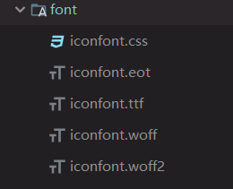
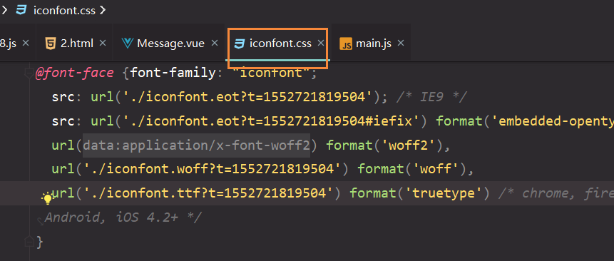

### 使用阿里巴巴图标库

> 下载代码
>
> 
>
> 这五个文件
>
> iconfount.css
>
> 
>
> 改成./路径
>
> ```js
> //main.js
> import './assets/font/iconfont.css'
> ```
>
> 可以直接使用了
>
> ```js
> <Icon custom="icon iconfont
> icon_dingtalk_line
> icon-icon_dingtalk_line" size="small" />
> 注意 记得上上 icon iconfont
> 后面的复制的时候要注意有没有.   
> 因为这样我找了很久没发现是这个原因
> ```

### 栅格布局

| None （自动） | 750px      | 970px      | 1170px     |
| ------------- | ---------- | ---------- | ---------- |
| `xs` | `sm` | `md` | `lg` |

虽然参照Boostrap响应式但是是24栅格

**Layout 布局下面的案例没懂?? 先看后面**

使用Switch 出现命名冲突,报错

```js
Vue.component('i-switch', Switch)
不用Switch  使用i-switch标签
```

### 根据当前路由自动选中对应的菜单

```js
    <Menu :active-name="activeName">
      <MenuItem name="/home" to="/home">Home</MenuItem>
      <MenuItem name="/about" to="/about">About</MenuItem>
    </Menu>
      <router-view></router-view>
  </div>
</template>

<script>
  import {mapState, mapActions} from 'vuex'

  export default {
    data(){
      return{
        activeName:this.$route.path
      }
    },
    watch:{
      '$route'(){
        this.activeName=this.$route.path
      }
    },
```


