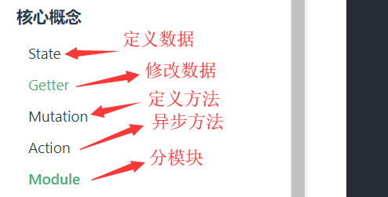

[配置ESlint](https://blog.csdn.net/qq_29329037/article/details/80100450)

### yarn

```javascript
初始化 
yarn init yes
添加依赖
yarn add [package]
升级依赖
yarn upgrade [package]
移出依赖
yarn remove [package]
```

### npm

```
npm i
npm init --yes
npm i gulp-pug gulp-debug gulp-sass
//生产依赖
npm i gulp -P
//开发依赖
npm i gulp -D
//不添加到package.json
npm i gulp --no-save
指定下载版本
npm i vue@2.5.15
卸载package包
npm uninstall vue  //可以使用rm  un   r
全局安装
-g
强制清除缓存 
npm cache clean --fore
```

### bower

```
它是从github下载的
初始化
bower init yes
更新
bower update  包名
卸载
bower uninstall 包名
删除缓存
bower cache clean
添加依赖
bower install 包名
```

### webpack

```js
初始化
npm init -y
    全局安装
    npm install webpack -g  //不推荐
本地安装
npm install webpack webpack-cli -D  //-D 开发依赖

执行webpack
npx webpack  //打包

npm install lodash -D

npm install webpack-dev-server -D
npm install html-webpack-plugin -D

//css
npm install style-loader css-loader -D
webpack.config.js
module: { // 所有 非.js 结尾的第三方文件类型，都可以在 module 节点中进行配置
    rules: [ // rules 是匹配规则，如果 webpack 在打包项目的时候，发现，某些 文件的后缀名是 非 .js 结尾的
      //  webpack 默认处理不了，此时，webpack 查找 配置文件中的 module -> rules 规则数组；
      { test: /\.css$/, use: ['style-loader', 'css-loader'] }
    ]
  }
//less
npm install less-loader less -D
{ test: /\.less$/, use: ['style-loader', 'css-loader', 'less-loader'] }

//sass
npm install sass-loader node-sass -D
{ test: /\.scss$/, use: ['style-loader', 'css-loader', 'sass-loader'] }

//加载图片
npm install url-loader file-loader -D
{ test: /\.jpg|png|gif|bmp$/, use: 'url-loader' }

```

### [vue指令](https://blog.csdn.net/wulala_hei/article/details/85000530)

```
npm install webpack webpack-cli -g
npm install -g vue-cli
vue init webpack vue_demo
cd vue_demo
npm install 
npm run dev
```

### vue

```js
beforeCreate      created  初始化后
beforeMounted		mounted  挂载后
ref  获取dom节点
    <p ref="myp">{{msg}}</p>
    this.$refs.myp获取这个div
由于dom的渲染是异步的 $nextTick 如果数据变化后想获取真实dom中内容,需要等待页面刷新后在去获取
所有的dom操作最后用$nextTick中

全局组件
   Vue.component('my-handsom',{
        template:'<div>{{msg}}</div>',
        data(){
          return {msg:'我很英剧'}
        },
    });
局部组件
	components
	三步取: 创建  注册  使用
	     let handsome={template:'<div>{{msg}}</div>',data(){
       			 return  {msg:'张三'}
        }};
		components:{
            handsome,
            methods:{
                
            }
        }
        在页面上使用这个标签
        
子传父
 let vm=new Vue({
        el:'#app',
        data:{
            money:400,
        },
        methods:{
          things(val){
            this.money=val;
          }
        },
        components:{
            child:{
                props:['m'],
                template:'<div>儿子{{m}} <button @click="getMoney">多要钱</button></div>',
                methods:{
                    getMoney(){
                        this.$emit('child-msg', 800);//触发自己的自定义事件,让父亲方法执行
                    }
                }
            }
        }
    })
    //儿子的自定义方法方法执行父亲的方法,
    <div id="app">
    父亲:{{money}}
    <child :m="money" @child-msg="things"></child>
	</div>
简单的理解子组件传递参数给父组件
    子组件
    <button @click.self="$emit('patch')">加一块钱</button>
	$emit()里面的第一个参数是传递给父组件的自定义方法,第二个参数是一个对象,可以是需要传递给父组件的对象
	父组件
    <User @patch="ttt"/>
        //methods 执行这个方法
        ttt() {
                this.money++
            }
slot

<div id="app">
    <modal>
        <a href='http://www.baidu.com'>去百度</a>
        <p slot="content">是否删除</p>
        <h1 slot="title" @click="fn">是否删除??</h1>
    </modal>
</div>
<!--slot作用 定制模板-->
<!--模板中只能有一个根元素,可以通过元素属性定制模板-->
<!--slot 中可以放置一些默认的内容,如果传递了内容则替换掉-->
<!--如果没有名字的标签默认会放置到default-->
<template id="modal">
    <!-- 这里放的内容属于父级当前模板的,只有属性名是属于组件的-->
    <div>
        <slot name="title">默认标题</slot>
        <slot name="content">这是一个默认标签</slot>
        <slot name="default">这是一个默认标签</slot>
    </div>
</template>
    let vm=new Vue({
        el:"#app",
        data:{

        },
        components:{
            modal
        },
        methods:{
            fn(){
                alert(1)
            }
        }
    })
操作挂载后组件的dom    
    <loading ref="load"></loading>

mounted(){//ref 如果放在组件上,获取的是组建的实例,并不是组件的DOM元素
            // this.$refs.load.hide(); 想操作dom 就加一个$nextTick
            this.$refs.load.$el.style.backgroundColor = 'red';
        },    
        
----------------
<div id="app">
    <input type="radio" v-model="radio" value="home">home
    <input type="radio" v-model="radio" value="list">list
    <!--一般用作缓存:为的是后面路由做准备-->
    <keep-alive>
        <component :is="radio"></component>
    </keep-alive>
</div>
    /* 子组件和父组件同时拥有mounted方法,会先走谁*/
    /*需要等待子组件挂载完成后在触发父组件的挂载*/
    let home = {template:"<div>home</div>"};
    let list = {template:"<div>list</div>"};
    let vm=new Vue({
        el:"#app",
        data:{
            radio:'home'
        },
        components:{
            home,list
        }

向子组件传送数据是通过props实现的
     <foo-component :foo-message="fooMessage"></foo-component>
        fooMessage  是父组件的变量
     /*type  能够指定的类型
        String Number Boolean Function Object Array Symbol
        required 声明这个参数是否必须传入
        default 选项来指定当父组件未传入参数是props变量的默认值
        当type的类型为Array或者Object的时候default必须是一个函数
        自定义函数校对
        * */
      props:{
          fooMessage: {type:[Number,String],required:true}
      },
      template:'<div>{{fooMessage}}</div>'   
      
//props总结      
      props: {
    // fooA只接受数值类型的参数
    fooA: Number,
    // fooB可以接受字符串和数值类型的参数
    fooB: [String, Number],
    // fooC可以接受字符串类型的参数，并且这个参数必须传入
    fooC: {
        type: String,
        required: true
    },
    // fooD接受数值类型的参数，如果不传入的话默认就是100
    fooD: {
        type: Number,
        default: 100
    },
    // fooE接受对象类型的参数
    fooE: {
        type: Object,
        // 当为对象类型设置默认值时必须使用函数返回
        default: function(){
            return { message: 'Hello, world' }
        }
    },
    // fooF使用一个自定义的验证器
    fooF: {
        validator: function(value){
            return value>=0 && value<=100;
        }
    }
}
slot 绑定数据
父组件
因为组件中只能包一个div,所以可以用template包起来
slot-scope是让slot具有私有性
<div slot="wang" slot-scope="item">
            <div v-for="sex in item.data">
                {{sex}}
            </div>
</div>
子组件
<slot name="wang" :data="sexArr"></slot>
 data(){return { sexArr:['男','女']
                    }
                }
父组件与子组件的数据通信
    父组件
     <TodoFooter :class1="class1"/>
     data(){
         return{
             class1:'zhangsan'
         }
     }
     子组件
     props: ['class1']
     
子组件与父组件
$emit
父组件
<button-counter v-on:increment="incrementTotal"></button-counter>	
  methods: {
            incrementTotal () {
                this.total++
            }
        }
子组件
   metheds: {
            incrementCounter () {
                this.$emit('increment')
                this.counter++
            }
        }

--------
    父组件
<custom @childByValue="childByValue"/>
 childByValue(childValue){
        console.log(childValue);
      }
	子组件
<button @click.self="childClick">点我触发</button>
 childClick(){
      this.$emit('childByValue',this.childValue)
     //第一个参数是 @父组件的方法,第二个参数是本组件的数据
      }   
//非组件的传值   
 注册一个空vue
 对象.$emit()
mounted(){
    对象.$on('方法',function(传的参数))
}
不建议,太复杂的建议用vuex

           
vue 消息订阅与发布

缓存路由
    <keep-alive>
            <router-view></router-view>
    </keep-alive>
向路由组件传递数据
$route.params.id
注意是route不是router不要写错了

编程式路由导航
this.$router.push(path) :想当于点击路由链接(可以返回到当前路由界面)
this.$router.replace(path):用新路由替换当前路由(不可以返回到当前路由界面)
this.$router.back() 请求(返回)上一个记录路由
this.$router.go(-1) 请求返回上一个记录路由
```

### 动态组件

```js
vue 中 <component> 用 :is 来挂载不同的组件

   <component :is="currentView"></component>
  <button @click="handleChangeView('A')">A</button>
  <button @click="handleChangeView('B')">B</button>
   <button @click="handleChangeView('C')">C</button>

components:{
                comA:{
                    template:`
                        <div>组件A</div>
                    `
                },
                comB:{
                    template:`
                        <div>组件B</div>
                    `
                },
                comC:{
                    template:`
                        <div>组件C</div>
                    `
                }
            },
            data:{
                currentView:'comA'
            },
            methods:{
                handleChangeView:function(component){
                    this.currentView='com'+component;
                }
            }
```


向路由组件传递数据和编程式路由导航

```js
父组件
<template>
<div>
  <!--<p>{{// $router.params.id}}</p>-->
  <ul>
    <li v-for="(message,index) in messages" :key="message.id">
      <router-link :to="`/home/message/detail/${message.id}`">{{message.title}}</router-link>
      <button @click="pushShow(message.id)">push查看</button>
      <button @click="reqplaceShow(message.id)">replace查看</button>
    </li>
  </ul>
  <button @click="$router.back()">回退</button>
  <hr>
  <router-view></router-view>
</div>

</template>

<script>
    export default {
        name: "Message",
      data(){
          return{
            messages:[],
          }
      },
      methods:{
        pushShow(id){
          this.$router.push(`/home/message/detail/${id}`)
        },
        reqplaceShow(id){
          this.$router.replace(`/home/message/detail/${id}`)
        },
      },
      mounted(){
          //模拟ajax请求从后台获取数据
        setTimeout(()=>{
          const messgesd=[
            {
              id:1,
              title:'message001',
              content:'message001 content...'
            },
            {
              id:2,
              title:'message002',
              content:'message002 content...'
            },
            {
              id:4,
              title:'message004',
              content:'message004 content...'

            }
          ];
          this.messages=messgesd;

        })
      }
    }
</script>

<style scoped>

</style>


子组件
    <template>
      <div>
        <p>{{$route.params.id}}</p>
        <ul>
          <li>id:{{messageDetail.id}}</li>
          <li>title:{{messageDetail.title}}</li>
          <li>content:{{messageDetail.content}}</li>
        </ul>
      </div>

    </template>

    <script>

        export default {
            name: "MessageDetail",
          data(){
              return{
                messageDetail:{
                }
              }
          },
          mounted(){
              setTimeout(()=>{
                const allMessageDetails=[
                  {
                    id:1,
                    title:'message001',
                    content:'message001 content...'
                  },
                  {
                    id:2,
                    title:'message002',
                    content:'message002 content...'
                  },
                  {
                    id:4,
                    title:'message004',
                    content:'message004 content...'

                  }
                ];
                this.allMessageDetails=allMessageDetails;
                const id=this.$route.params.id*1;
                this.messageDetail=allMessageDetails.find(detail=>detail.id===id)
              },1000)
          },
          watch:{
              $route:function (value) {
                const ids=value.params.id*1;
                this.messageDetail=this.allMessageDetails.find(detail=>detail.id===ids)
              }
          }
        }
        
vuex 
npm install vuex -D
```

[vuex 模块](https://www.jianshu.com/p/6b9578831d3e)

[使用模块](https://www.jianshu.com/p/aa022b1c6686)

style中的scoped是限定样式的作用范围

# JavaScript 风格指南

# 代码整洁的 JavaScript

# JavaScript 代码简洁之道

### [vue的路由](file:H:\日常demo练习\公司\python\vue02\vue-demo)

### //5-3

//尚硅谷61

//珠峰女 vue14

//珠峰男 vue06

### vue-cli@3

> yarn global add @vue/cli
>
> vue create 项目名
>
> cd 项目名
>
> yarn serve

为什么data是一个函数:每一个实例的data属性都是独立的,不会相互影响的

### .self修饰符

>  self是只执行子级本身的函数 
>
> .stop和.self的区别，前者是防止事件冒泡，后者则是忽略了事件冒泡和事件捕获的影响。只有直接作用在 该元素上的事件才会被调用 

```js
 <div class="mid" @click.self="getTarget($event)">
```

### 去掉webstrom的单词波浪线

>  光标选中该单词，alt+enter，关闭相应选项即可。 

###vue编译报错

> 注意别再routes/index里面写内联组件const={template:'<div>这种会报错的</div>'}
>
> 在目录下新建一个`vue-config.js`
>
> ```js
> module.exports={
>     runtimeCompiler: true
> };
> ```
>

### vuex的流程

```js
//store.js
import Vue from 'vue';
import Vuex from 'vuex';

Vue.use(Vuex);

const state={
    count:1
};
const mutations={
    increment(state) {
        state.count++
    },
    decrement(state) {
        state.count--
    }
};

const actions={
    increment:({commit})=>{
        commit('increment');
    },
    decrement:({commit})=>{
        commit('decrement');
    }
};
export default new Vuex.Store({
    state,
    mutations,
    actions,
})
//在mian.js导入
在实例上挂载
  <h1>vuex {{$store.state.count}}</h1>
  <button @click.self="increment">增加</button>
  <button @click.self="decrement">删减</button>

 import {mapActions} from 'vuex'
    export default {
        methods:mapActions([
            'increment',
            'decrement'
        ])
    }

====
state
在方法中通过 this.$store.state 获取
在计算属性中通过 this.$store.commit("方法函数")获取
辅助函数 mapState

 import {mapState} from 'vuex';

computed:mapState({
         count:'count',//第一种写法
         sex:(state)=>state.sex,//第二种写法
    	from: function (state) { // 用普通函数this指向vue实例,要注意,取得事data的属性或者computed里面的属性,因为箭头函数没有this
               return this.ddd + ':' + state.from
           },
    //简化
    	from(state) { // 用普通函数this指向vue实例,要注意
                return this.ddd + ':' + state.from
            },
       }),
    
computed: {
  localComputed () { /* ... */ },
  // 使用对象展开运算符将此对象混入到外部对象中
  ...mapState({
    // ...
  })
}
// 在 store 中定义“getter”（可以认为是 store 的计算属性）。就像计算属性一样
//自带的第一个参数是store,第二个参数是getters(是自己,可以访问自己的属性)
//mapGetters辅助函数
 computed: {
  // 使用对象展开运算符将 getter 混入 computed 对象中
    ...mapGetters({
           coneCount:'doneTodoss',
           doneTodo:'doneTodoCounts',
      // ...
    })
  }
可以用数组和对象的形式
    ...mapGetters([
      'doneTodosCount',
      'anotherGetter',
      // ...
    ])
======
更改Vuex的store中的状态唯一方法是提交mutation  

Action
* Action提交的是mutation,而不是直接变更状态
* Action 可以包含任意异步操作
Action 是通过 store.dispatch('里面放着方法',{传入的对象})方法触发的

```



```js
        methods: {
            ...mapActions([
                'increment',
                'decrement'
            ])
        },
        computed: {
            doneTodosCount() {
                return this.$store.state.arr.filter(todo => todo > 2);
            },
            ...mapGetters({
                coneCount: 'doneTodoss',
                doneTodo: 'doneTodoCounts',
            })

        }
    }
    
 ====
     import Vue from 'vue';
import Vuex from 'vuex';

Vue.use(Vuex);

const state = {
    count: 1,
    name: 'dkr',
    sex: '男',
    from: 'china',
    arr: [2, 3, 5, 6, 7],
    todos: [
        {id: 1, text: '...', done: true},
        {id: 2, text: '...', done: false}
    ]
};
const mutations = {
    //大多说第二个参数载荷是一个对象,也可以是一个数字
    increment(state, n) {
        console.log(state.count);
        state.count += n
    },
    decrement(state,payload) {
        state.count-=payload.amount
    }
};

const actions = {
    increment: ({commit}) => {
        commit('increment', 10);
    },
    decrement: ({commit}) => {
        // commit('decrement',{amount:10}); 也可以写成一个包含type属性的对象
        commit({type:'decrement', amount: 10});
    }
};
//getters  getters.js
export default new Vuex.Store({
    state,
    getters: {
        doneTodoss: state => {
            return state.todos.filter(todo => todo.done);
        },
        doneTodoCounts(state, getters) {
            return getters.doneTodoss.length
        }
    },
    mutations,
    actions,
})
```

> 客户端的路由实现方式两种:基于hash和HTML5 history api
>
> vue-router其本质就是:建立并管理url和对应组件之间的映射关系
>
> * ```js
>   配置路由
>   yarn add vue-router
>   新建router/index.js
>   ----
>   import Vue from 'vue'
>   import VueRouter from 'vue-router'
>   
>   //导入自己的路由模块
>   import xxx from '../templates/xxx.vue'
>   
>   Vue.use(VueRouter)
>   export default new VueRouter({
>       routes:[
>           {path:'/xxx',component:xxx,
>            children:[{ //在子路由中父路由要有
>                path:'/子路由',
>                component:xxx,
>                redirect:'/重定向'
>            ]}
>       ]
>   })
>   ----
>   在main.js 导入
>   import router from './router'
>   new Vue({
>       router
>   })
>   
>   页面实现(html模板中)
>   <router-link to=""></router-link>
>   <router-view></router-view> 
>           //动态路径参数 以冒号开头,也就是只有传入动态参数才能进入子页面
>           {path:'/user/:id',component:xxx}
>           对应的值都会设置 $route.params={username:'event'}
>           或者 $route.params={id:1}
>           
>   命名路由,可以给router-link 的to 属性传递一个对象
>        <router-link :to="{ name: 'user', params: { userId: 123 }}">User</router-link> 
>       	router.push({name:'user',params:{userID:123}})
>           两种方法都会把路由导航到 /user/123 路径
>   命名视图
>           有 sidebar (侧导航) 和 main (主内容) 两个视图
>           <router-view class="view one"></router-view>
>           <router-view class="view two" name="a"></router-view>
>           <router-view class="view three" name="b"></router-view>
>           对于同个路由，多个视图就需要多个组件,确保components配置记得加(s)
>           const router = new VueRouter({
>             routes: [
>               {
>                 path: '/',
>                 components: {
>                   default: Foo,
>                   a: Bar,
>                   b: Baz
>                 }
>               }
>             ]
>           })
>   	简写
>            <div>
>             <h1>User Settings</h1>
>             <NavBar/>
>             <router-view/>
>             <router-view name="helper"/>
>           </div>
>   重定向
>       { path: '/a', redirect: '/b' }	
>   	//命名路由
>   	{ path: '/a', redirect: { name: 'foo' }}
>   	//动态返回重定向目标的方法
>       { path: '/dynamic-redirect/:id?',
>             redirect: to => {
>               const { hash, params, query } = to
>               if (query.to === 'foo') {
>                 return { path: '/foo', query: null }
>               }
>               if (hash === '#baz') {
>                 return { name: 'baz', hash: '' }
>               }
>               if (params.id) {
>                 return '/with-params/:id'
>               } else {
>                 return '/bar'
>               }
>             }
>           }
>   	这里return的值是path值,必须是一个已经存在的path才能进行路由重定向。而且这个path不能使自身,如果是自身就变成的死循环了
>   
>   <!-- 带查询参数，下面的结果为 /register?plan=private -->
>   <router-link :to="{ path: 'register', query: { plan: 'private' }}">Register</router-link>
>   ```

### 比较好的vue-router的[文档](https://juejin.im/post/5b82bcfcf265da4345153343)

```js
import User from '@/components/User' //这里可以省略.vue
// 给路由命令,设置的name要唯一
{path:'/user',name:'user',component:User}
//路由懒加载:单页面应用,首页时,加载内容时间过长.运用懒加载对页面组件进行划分,减少首页加载时间
		{
			path:'/Page',
			name:'Page',
			component:resolve => require(['@/components/Page'],resolve)
			//此时component则不需要在第一步import}
```

如果打包报错,就把


###router,routes,route分不清楚

> $router :  路由实例
>
> routes : 指router路由实例的routes API,用来配置多个routes路由对象
>
> $route : 当前路由对象 

vue-router默认使用hash模式,使用url的hash来模拟一个完整的url

路由对象属性介绍`this.$route`  注意不是$router

> **$route.path**: 类型string, 对应当前路由的路径,总是解析绝对路径,'/foo/bar'
>
> **$route.params**: 类型Object ,一个key/value对象,包含动态片段和全匹配片段,如果没有路由,就是一个空对象
>
> **$route.query**: 类型Object,一个key/value,表示url查询参数,对于路径`/foo?user=1` 则有`$route.query.user==1`,如果没有查询参数,则是个空对象
>
> **$route.name** 当前路由的名称,如果有,最好给每个路由对象命名,方便以后编程式导航,不过记住name必须唯一
>
> **$route.hash** 类型: `string` 当前路由的 hash 值 (带 `#`) ，如果没有 hash 值，则为空字符串。
>
> **$route.fullPath** 类型: `string` 完成解析后的 URL，包含查询参数和 hash 的完整路径。
>
> **$route.matched** 类型: `Array<RouteRecord>` 一个数组，包含当前路由的所有嵌套路径片段的**路由记录** 。路由记录就是 `routes` 配置数组中的对象副本 (还有在 `children` 数组)。	
>
> **$route.redirectedFrom** 如果存在重定向，即为重定向来源的路由的名字。

### 别名

```js
//这时,路径'/fxxksky'和'/two-dogs' 都会跳转到A
  routes: [
    { path: '/fxxksky', component: A, alias: '/two-dogs' }
	//当有多个别名时,alias也可以写成数组形式.  alias: ['/two-dogs', 'three-dogs','four-dogs','five-dogs'] 
  ]
```


### params进行配置

- 一个路径参数使用':'冒号进行标记.
- 当匹配到一个路由时,参数就会被设置到`this.$route.params`,可以在每个组件内使用.例如/user/foo在`this.$route.params.id`就为foo

| 模式                          | 匹配路径            | $route.params                        |
| ----------------------------- | ------------------- | ------------------------------------ |
| /user/:username               | /user/evan          | `{ username: 'evan' }`               |
| /user/:username/post/:post_id | /user/evan/post/123 | `{ username: 'evan', post_id: 123 }` |

 ```js
routes:[
	{path:'/user/:shot/foo/:id', component:shotCat}
]

<p>
	<router-link to="/user/shot/foo">/user/shot/foo</router-link>  
		<!--无法匹配到对应路由-->	
	<router-link to="/user/shot/cat/foo">/user/shot/cat/foo</router-link>	
		<!--无法匹配到对应路由-->	
	<router-link to="/user/foo/foo/foo">/user/foo/foo/foo</router-link>	
		<!--成功匹配,$route.params.shot为foo;$route.params.cat为foo;-->	
	<router-link to="/user/shot/foo/cat">/user/shot/foo/cat</router-link>
		<!--成功匹配,$route.params.shot为shot;$route.params.cat为cat;-->	
</p>
<router-view></router-view>
 ```

### vue路由导航

> 导航守卫主要用来通过跳转或取消的方式守卫导航
>
> 
>
> 导航守卫分为: 全局的,单个路由独享的,组件内的三种
>
> **全局路由钩子：beforeEach(to,from, next)、beforeResolve(to,from, next)、afterEach(to,from)；**
>
> **独享路由钩子：beforeEnter(to,from, next)；**
>
> **组件内路由钩子：beforeRouteEnter(to,from, next)、beforeRouteUpdate(to,from, next)、beforeRouteLeave(to,from, next)**
>
> 全局的:路由实例上直接操作的钩子函数
>
>  全局守卫又分全局前置守卫，全局解析守卫 和 全局后置钩子。   
>
> **全局前置守卫**
>
> * 在一个导航被触发时调用，守卫异步解析执行，在所有守卫 resolve 前，导航一直处于等待状态。我们可以使用 router.beforeEach((to, from, next) => { //. . .}) 来注册一个全局前置守卫 
>
> * ```js
>   // 全局路由守卫
>   router.beforeEach((to, from, next) => {
>     console.log('navigation-guards');
>     // to: Route: 即将要进入的目标 路由对象
>     // from: Route: 当前导航正要离开的路由
>     // next: Function: 一定要调用该方法来 resolve 这个钩子。执行效果依赖 next 方法的调用参数。
>       	//首先to和from 其实是一个路由对象,所以路由对象的属性都是可以获取到的(具体可以查看官方路由对象的api文档).
>   	//例如:我想获取获取to的完整路径就是to.path.获取to的子路由to.matched[0].
>       //  next();//使用时,千万不能漏写next!!!
>   	//next()  表示直接进入下一个钩子.
>   	//next(false)  中断当前导航
>   	//next('/path路径')或者对象形式next({path:'/path路径'})  跳转到path路由地址
>   	//next({path:'/shotcat',name:'shotCat',replace:true,query:{logoin:true}...})  这种对象的写法,可以往里面添加很多.router-link 的 to prop 和 router.push 中的选项(具体可以查看api的官方文档)全都是可以添加进去的,再说明下,replace:true表示替换当前路由地址,常用于权限判断后的路由修改.
>   	//next(error)的用法,(需2.4.0+) 
>     const nextRoute = ['home', 'good-list', 'good-detail', 'cart', 'profile'];
>     let isLogin = global.isLogin;  // 是否登录
>     // 未登录状态；当路由到nextRoute指定页时，跳转至login
>     if (nextRoute.indexOf(to.name) >= 0) {  
>       if (!isLogin) {
>         console.log('what fuck');
>         router.push({ name: 'login' })
>       }
>     }
>     // 已登录状态；当路由到login时，跳转至home 
>     if (to.name === 'login') {
>       if (isLogin) {
>         router.push({ name: 'home' });
>       }
>     }
>     next();
>   });
>   .catch(()=>{
>     //跳转失败页面
>     next({ path: '/error', replace: true, query: { back: false }})
>   })
>   //如果你想跳转报错后,再回调做点其他的可以使用 router.onError()
>   router.onError(callback => { 
>         console.log('出错了!', callback);
>       });
>   ```
>
> **全局解析守卫**
>
> * 我们可以通过 router.beforeResolve 注册一个全局守卫。使用方法 router.beforeEach 类似，区别是在导航被确认之前，同时在**所有组件内守卫和异步路由组件**被解析之后，解析守卫就被调用。                 
>
> **全局后置钩子**
>
> 全局后置钩子和全局前置守卫的区别在于没有 next，因此不会改变导航：router.afterEach((to, from, next) => { //. . .})
>
> ##### **路由独享守卫**
>
> 路由独享的守卫是在路由配置上定义 beforeEnter 的，用法与全局前置守卫一致
>
> ```js
>  {
>  path: '/foo',
>  component: Foo,
>  beforeEnter: (to, from, next) => {
>  // ...
>  }
> ```
>
> **组件内的守卫**
>
> ```js
> //在组件内部进行配置,这里的函数用法也是和beforeEach一毛一样
> const Foo = {
>   template: `...`,
>   beforeRouteEnter (to, from, next) {
>     // 在渲染该组件的对应路由被 confirm 前调用
>     // 不！能！获取组件实例 `this`
>     // 因为当守卫执行前，组件实例还没被创建
>   },
>   beforeRouteUpdate (to, from, next) {
>     // 在当前路由改变，但是该组件被复用时调用
>     // 举例来说，对于一个带有动态参数的路径 /foo/:id，在 /foo/1 和 /foo/2 之间跳转的时候，
>     // 由于会渲染同样的 Foo 组件，因此组件实例会被复用。而这个钩子就会在这个情况下被调用。
>     // 可以访问组件实例 `this`
>   },
>   beforeRouteLeave (to, from, next) {
>     // 导航离开该组件的对应路由时调用
>     // 可以访问组件实例 `this`
>   }
> }
> ```
>
> 

 ### vue-router meta

  在路由列表中，每个路由都有一个 meta 元数据字段， 我们可以在这里设置一些自定义信息，供页面组件或者路由钩子函数中使用。

获取meta数据

* $route.meta 获取路由元信息中的数据
* 路由钩子中获取

```js
//全局路由改变前钩子
router.beforeEach((to, from, next) => {
  window.document.title = to.meta.title;
  next();
})
//动态获取
this.$route.meta.title
还有一些太复杂我就不写了
```

### 编程式导航的写法

```js
//字符串
this.$router.push('home')

//对象
this.$ruter.push({path:'home'})

//命名路由
this.$router.push({name:'user',params:{userId:2333}})

//带查询参数,变成/register?plan=private
this.$router.push({path:'register',query:{plan:'private'}})
```

注意:**path和params是不能同时生效的** ,否则params会被忽略掉,使用对象写法进行params传参时,要么就是`path`加冒号`:`,要么就是像上例中的'命名路由'.通过name和params进行传参. 

### router.reqlace

- 用push方法,页面1跳转到页面2,你使用浏览器的后退可以回到页面1
- 用replace方法,页面1被替换成页面2,你使用浏览器的后退,**此时你回不到页面1**,只能回到页面1的前一页,页面0.
- **那什么时候会用到replace呢?** 当你不想让用户回退到之前的页面时,常见于权限验证,验证后就不让用户回退到登录页重复验证

 ```js
<router-link :to="{ name:'shotCat',params:{paramId:'hello'},query:{queryId:'world'}}">helloWorld</router-link> 
<!--此时通过name匹配到路由对象shotCat.-->	 

<router-link :to="{ path:'/shotCat',params:{paramId:'hello'},query:{queryId:'world'}}">helloWorld</router-link> 
<!--此时通过path匹配到路由对象shotCat.但是!!!!!此时`paramId`并不能添加到`$route.params`里,只有`queryId`成功添加到`$route.query`-->
{{$route.params}}和{{$route.query}}进行验证

 ```

### 路由嵌套和单组件多视图

**嵌套路由**:就是父路由嵌套子路由.url上就是/user嵌套两个子路由后就是/user/foo和/uer/bar.用一张图表示就是 


**单组件多视图**:就是一个组件里有多个视图进行展示.即包含有多个`<router-view/>`

### axios

> ```js
> import axios from 'axios'
> import VueAxios from 'vue-axios'
> Vue.use(VueAxios,axios)
> this.axios.get(api).then((response) => {
>   console.log(response.data)
> })
> ```
>
> 

### vue生命周期

> beforeCreate
>
> * el 没有
> * data 没有
> * 事件没有初始化
>
> created
>
> * el 没有
> * data 数据有了
> * 事件 也有了
>
> beforeMount
>
> * el 找到了
> * data 数据有了
> * 事件也有了
>
> mounted
>
> * el:找到了,并且数据渲染进标签了
> * dta:数据有了,被监听
> * 事件有了被监听了
>
> beforeUpdate
>
> updated
>
> beforeDestory

VueRouter的实现原理:是通过监听a标签的描点值,来动态的显示页面的值

#### proxyTable

### v-model.lazy

> 同步输出    简称  防抖
>
> v-model.number  规定输出的数字
>
> v-model.trim  去除空格

### [vue 项目问题](https://juejin.im/post/58c0e882da2f60186d6d4818#heading-4)

> **v-if 解决异步传参组件**
>
> ```js
> ` <mapBox v-if="mapData" :data="mapData"></mapBox>`
> 
> 点击搜索的时候
> 
> let This=this
> this.mapData=false; //重要
> this.$http.post('/api/show..',{参数}).then(
> response=>this.mapData=response.data;
> )
> ```
>
> 还有一些强制刷新的
>
> `$forceUpdate()`
>
> ```js
> this.$nextTick(()=>{
>     
> })
> this.$set()
> ```
>
> **使用$refs调用子组件的方法**
>
> ```js
> <Tree  ref="Tree"></Tree>
> let rules = this.$refs.Tree.方法
> ```
>
> setTimeout
>
> $set()
>
> ### 组件递归实现多级菜单
>
> ```js
> 父组件
> `
>   <div>
>     <Items :msg="msg"></Items>
>   </div>
>  data () {
>       return {
>         msg: [{
>           text: 1,
>           next: [{
>             text: '1-1',
>             next: [{
>               text: '1-1-1',
>               next: [{
>                 text: '1-1-1-1',
>               }],
>             }],
>           }, {
>             text: '1-2', //1-2写在这儿，第二层数据数组中的a[1].text就是‘1-2’
>           }],
>         }, {
>           text: 2,
> 
>         }, {
>           text: 3,
> 
>         }],
>       }
>     },
>     components: {
>       Items,
> 
>     },
> `
> 子组件
>   <ul >
>       <li v-for='(a,index) in msg' @click.stop.self='show=!show' :key="index">
>         {{a.text}}
>         <Items :msg='a.next' v-if='show' ></Items>
>       </li>
>     </ul>
>   export default {
>     name:'Items', //这个必须写
>     props:['msg'],// 父组件传到子组件的数据
>     data(){
>       return {
>         show:false
>       }
>     }
>   }
> ```
>
> **使用watch监听路由参数重新获取数据**
>
> [方法](https://www.cnblogs.com/crazycode2/p/8727410.html)
>
> ```js
> // 监听,当路由发生变化的时候执行
> watch: {
>   '$route':'getPath'
> },
> methods: {
>   getPath(){
>     console.log(this.$route.path);
>   }
> }
> 
> Vue 为你提供了一种方式来声明“这两个元素是完全独立的——不要复用它们”。只需添加一个具有唯一值的 key 属性
> <router-view :key="key"></router-view>
>  
> computed: {
>   key() {
>     return this.$route.name !== undefined? this.$route.name +new Date(): this.$route +new Date()
>   }
> }
> ```
>

###Vue.js 内置的通信手段一般有两种：

- ref：给元素或组件注册引用信息；

- `$parent` / `$children`：访问父 / 子实例。

- ```js
  this.$parent.属性或者方法
  this.$children[0].属性或者方法
  ```

### vue 组件传值provide/inject

```js
以允许一个祖先组件向其所有子孙后代注入一个依赖，不论组件层次有多深，并在起上下游关系成立的时间里始终生效
跟react 上下文特性相似
// A.vue  父组件
export default {
  provide: {
    name: 'Aresn'
  }
}

// B.vue  子组件
export default {
  inject: ['name'],
  mounted () {
    console.log(this.name);  // Aresn
  }
}
```

### 实例还暴露了一些有用的实例属性与方法。它们都有前缀 `### ，以便与用户定义的属性区分开 

### 通过$event 访问原始DOM事件

```js
<button @click.self='warn($event)'>点击我</button>
methods:{
    warn(event){
        event.target.innerHTML
    }
}
```

### prevent是拦截默认事件

```js
@click.prevent.self  会阻止所有的点击
@click.self.prevent  只会阻止对元素自身的点击
```

### 按键修饰符

```js
@keyup.enter="submit"
.enter
.tab
.delete (捕获“删除”和“退格”键)
.esc
.space
.up
.down
.left
.right
```

###根实例可以通过 `$root` 属性进行访问 