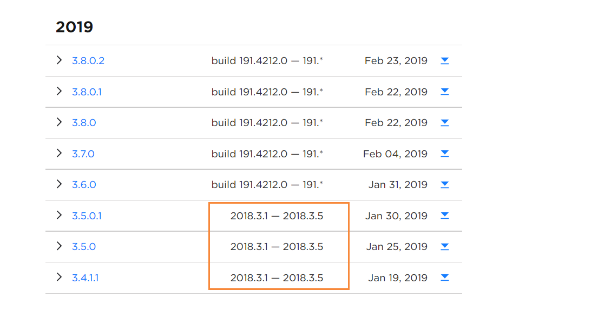
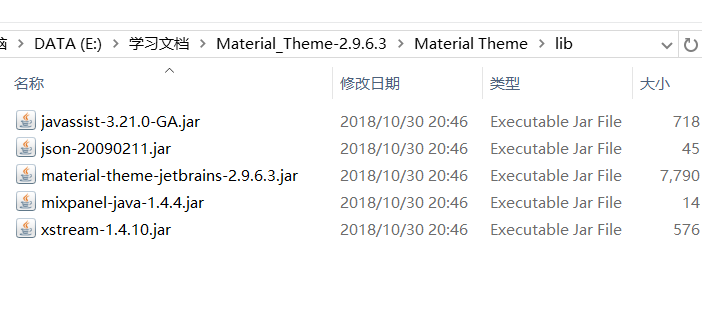
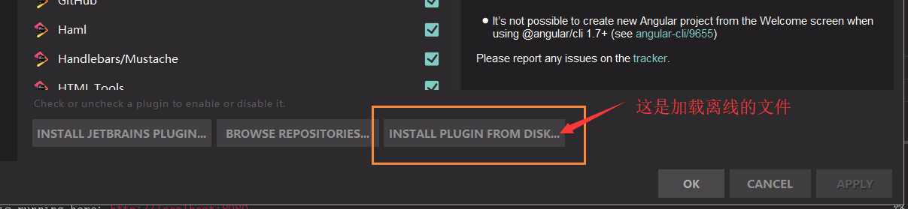
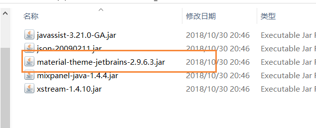

### webstorm离线装载`Material Theme UI`

> 首先说说需求,由于直接用webstorm听说VS挺火的,但是初恋的感觉是其他任何编辑器无法替代的
>
> 瞎说了一些话,新公司内网开发,用的是vscode,但是我还是喜欢用webstorm,连不上网,所以不能装主题
>
> 百度了一圈没有找到解决方法,后来还是请教大佬

### 首先百度搜索`Material Theme UI`

> [找到官网](https://plugins.jetbrains.com/plugin/8006-material-theme-ui)
>
> 注意下载的版本
>
> 不一定最新的就是最好的
>
> 
>
> 要看看自己webstorm的版本对应的下载版本
>
> 没有的话点击下面这个按钮
>
> 
>
> 下载好,解压后
>
> 
>
> 在webstorm=>File=>Settring=>Plugins=>
>
> 
>
> 找到自己解压的目录
>
> 刚开始我也一脸懵逼这有好几个我选哪个呢?
>
> 
>
> 发现这个跟文件很匹配,就选了然后重启webstorm就可以呀
>
> 其实也不是很难,但是说真的有之前还真的不知道,
>
> 不知道你们是不是,习惯了那款主题用其他的就不太喜欢,好啦,完美的解决了问题啦
>
> 