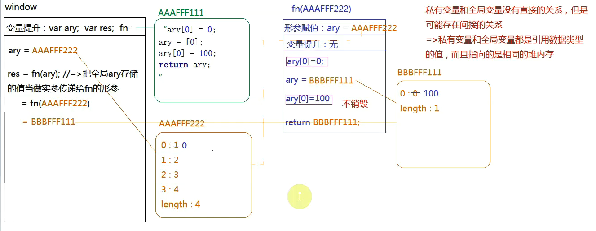
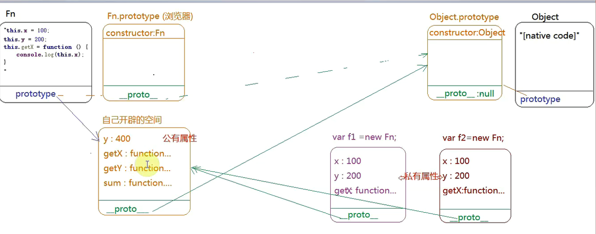

```js

    //indexOf  没有出现返回-1
    //split 拆分字符串
    function queryURLParameter(url) {
        let obj = {};
        if (url.indexOf('?') < 0) return obj;
        let ary = url.split('?');
        url = ary[1];
        ary = url.split('&');
        for (let i = 0; i < ary.length; i++) {
            let cur = ary[i],
                curAry = cur.split('=');
            obj[curAry[0]] = curAry[1];
        }
        return obj;
    }

    //charAt charCodeAt substr subString slice substr
    console.log(queryURLParameter('https://www.google.com/search?q=%E5%BC%A0%E4%B8%89'));

    //indexOf split charAt slice
    function queryURLParameter(url) {
        let reg = /([^&?=]+)=([^&?=]+)/g,
            obj = {};
        url.replace(reg, function () {
            obj[arguments[1]] = arguments[2];
        });
        return obj;
    }

    String.prototype.myQueryURLParmeter = function () {
        let reg = /([^&?+]+)=([^&?+]+)/g;
        let obj = {};
        this.replace(reg, (...arg) => {
            obj[arg[1]] = arg[2];
        });
        return obj;
    };
    url.myQueryURLParmeter();

    //2
    console.log(a); //undefined
    var a = 12;

    function fn() {
        console.log(a); //由于局部作用域a声明了,a=>undefined
        var a = 13;
    }

    fn();
    console.log(a); //12

    //3
    console.log(a); //undefined
    var a = 12;

    function fn() {
        console.log(a); //12
        a = 13;
    }

    fn();
    console.log(a); //13

    //4
    console.log(a); //程序报错后面不执行
    a = 12;

    function fn() {
        console.log(a);
        a = 13;
    }

    fn();
    console.log(a);

    //5
    var foo = 1;

    function bar() {
        if (!foo) {
            var foo = 10;
        }
        console.log(foo);
    }

    bar(); //10

    //6
    //全局下的变量提升 var n;var c; a=地址
    var n = 0;

    function a() {
        //私有作用域:var a;b=地址;
        var a = 10;

        function b() {
            n++;
            console.log(n);
        }

        b();
        return b; //地址
    }

    var c = a(); //11
    c();//12
    console.log(n);//0

    //7
    var a = 10, b = 11, c = 12;
    function test(a) {
        //私有作用域: a=10  var b
        a=1; //私有 A=1
        var b=2;  //私有b=2
        c=3; //全局c=3
    }
    test(10);
    console.log(a, b, c);//10 ,11,3

    //8
    //变量提升 :var a;=>window.a=undefined=>a in window 为true
    if (!("a" in window)) {//条件不成立
        var a=1;
    }
    console.log(a); //undefined

    //9
    //变量提升: var a; b=地址
    var a=4;
    function b(x,y,a) {
        //=> 私有作用域 : x=1,y=2;a=3
        console.log(a);//3
        arguments[2]=10;//让第三个传递进来的实参等于10
        console.log(a);//10
    }

    a = b(1, 2, 3);//undefined  因为B函数执行没有返回值
    console.log(a);//3,10,undefined
    /*
    * 在js的非严格模式下,函数的参数集合域形式变量存在"映射"关系
    * 不管其中谁改变了,另外一个都跟着改变
    * 在js严格模式下,arguments和形参变量的映射关系被切断了
    * 互不干扰
    * */

    //10
    //变量提升 var foo;
    var foo='hello';
    (function (foo) {
        //私有作用域 foo='hello'(我们的foo和外面的foo是不同的变量
        console.log(foo);//hello
        var foo = foo || 'world';
        console.log(foo);//hello
    })(foo); //把全局Foo的值当做实参传递给私有作用域中的形参
    console.log(foo);//hello
    /*
    * A&&B  A为假返回A,A为真返回B
    * A||B  A为真返回A,A为假返回B
    * 逻辑与的优先级高于逻辑或
    * */
    function fn(num,callBack) {
        //如果num没有传递至:让其默认值为0
        //if(typeOf num==="undefined') num=0;
        num=num||0;//ES6可以给形参添加默认值
        callBack&&callBack();//符合条件就去执行
    }

    //11
    var a=9;
    function fn() {
        a=0;
        return function (b) {
            return b+a++;
        }
    }
    var f=fn();
    console.log(f(5));//5 a=1
    console.log(fn()(5));//5 fn()=>a=0, a=1
    console.log(f(5));//6 a=2
    console.log(a);//2

    //12
    //变量提升 var ary; var res;fn=地址
    var ary = [1, 2, 3, 4];
    function fn(ary) {
        ary[0]=0;
        ary=[0];
        ary[0]=100;
        return ary;
    }
    var res=fn(ary);
    console.log(ary);//[0,2,3,4]
    console.log(res);//100
```



```js
//13
function fn(i) {
    return function (n) {
        console.log(n + (--i));
    }
}
var f=fn(2);
f(3); //4  i=1
fn(4)(5);//8
fn(6)(7);//12
f(8);//8  i=0

//14
var num=10;//60  65
var obj={num: 20};//30
obj.fn=(function (num) {
    this.num=num*3;
    num++;//21 22 23
    return function (n) {
        this.num+=n;
        num++;
        console.log(num);
    }
})(obj.num);//自执行函数
var fn=obj.fn;
fn(5);//22
obj.fn(10);// 23
console.log(num, obj.num);//65 30

//15
function Fn() {
    this.x=100;
    this.y=200;
    this.getX=function () {
        console.log(this.x);
    }
}
Fn.prototype={
    y:400,
    getX:function () {
        console.log(this.x);
    },
    getY:function () {
        console.log(this.y);
    },
    sum:function () {
        console.log(this.x + this.y);
    }
};
var f1=new Fn;
var f2=new Fn;
console.log(f1.getX === f2.getX);//false 地址不一样
console.log(f1.getY === f2.getY);//true两个的原型是一致的
console.log(f1.__proto__.getY === Fn.prototype.getY);//true
console.log(f1.__proto__.getX === f2.getX());//false
console.log(f1.constructor);//f1私有没有去原型找,Object
```



```js
//16
for(var i=0;i<inputs.length;i++){
    input[i].onclick=function(){
        alert(i); //5
    }
}
//同步异步编程
//解决方法
//自定义属性
for(var i=0;i<inputs.length;i++){
	input[i].myIndex=i;
    input[i].onclick=function(){
        console.log(this.myIndex)
    }
}
//闭包
for(var i=0;i<inputs.length;i++){
    input[i].onclick=(function(i){
        return function(){
            alert(i)
        }
    })(i)
}
//ES6  (块级作用域)
for(let i=0;i<inputs.length;i++){
    input[i].onclick=function(){
        alert(i); //5
    }
}
```

学东西不要学表面要学原理要学核心

```js
//17
var fullName='language';
var obj={
    fullName:'javascript',
    prop:{
        getFullName:function(){
            return this.fullName;
        }
    }
};
console.log(obj.prop.getFullName());//undefined
//this=>obj.prop=>obj.prop.getFullName=>undefined
//this指向问题 ,方法执行看前面有没有点,点谁,this指向this
var test=obj.prop.getFullName;
console.log(test());//this=>window  language

 //18
    var name='window';
    var Tom={
        name:"Tom",
        show:function () {
            console.log(this.name);
        },
        wait:function () {
            var fun=this.show;
            fun();
        }
    };
    Tom.wait();//this:Tom=>fun=Tom.show=> fun()  没有点this是window=> 打印'window'
```

undefined

```
* 变量提升:只声明未定义默认值就是undefined
* 严格模式下:没有明确的执行主体,this就是undefined
* 对象没有这个属性名,属性值是undefined
* 函数定义形参不传值,默认就是undefined
* 函数没有返回值,默认返回就是undefined
```

null

```
手动设置变量的值或者对象某一个属性值为null(此时不赋值,后面赋值)
在js的DOM元素获取中,如果没有获取到指定对象,结果一般都是null
object.prototype.__proto__的值也是null
正则捕获的时候,没有捕获到结果,默认也是null
```

```js
var obj={
    name:'js',
    can:(function(){
        console.log(obj);//undefined
        return obj.name; //报错
    })(),

};
console.log(obj.can);
```

```js
var number=2;
var obj={
    number:4,
    fn1:(function () {
        this.number*=2; //window.number=4
        number=number*3;//私有变量 number =NaN
        var number=3; //私有 number=3
        return function () {
            this.number*=2;
            number*=3;
            console.log(number);
        }
    })()
};
var fn1=obj.fn1;
console.log(number);//4
fn1();//this=window  window.number=8  私有number=9
obj.fn1();// window.number =8, 私有number=27
console.log(window.number);//8
console.log(obj.number);//8
```
```
 var y = 1, x = y = typeof x;
 x;//"undefined"
 表达式是从右往左的,x由于变量提升类型应该是undefined,
 所有x=y=undefined
```

选择分组符

```
let a=(1,2,3);
console.log(a);//3
以最后一个为准
```

```
  var x = 1;
  if (function f(){}) {
    x += typeof f;
  }
  x;//"1undefined"
  
  if (fucntion f(){})  为true 类式!! 强制转换
  但是javascript引擎在搜索的时候却找不到该函数。所以结果为”1undefined”
```

```
  (function(foo){
    return typeof foo.bar;
  })({ foo: { bar: 1 } });
  //"undefined"
  形参的foo指向{foo:{bar:1}}
```

### 函数作用域链

**对象内部的函数表达式**

```
var o={
  fn:function (){
    console.log(fn);
  }
};
o.fn();//ERROR报错
```

**非对象内部的函数表达式**

```
var fn=function (){
  console.log(fn);
};
fn();//function (){console.log(fn);};正确
```

> 使用var或是非对象内部的函数表达式内，可以访问到存放当前函数的变量；在对象内部的不能访问到。
>
> 因为**函数作用域链**的问题，采用var的是在外部创建了一个fn变量，函数内部当然可以在内部寻找不到fn后向上册作用域查找fn，而在创建对象内部时，因为没有在函数作用域内创建fn，所以无法访问。  
>
> **最内层的return出去的fun函数不是第二层fun函数，是最外层的fun函数**。 

```js
function fun(n,o) {
  console.log(o)
  return {
    fun:function(m){
      return fun(m,n);
    }
  };
}
var a = fun(0);  a.fun(1);  a.fun(2);  a.fun(3);
第一个fun(0)是在调用第一层fun函数。第二个fun(1)是在调用前一个fun的返回值的fun函数，所以：
第后面几个fun(1),fun(2),fun(3),函数都是在调用第二层fun函数。
在第一次调用fun(0)时，o为undefined；
第二次调用fun(1)时m为1,第一次调用n=0,即内部调用第一层fun函数即m=1，n=0，并在内部调用第一层fun函数fun(1,0);所以o为0；
同理最终答案为undefined,0,0,0

var b = fun(0).fun(1).fun(2).fun(3); 
从fun(0) 开始看,肯定调用的第一层fun函数;而他的返回值是一个对象，所以第二个fun(1)调用的是第二层fun函数，后面几个也是调用的第二层fun函数。
在第一次调用第一层fun(0)时，o为undefined；
第二次调用 .fun(1)时m为1，此时fun闭包了外层函数的n，也就是第一次调用的n=0，即m=1，n=0，并在内部调用第一层fun函数fun(1,0);所以o为0；
第三次调用 .fun(2)时m为2，此时当前的fun函数不是第一次执行的返回对象，而是第二次执行的返回对象。而在第二次执行第一层fun函数时时(1,0)所以n=1,o=0,返回时闭包了第二次的n，遂在第三次调用第三层fun函数时m=2,n=1，即调用第一层fun函数fun(2,1)，所以o为1；
第四次调用 .fun(3)时m为3，闭包了第三次调用的n，同理，最终调用第一层fun函数为fun(3,2)；所以o为2；
即最终答案：undefined,0,1,2

var c = fun(0).fun(1);  c.fun(2);  c.fun(3);
在第一次调用第一层fun(0)时，o为undefined；

第二次调用 .fun(1)时m为1，此时fun闭包了外层函数的n，也就是第一次调用的n=0，即m=1，n=0，并在内部调用第一层fun函数fun(1,0);所以o为0；
第三次调用.fun(2)时m为2,此时fun 闭包的是第二次调用的n=1,即m=2,n=1,并在内部调用第一层fun函数fun(2,1);所以o为1；
第四次.fun(3)时同理，但依然是调用的第二次的返回值，遂最终调用第一层fun函数fun(3,1)，所以o还为1
即最终答案：undefined,0,1,1

广义上的闭包就是指一个变量在他自身作用域外被使用了，就叫发生了闭包。
```

变量提升

```js
var foo = 1;
function bar() {
//var foo =undefined
    if (!foo) {
      var foo = 10;
    }
    alert(foo);
}
bar();

---------
var a = 1;
function b() {
    a = 10; //函数提升,然后变量覆盖,但是函数式局部的,所以变量是局部的
    return;
    function a() {}
}
b();
alert(a);//1
```

call

```js
let obj={};
function A(a){
    this.a=1; //window.a=1
    this.b=a;//window.b=undefined
}
A();
console.log(a);//1
A.call(obj,10);//this->obj
console.log(b);//undefined
console.log(obj);//{a:1,b:10}
```

### 词法检测和分析

```js
所有的js代码执行之前,浏览器都会惊醒词法检测和分析,其中有意见事情就是看当前变量是基于哪种规范声明的
let n=10;// window.n  =>window下没有n这个属性
if(!('n' in window)){
    //词法分析 (不是提前声明)
    let n=n+30;
    //n是基于ES6规范创建的,在当前操作中,先处理n+30然后在声明n,然后再赋值,但是n+30的时候,此时块级作用中n还没有生命,所有直接报错
}
console.log(n)
```

```js
let n=10,
    m=20;
~function(n,m){
    /*
    * 形参赋值
    * n=20 m=undefined[私有] arg:[0:20,length:1]
      n  arg[0]
      m  arg[1]  此时arg中没有第二项,所以m无法建立映射
    * */
    let arg=arguments;
    arg[0]=n||100;
    arg[1]=m||200;
    console.log(n, m);//20,undefined
}(m);
console.log(n, m);//10,20
```

```js
var n=0,
    fn=function(){
    this.n*=2;//window.n=0
    n++;//全局的n等于1
    return function(m){
        n+=++m;
        console.log(n);
    }
};
var f = fn(2);
f(3);//5, window.n=5
fn(3)(4);//11, window.n=11
f(4);//闭包  16
console.log(n);//16
```

```js
let i=2,
    fn=function(n){
        i*=2;//i=4
        return function(m){
            i -= (n--) + (++m);//赋值运算符的优先级大于后++后--,后++后--是对自己++或者--
            console.log(i);
        }
    };
let f = fn(1);
f(2); //n=1,m=2, i=0
fn(3)(4);//i=-8
f(5);//i=-8  由于n=1,在后加加,n=0,m=5,i=-8-6=-14
console.log(i);//-14
```

```js
//let 声明的变量和window属性没有关系
let n = 1;
let x = {
    n: 2,
    y: (function (n) {
        n = n || 3;//n=3
        return function (m) {
            m = m || 4;
            this.n += m++;
            n+=++m;
            console.log(n);
        }
    })(window.n)//window.n为undefined
};
let z=x.y;
x.y(5);//this.n=2+5=7,m=6,m=7,window.n=3+7=10,n=10
z(6);//闭包,不改变外面的n,m=7,m=8,this.n=undefined, this.n=NaN, window.n=18
console.log(n, x.n);//n=1,因为声明的变量和window属性没有关系,x.n=7
```

```js
function C1(name) {// undefined
    if(name) this.name=name;//没有给实例this设置私有属性
}
function C2(name) {// undefined
    this.name=name;//给实例的私有属性设置name:undefined
}
function C3(name) {// undefined
    this.name = name || 'join';//设置私有属性为join
}

C1.prototype.name = 'Tom';
C2.prototype.name = 'Tome';
C2.prototype.name = 'Tome';
console.log(new C1().name + new C2().name + new C3().name);
//new C1().name先执行new C1()再执行.name
//"Tomundefinedjoin"
```

```js
let a = {}
let fn = function () { console.log(this) }
fn.bind().bind(a)() // => ?

// fn.bind().bind(a) 等于
let fn2 = function fn1() {
  return function() {
    return fn.apply()
  }.apply(a)
}
fn2()

```

[经典面试题](http://www.cnblogs.com/xxcanghai/p/5189353.html)

### var a = {b: 1}和 var a = {b: {c: 1}}存放位置有什么不同

> （1）创建变量`a`指向对象`{b: 1};` // 栈里有一个`a`,给`{b:1}`分配地址并指向 
>
> （2）创建变量`a`指向对象`{b: c: 1};` // 通过`var`声明此时`a`被覆盖,给`{b:{c:1}}`分配地址并指向 
>
> （3）`{b:1}`不再被使用,js的垃圾回收机制会回收 

### 闭包问题

```js
function Foo() {
  var i = 0;
  return function () {
    console.log(i++);
  }
}

var f1 = Foo(),
  f2 = Foo();
f1();//0
f1();//1
f2();//0
```

### 隐式类型转换

```js
console.log(NaN + '1');//NaN1
console.log(NaN + 1);//NaN
```

### 作用域提升易错的

```js
x = 1;
console.log((function () {
    //var x    变量提升了
  return x;
  var x = 2;
}()));
```

### 函数的形参和基本类型的形参

```js
[]['splice']['length']  //2
[]['slice']['length']  //2
100['toString'].length //1   function.length 为1
[]['toString']["length"] //0
0..toString.length //1

[true, false][+true, +false]   
// [+true,+false]   [1,0]   ,运算符取 多个参数取后面一个
// (1,2,4)   //4
// [true,false][0]   true
```

### {}==!{}

```js
{}==false   {}==0
!{}  {}.toString()  NaN
0==NaN  false
```

### (!+[]+[]+![]).length

```js
"truefalse".length
9
```

