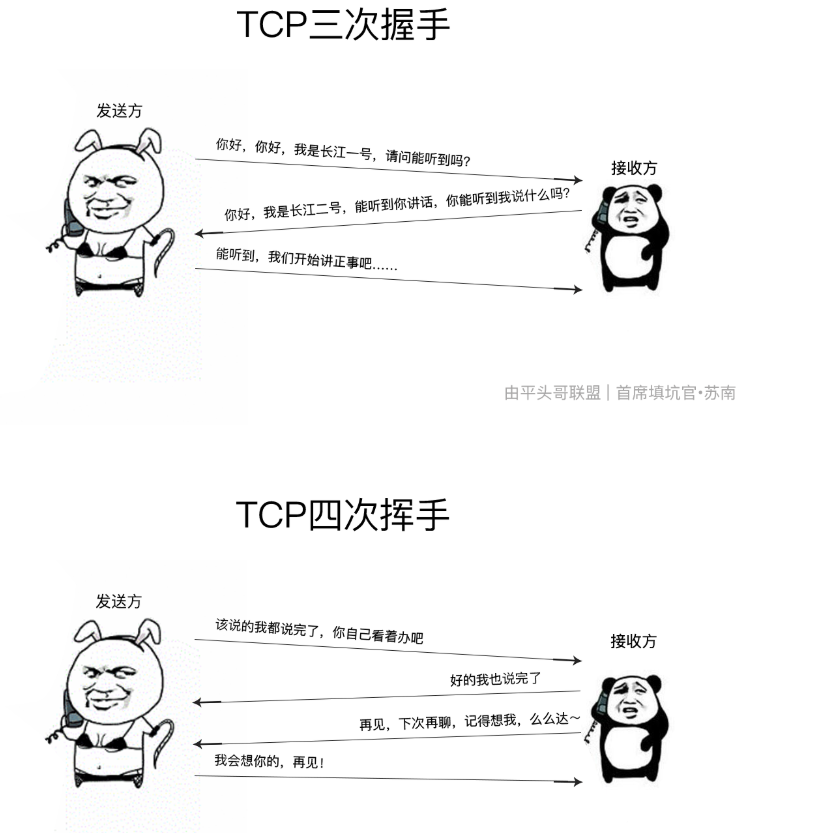
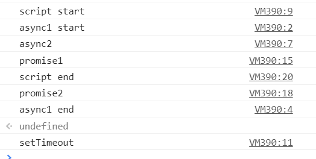

### 函数

```
// 你不能改变一个函数的 name 属性的值, 因为该属性是只读的
var object = {
  // someMethod 属性指向一个匿名函数
  someMethod: function() { }
};
object.someMethod.name = "otherMethod";
console.log(object.someMethod.name); // someMethod

函数的length属性等于该函数声明时所要传入的新参数量
通过arguments.length,可以知道在调用时传入了多个参数
```

### setTimeout()和setInterval()的区别

```
setTimeout(()=>{
    console.log('执行setTimeout')
},1000)
setInterval(()=>{
    console.log('执行setInterval')
},1000)
setTimeout是执行并延迟1s执行
只有满足 (1)3秒后 (2)主线程空闲,同时满足时,才会3秒后执行该函数
setInterval是每隔1s就尝试执行
```

### setTimeout、setInterval被遗忘的第三个参数

```
for ( var i=1; i<=5; i++) {
	setTimeout( function timer(j) {
		console.log( j );
	}, i*1000, i);
}
第三个参数param1,param2l...
作为参数传递给function或者字符串中的参数
```




###event loop的概念

```js
微任务 promise  process.nextTick          
宏任务 setTimeout  setInterval  I/O  script
同一次事件循环中  微任务永远在宏任务之前执行
```


```js
 setTimeout(function(){
     console.log('定时器开始啦')
 });
 
 new Promise(function(resolve){
     console.log('马上执行for循环啦');
     for(var i = 0; i < 10000; i++){
         i == 99 && resolve();
     }
 }).then(function(){
     console.log('执行then函数啦')
 });
 
 console.log('代码执行结束');
```

> ```js
> 首先执行script下的宏任务,遇到setTimeout,将其放到宏任务的【队列】里
> 
> 遇到 new Promise直接执行,打印"马上执行for循环啦"
> 
> 遇到then方法,是微任务,将其放到微任务的【队列里】
> 
> 打印 "代码执行结束"
> 
> 本轮宏任务执行完毕,查看本轮的微任务,发现有一个then方法里的函数, 打印"执行then函数啦"
> 
> 到此,本轮的event loop 全部完成。
> 
> 
> 下一轮的循环里,先执行一个宏任务,发现宏任务的【队列】里有一个 setTimeout里的函数,执行打印"定时器开始啦"
> ```

【马上执行for循环啦 --- 代码执行结束 --- 执行then函数啦 --- 定时器开始啦】 

```
async function fn1(){
    return 123
}

function fn2(){
    return 123
}

console.log(fn1())
console.log(fn2())
//返回
Promise {<resolved>: 123}
123
-----
new promise(()=>{
    同步的
}).then(
异步的微任务
)
```

第二题

```js
setTimeout(() => console.log('setTimeout1'), 0);  //1宏任务
setTimeout(() => {								//2宏任务
    console.log('setTimeout2');
    Promise.resolve().then(() => {
        console.log('promise3');
        Promise.resolve().then(() => {
            console.log('promise4');
        })
        console.log(5)
    })
    setTimeout(() => console.log('setTimeout4'), 0);  //4宏任务
}, 0);
setTimeout(() => console.log('setTimeout3'), 0);  //3宏任务
Promise.resolve().then(() => {//1微任务
    console.log('promise1');
})
```


第三题

```
async function async1() {
    console.log( 'async1 start' )
    await async2()
    console.log( 'async1 end' )
}
async function async2() {
    console.log( 'async2' )
}
async1()
console.log( 'script start' )

执行结果
async1 start
async2
script start
async1 end
```

> 一旦遇到await 就立刻让出线程,阻塞后面的代码
>
> 等候之后,对于await来说分两种情况
>
> * 不是promise 对象
> * 是promise对象
>
> **如果不是promise,await会阻塞后面的代码,先执行async外面的同步代码,同步代码执行完毕后,在回到async内部,把promise的东西,作为await表达式的结果**
>
> **如果它等到的是一个 promise 对象，await 也会暂停async后面的代码，先执行async外面的同步代码，等着 Promise 对象 fulfilled，然后把 resolve 的参数作为 await 表达式的运算结果。** 
>
> **如果一个 Promise 被传递给一个 await 操作符，await 将等待 Promise 正常处理完成并返回其处理结果。** 

第四题

```js
        async function async1() {
            console.log( 'async1 start' ) //2
            await async2()
            console.log( 'async1 end' )//7
        }
        async function async2() {
            console.log( 'async2' )//3
        }
        console.log( 'script start' ) //1
        setTimeout( function () {
            console.log( 'setTimeout' )//8
        }, 0 )
        async1();
        new Promise( function ( resolve ) {
            console.log( 'promise1' )//4
            resolve();
        } ).then( function () {
            console.log( 'promise2' ) //6
        } )
        console.log( 'script end' )//5
```

 控制台执行任何语句都认为是在一个匿名函数空间包裹下的，JS函数return; 和不写return都是默认返回undefined，所以会在控制台下输出undefined 



第五题

```
       new Promise( ( resolve, reject ) => {
                console.log( "promise1" )
                resolve()
            } )
            .then( () => {
                console.log( 1 )
            } )
            .then( () => {
                console.log( 2 )
            } )
            .then( () => {
                console.log( 3 )
            } )

        new Promise( ( resolve, reject ) => {
                console.log( "promise2" )
                resolve()
            } )
            .then( () => {
                console.log( 4 )
            } )
            .then( () => {
                console.log( 5 )
            } )
            .then( () => {
                console.log( 6 )
            } )
        // 1 4 2 5 3 6
```

> 先执行同步代码 promise1,   promise2,此时微任务有两个任务 log(1)和log(4)
>
> 执行完log(1)和log(4)此时任务中有log(2)和log(5)两个微任务
>
> 执行log(2)和log(5)此时任务中有log(3)和log(6)两个微任务
>
> 连续的几个`then()`回调，并不是连续的创建了一系列的微任务并推入微任务队列，因为`then()`的返回值必然是一个`Promise`，而后续的`then()`是上一步`then()`返回的`Promise`的回调 

### ECS(执行环境栈)

```
function foo(i) {
  if (i < 0) return;
  console.log('begin:' + i);
  foo(i - 1);
  console.log('end:' + i);
}
foo(2);

// 输出:

// begin:2
// begin:1
// begin:0
// end:0
// end:1
// end:2
```

**执行栈既是函数在执行时存储调用过程的栈,同样的,采取调用形式进行队列,先进后出的方式 **

第六题

```
async function t1 () {
  console.log(1)
  console.log(2)
  await Promise.resolve().then(() => console.log('t1p'))
  console.log(3)
  console.log(4)
}

async function t2() {
  console.log(5)
  console.log(6)
  await Promise.resolve().then(() => console.log('t2p'))
  console.log(7)
  console.log(8)
}

t1()
t2()

console.log('end')

// 输出：
// 1
// 2
// 5
// 6
// end
// t1p
// t2p
// 3
// 4
// 7
// 8
// undefined
```

第七题

```
async function t1 () {
  console.log(1)
  console.log(2)
  await new Promise(resolve => {
    setTimeout(() => {
      console.log('t1p')
      resolve()
    }, 1000)
  })
  await console.log(3)
  console.log(4)
}

async function t2() {
  console.log(5)
  console.log(6)
  await Promise.resolve().then(() => console.log('t2p'))
  console.log(7)
  console.log(8)
}

t1()
t2()

console.log('end')

// 输出：
// 1
// 2
// 5
// 6
// end
// t2p
// 7
// 8
// undefined
// t1p
// 3
// 4
```


